```mermaid
---
title: Exemple de Flux de Travail
---
graph TD
    A[Début] --> B{Décision}
    B -->|Oui| C[Processus 1]
    B -->|Non| D[Processus 2]
    C --> E[Fin]
    D --> E
```

This file is a merged representation of a subset of the codebase, containing specifically included files, combined into a single document by Repomix.

# File Summary

## Purpose
This file contains a packed representation of the entire repository's contents.
It is designed to be easily consumable by AI systems for analysis, code review,
or other automated processes.

## File Format
The content is organized as follows:
1. This summary section
2. Repository information
3. Directory structure
4. Multiple file entries, each consisting of:
  a. A header with the file path (## File: path/to/file)
  b. The full contents of the file in a code block

## Usage Guidelines
- This file should be treated as read-only. Any changes should be made to the
  original repository files, not this packed version.
- When processing this file, use the file path to distinguish
  between different files in the repository.
- Be aware that this file may contain sensitive information. Handle it with
  the same level of security as you would the original repository.
- Pay special attention to the Repository Description. These contain important context and guidelines specific to this project.

## Notes
- Some files may have been excluded based on .gitignore rules and Repomix's configuration
- Binary files are not included in this packed representation. Please refer to the Repository Structure section for a complete list of file paths, including binary files
- Only files matching these patterns are included: .cursor/*, **/.cursor/**
- Files matching default ignore patterns are excluded

## Additional Info
### User Provided Header
Date: 2025-03-09T04:44:40.945

# Directory Structure
```
cv-generator/
  .cursor/
    rules/
      000-cursor-rules-standardized.mdc
      001-project-overview.mdc
      002-naming-conventions.mdc
      003-tdd-workflow.mdc
      100-docker-standards.mdc
      101-alias-config.mdc
      2001-tailwind-vue3.mdc
      2002-vue3-components.mdc
      2003-vue3-composables.mdc
      400-md-docs-standardized.mdc
      400-readme.mdc
      500-changelog.mdc
      800-project-foundation-template-standardized.mdc
      801-workflow-agile-standardized.mdc
      802-code-generation-standardized.mdc
      803-overengineering-prevention-standardized.mdc
      901-prd-template-standardized.mdc
      902-arch-template-standardized.mdc
      903-story-template-standardized.mdc
      git-push-command-standardized.mdc
      overengineering.mdc
le-journal/
  .cursor/
    rules/
      rule-backend-controller.mdc
      rule-backend-domain-services.mdc
      rule-backend-domain.mdc
      rule-backend-global.mdc
      rule-backend-mapper.mdc
      rule-backend-repository.mdc
      rule-backend-seed.mdc
      rule-backend-use-case.mdc
      rule-frontend-component.mdc
      rule-frontend-global.mdc
      rule-frontend-remix-loaders.mdc
      rule-frontend-store.mdc
      rule-global-code-generation.mdc
      rule-global-installation.mdc
      rule-shared-types.mdc
UltraContextAI/
  .cursor/
    rules/
      brain-memories-lessons-learned-scratchpad.mdc
      documentations-inline-comments-changelog-docs.mdc
    lessons-learned.md
    memories.md
    project-requirements.md
    scratchpad.md
```

# Files

## File: cv-generator/.cursor/rules/000-cursor-rules-standardized.mdc
````
---
description: "ALWAYS use when CREATING or UPDATING a RULE or when taught a lesson that should be RETAINED as a new rule for Cursor"
globs: "**/*.mdc"
alwaysApply: false
---

# 📏 Format Standard des Règles Cursor

## 📋 Vue d'Ensemble
Cette règle définit le format standard pour toutes les règles Cursor. Elle garantit que les règles sont structurées de manière cohérente, optimisées pour l'IA et fournissent des instructions claires et exploitables. Le respect de ces standards est essentiel pour l'efficacité de l'agent IA et la cohérence du système de règles.

> ⚠️ **Attention**: Cette règle est fondamentale et toutes les autres règles doivent s'y conformer. Elle définit le cadre dans lequel toutes les autres règles doivent s'inscrire.

## 🎯 Objectifs
- Assurer une structure cohérente pour toutes les règles Cursor
- Optimiser les règles pour une détection et une application efficaces par l'IA
- Minimiser l'overhead de contexte tout en maximisant l'impact des règles
- Faciliter la maintenance et l'évolution du système de règles
- Garantir que les règles sont claires, concises et exploitables

## ✅ Structure de Base des Règles

### 1️⃣ Format du Frontmatter
```mdc
---
title: "Titre Descriptif de la Règle"
version: "X.Y.Z"
description: "ACTION quand DÉCLENCHEUR pour RÉSULTAT"
globs: "motif/glob/*.ext"
lastUpdated: "YYYY-MM-DD"
tags: ["tag1", "tag2", "tag3"]
---
```

### 2️⃣ Corps de la Règle
```mdc
# Titre de la Règle

## Contexte
- Quand appliquer cette règle
- Prérequis ou conditions

## Requirements
- Éléments d'action concis
- Chaque exigence doit être testable

## Exemples
<example>
Bon exemple concis avec explication
</example>

<example type="invalid">
Exemple invalide concis avec explication
</example>

<version>X.Y.Z</version>
```

## 📁 Organisation des Fichiers

### 📂 Emplacement
- Chemin: `.cursor/rules/`
- Extension: `.mdc`

### 🏷️ Convention de Nommage
`PRÉFIXE-nom.mdc` où PRÉFIXE est:
- `0XX`: Standards fondamentaux
- `1XX`: Configurations d'outils
- `3XX`: Standards de test
- `1XXX`: Règles de langage
- `2XXX`: Règles de framework
- `8XX`: Workflows
- `9XX`: Templates
- `_nom.mdc`: Règles privées

## 🔍 Champs Obligatoires

### 📋 Frontmatter
- `title`: Titre descriptif de la règle (nouveau, recommandé)
- `description`: Format ACTION DÉCLENCHEUR RÉSULTAT
- `globs`: Motif glob pour les fichiers et dossiers
- `version`: Numéro de version X.Y.Z (maintenant dans le frontmatter)
- `lastUpdated`: Date de dernière mise à jour (nouveau, recommandé)
- `tags`: Liste de tags pour la catégorisation (nouveau, recommandé)

### 📝 Corps
- Contexte: Conditions d'usage
- Requirements: Éléments d'action
- Exemples: Valides et invalides
- `<version>X.Y.Z</version>`: À la fin du document

## 📊 Motifs Glob Courants

| Type de Règle | Exemple de Motif Glob |
|:--------------|:----------------------|
| Standards fondamentaux | `.cursor/rules/*.mdc` |
| Règles JavaScript/TypeScript | `src/**/*.{js,ts}` |
| Standards de test | `**/*.test.{js,ts}` |
| Composants React | `src/components/**/*.tsx` |
| Documentation | `docs/**/*.md` |
| Fichiers de configuration | `*.config.{js,json}` |
| Artefacts de build | `dist/**/*` |
| Extensions multiples | `src/**/*.{js,jsx,ts,tsx}` |
| Fichiers multiples | `dist/**/*`, `docs/**/*.md` |

## 📝 Directives de Formatage

### ✏️ Style Général
- Utiliser principalement du Markdown concis
- Limiter les balises XML à:
  - `<example>`
  - `<danger>`
  - `<required>`
  - `<rules>`
  - `<rule>`
  - `<critical>`
  - `<version>`
- Indenter le contenu dans les balises XML de 2 espaces
- Garder les règles aussi courtes que possible
- Utiliser la syntaxe Mermaid si elle sera plus claire qu'une description textuelle
- Utiliser des emojis pour améliorer la compréhension par l'agent IA
- Garder les exemples aussi courts que possible

## 🧠 Optimisation pour l'IA

### 🔧 Techniques d'Optimisation
1. Format ACTION DÉCLENCHEUR RÉSULTAT précis dans les descriptions
2. Exemples positifs et négatifs concis de l'application de la règle
3. Optimisation pour l'efficacité de la fenêtre de contexte de l'IA
4. Suppression des informations non essentielles ou redondantes
5. Utilisation de motifs glob standards sans guillemets (ex: `*.js`, `src/**/*.ts`)

### 🚀 Efficacité du Contexte
1. Maintenir la description du frontmatter sous 120 caractères
2. Limiter les exemples aux modèles essentiels uniquement
3. Utiliser une structure hiérarchique pour une analyse rapide
4. Supprimer les informations redondantes entre les sections
5. Maintenir une densité d'information élevée avec un minimum de tokens
6. Se concentrer sur les instructions exploitables par la machine

## 💡 Exemples

<example>
**Bonne Règle Cursor**:

```mdc
---
title: "JavaScript Error Handling"
version: "1.0.0"
description: "ALWAYS use when WRITING error handling code to ENSURE robust error management"
globs: "src/**/*.{js,ts}"
lastUpdated: "2024-02-15"
tags: ["javascript", "error-handling", "robustness"]
---

# JavaScript Error Handling Standards

## Context
- Apply when implementing error handling in JavaScript/TypeScript code
- Critical for production applications and API integrations

## Requirements
- Use try/catch blocks for all async operations
- Always include specific error types in catch blocks
- Log errors with sufficient context for debugging
- Never swallow errors without proper handling
- Return consistent error responses from APIs

## Examples
<example>
// Good error handling
try {
  const data = await fetchData();
  processData(data);
} catch (error) {
  if (error instanceof NetworkError) {
    logger.error('Network error during fetch', { error, context: 'fetchData' });
    notifyUser('Connection issue detected');
  } else {
    logger.error('Unknown error during fetch', { error });
    throw new ApplicationError('Data processing failed', error);
  }
}
</example>

<example type="invalid">
// Poor error handling
try {
  await fetchData();
} catch (error) {
  console.log(error);
}
</example>

<version>1.0.0</version>
```

Cette règle est optimisée car elle:
1. Utilise un format ACTION DÉCLENCHEUR RÉSULTAT clair
2. Fournit des exigences spécifiques et testables
3. Inclut des exemples concrets positifs et négatifs
4. Utilise une structure hiérarchique claire
5. Ne contient pas d'informations redondantes
6. Est orientée vers des instructions actionnables
</example>

<example type="invalid">
**Règle Cursor Problématique**:

```mdc
---
description: "This is a rule about JavaScript error handling that helps you handle errors better"
globs: "*.js"
other_field: "Something else"
---

# JS Errors

This rule helps you handle errors better in JavaScript. It's really important to handle errors properly because otherwise your application might crash.

## Some Guidelines

When you're writing JavaScript, you should try to handle errors appropriately. This means using try/catch blocks. Here's how you might do that:

try {
  // do something
} catch (e) {
  // handle the error
}

Make sure you don't just catch errors and do nothing with them, because that would be bad practice. Always log your errors or handle them in some way.

Also, remember that async functions can throw errors too, so you should handle those as well.

```

Cette règle est problématique car elle:
1. Utilise une description vague sans format ACTION DÉCLENCHEUR RÉSULTAT
2. Contient des champs non standard dans le frontmatter
3. Est verbeuse avec beaucoup d'explications non nécessaires
4. Manque d'exemples clairement délimités
5. Ne structure pas les exigences de manière concise et testable
6. Ne suit pas la structure hiérarchique standard
7. N'inclut pas de numéro de version
</example>

## ⚠️ Points Critiques

<critical>
- NE JAMAIS inclure d'explications verbeuses ou de contexte redondant qui augmente l'overhead de tokens de l'IA
- Garder le fichier aussi court et direct que possible MAIS JAMAIS aux dépens de l'impact et de l'utilité de la règle pour l'agent IA
- Le frontmatter peut UNIQUEMENT avoir les champs description, globs, title, version, lastUpdated et tags
</critical>

## ✅ Bonnes Pratiques

- **Concision**: Maximiser l'impact avec un minimum de mots
- **Clarté**: Utiliser un langage précis et direct
- **Actionnable**: Fournir des directives que l'on peut suivre et tester
- **Exemples**: Toujours inclure des exemples positifs et négatifs
- **Structure**: Suivre la hiérarchie recommandée
- **Optimisation**: Concevoir pour une efficacité maximale du contexte de l'IA
- **Maintenance**: Mettre à jour la version lors des modifications substantielles

## 🔗 Références
- [Template de Base](mdc:xnotes/000-base-template.md)
- [Template de Règle Cursor](mdc:xnotes/000-base-rule-template.mdc)
- [Standards de Documentation Markdown](mdc:xnotes/400-md-docs-standardized.mdc)

<version>2.0.0</version>
````

## File: cv-generator/.cursor/rules/001-project-overview.mdc
````
---
description: "DEFINE core project architecture, technical stack, and development principles for the CV Generator application"
globs: ["packages/**/*"]
alwaysApply: false
---
---
title: "CV Generator - Project Architecture & Technical Standards"
version: "2.3.0"
description: "DEFINE core project architecture, technical stack, and development principles for the CV Generator application"
globs: ["packages/**/*"]
lastUpdated: "2024-07-01"
tags: ["architecture", "standards", "monorepo", "ddd", "solid"]
---

# CV Generator - Project Architecture & Technical Standards

## Context
- This rule defines the architectural principles, technical stack, and development standards for the CV Generator application
- It serves as the central reference for understanding code organization and project structure
- All development work should align with these architectural decisions and coding standards
- This document references other critical standards including [naming conventions](mdc:.cursor/rules/002-naming-conventions.mdc) and [code generation standards](mdc:.cursor/rules/802-code-generation-standardized.mdc)

## Requirements
- The application MUST follow Clean Architecture principles with clear separation of concerns
- The codebase MUST be organized as a monorepo with well-defined package boundaries
- Domain logic MUST be implemented following Domain-Driven Design patterns
- All code MUST adhere to the SOLID principles and TypeScript standards defined in this document
- Validation MUST follow the multi-layer strategy described in this document
- All code MUST conform to the project's [naming conventions](mdc:.cursor/rules/002-naming-conventions.mdc)
- Code generation and modification MUST follow the [code generation standards](mdc:.cursor/rules/802-code-generation-standardized.mdc)

## Project Identity

The CV Generator is a modern web application for creating and managing resumes using the JSON Resume format. The architecture follows Clean Architecture and Domain-Driven Design principles to ensure clear separation of responsibilities, easy maintenance, and flexible system evolution.

## Technical Stack

| Technology   | Version | Description                             | Status      |
| ------------ | ------- | --------------------------------------- | ----------- |
| TypeScript   | 5.7+    | Primary language with strict typing     | ✅ In use   |
| Vue.js       | 3.4+    | UI framework with Composition API       | ✅ In use   |
| Vite         | 6.0+    | Build tool and dev server               | ✅ In use   |
| Pinia        | 2.1+    | State management                        | ✅ In use   |
| Tailwind CSS | 3.x     | Utility-first CSS framework             | ✅ In use   |
| Zod          | 3.22+   | Schema validation and runtime typing    | ✅ In use   |
| Vitest       | 3.0+    | Testing framework                       | ✅ In use   |
| Playwright   | Latest  | End-to-end testing                      | 🚧 Planned  |
| pnpm         | 10+     | Package manager with workspace support  | ✅ In use   |
| Biome        | 1.9+    | Linting and formatting                  | ✅ In use   |

## Key Architectural Decisions

### 1. Clean Architecture

- 🔄 Strict separation of layers (UI, Application, Domain, Infrastructure)
- 🔄 Dependencies pointing inward
- 🔄 Dependency inversion for repositories and services

### 2. Domain-Driven Design

- 📦 Organization by bounded contexts (CV, Export, User)
- 💎 Rich entities with encapsulated business logic
- 💠 Value Objects for complex types (Email, Phone)
- 📋 Aggregates for maintaining consistency (Resume)
- 🔌 Explicit port interfaces in each bounded context

### 3. Monorepo Structure

- 📂 Independent packages with clear responsibilities
- 🔄 Shared utilities for reuse
- 🧪 Co-located tests with implementation code

### 4. Validation Strategy

- ✅ Schema validation with Zod
- 🔄 Specialized composables for form validation
- 📝 Real-time validation with user feedback
- 🔀 Separation between UI validation and domain validation

## Project Structure

```
/
├── packages/                    # Monorepo workspace
│   ├── core/                    # Domain & Application layers
│   │   └── src/
│   │       ├── cv/              # CV Bounded Context
│   │       │   ├── domain/      # Domain layer
│   │       │   │   ├── entities/   # Domain entities
│   │       │   │   └── value-objects/ # Value Objects
│   │       │   ├── application/ # Application layer
│   │       │   │   └── use-cases/  # Business use cases
│   │       │   └── ports/       # Interface ports
│   │       │       └── repositories/ # Repository interfaces
│   │       ├── export/          # Export Bounded Context
│   │       │   ├── domain/      # Domain entities and logic
│   │       │   ├── application/ # Application services
│   │       │   └── ports/       # Interface ports
│   │       ├── user/            # User Bounded Context
│   │       │   ├── domain/      # User domain model
│   │       │   ├── application/ # User application services
│   │       │   └── ports/       # User interfaces
│   │       ├── shared/          # Shared domain elements
│   │       │   ├── domain/      # Shared domain concepts
│   │       │   └── application/ # Shared application logic
│   │       └── modules/         # Legacy/alternative organization
│   │
│   ├── ui/                      # Presentation layer
│   │   └── src/
│   │       ├── components/      # Vue components
│   │       │   └── shared/      # Shared components
│   │       ├── modules/         # Feature modules
│   │       │   └── cv/          # CV module
│   │       │       ├── presentation/ # Presentation components
│   │       │       └── stores/  # State management
│   │       ├── App/             # Application root
│   │       ├── plugins/         # Vue plugins
│   │       ├── assets/          # Static assets
│   │       └── core/            # Core UI logic
│   │
│   ├── infrastructure/          # Infrastructure layer
│   │   └── src/
│   │       ├── repositories/    # Data persistence implementations
│   │       ├── services/        # External service implementations
│   │       └── errors/          # Infrastructure-specific errors
│   │
│   └── shared/                  # Shared utilities
│       └── src/
│           ├── types/           # Shared TypeScript types
│           ├── validators/      # Shared validation logic
│           ├── schemas/         # Shared schema definitions
│           └── __tests__/       # Tests for shared code
```

## Package Responsibilities

### Core (@cv-generator/core)

- DDD bounded contexts organization:
  - **CV Context**: Resume entities, business logic, validation
  - **Export Context**: Export formats, conversion management
  - **User Context**: User management, preferences
  - **Shared**: Shared utilities (Result, ValidationError)
- Explicit port interfaces for dependency inversion
- TypeScript aliases by business context

### UI (@cv-generator/ui)

- Vue.js components and composables
- State management with Pinia
- Styling with Tailwind CSS
- Co-located unit tests

### Infrastructure (@cv-generator/infrastructure)

- Repository implementations
- External services and adapters
- Data persistence (LocalStorage)
- Error handling

### Shared (@cv-generator/shared)

- Shared types and utilities
- Validation schemas
- Common interfaces
- Test utilities

## Coding Standards

### SOLID Principles

- **S - Single Responsibility**: Each class, module, and function should have one responsibility
  - Example: A service class should either handle business logic OR data access, not both
  - Services, repositories, entities should have focused responsibilities

- **O - Open/Closed**: Software entities should be open for extension, closed for modification
  - Example: Use inheritance and interfaces to extend functionality without modifying existing code
  - Prefer composition over inheritance when appropriate

- **L - Liskov Substitution**: Subtypes must be substitutable for their base types
  - Example: Child classes must maintain all behaviors of parent classes
  - Interface implementations must honor the contract of the interface

- **I - Interface Segregation**: Many specific interfaces are better than one general-purpose interface
  - Example: Define focused repository interfaces rather than one large repository interface
  - Break large interfaces into smaller, more focused ones

- **D - Dependency Inversion**: Depend on abstractions, not concretions
  - Example: Core domain code should depend on port interfaces, not implementations
  - Use dependency injection to provide implementations at runtime

### TypeScript & Type Safety

- NEVER use any type without explicit justification
- NEVER use non-suffixed interfaces or types
- NEVER mutate entity state directly
- NEVER expose internal implementation details
- NEVER use barrel files (index.ts)
- ALWAYS use proper type suffixes
- ALWAYS validate data at boundaries
- ALWAYS use immutable patterns
- ALWAYS document public APIs
- ALWAYS import directly from source files

### Testing Strategy

- TDD as primary approach
- Tests MUST be co-located with the code they test
- Each public method or component MUST have tests
- Use factory methods for test data
- Mock external dependencies
- Test files MUST follow the naming pattern `*.spec.ts` or `*.test.ts`

### Code Generation Standards

The project follows standards for efficient, maintainable code generation as defined in the [code generation standards](mdc:.cursor/rules/802-code-generation-standardized.mdc). Key principles include:

- Follow KISS (Keep It Simple, Stupid), YAGNI (You Aren't Gonna Need It), and DRY (Don't Repeat Yourself)
- Generate only the code necessary for implementing the current task
- Maintain consistency with existing code patterns and architecture
- Avoid over-engineering and premature optimization
- Ensure all generated code follows project naming conventions

### Naming Conventions

The project enforces consistent naming conventions as defined in the [naming conventions rule](mdc:.cursor/rules/002-naming-conventions.mdc). These conventions ensure readability, maintainability, and searchability of the codebase.

## Examples

<example>
// Good: Properly structured domain entity with encapsulated logic
// packages/core/src/cv/domain/entities/Resume.ts
export class Resume {
  private readonly id: string;
  private basics: Basics;
  private skills: Skill[];
  
  constructor(params: ResumeParams) {
    this.id = params.id ?? uuidv4();
    this.basics = new Basics(params.basics);
    this.skills = params.skills.map(skill => new Skill(skill));
  }
  
  public getId(): string {
    return this.id;
  }
  
  public updateBasics(basics: BasicsParams): Result<Basics, ValidationError> {
    const validatedBasics = BasicsSchema.safeParse(basics);
    
    if (!validatedBasics.success) {
      return Result.failure(new ValidationError(validatedBasics.error));
    }
    
    this.basics = new Basics(validatedBasics.data);
    return Result.success(this.basics);
  }
  
  public toDTO(): ResumeDTO {
    return {
      id: this.id,
      basics: this.basics.toDTO(),
      skills: this.skills.map(skill => skill.toDTO())
    };
  }
}
</example>

<example type="invalid">
// Bad: Anemic model with no encapsulation, direct mutation, and no validation
// Avoid this approach:
export class Resume {
  public id: string;
  public basics: any;
  public skills: any[];
  
  constructor(data: any) {
    this.id = data.id;
    this.basics = data.basics;
    this.skills = data.skills;
  }
}

// Direct mutation from outside
const resume = new Resume(data);
resume.basics.name = "New Name"; // Bad: Direct mutation of internal state
</example>

<version>2.3.0</version>
````

## File: cv-generator/.cursor/rules/002-naming-conventions.mdc
````
---
description: ENFORCE consistent naming conventions across all project files to ensure code readability, maintainability, and searchability
globs: **/*
alwaysApply: false
---
---
description: ENFORCE consistent naming conventions across all project files to ensure code readability, maintainability, and searchability
globs: **/*
tags: [naming, conventions, code-quality, readability]
priority: 1
version: 1.0.0
---

# Naming Conventions

## Context
- Apply these naming conventions to all code elements including files, folders, functions, classes, interfaces, types, enums, etc.
- These conventions ensure code consistency, improve readability, and reduce cognitive load
- Follow these guidelines for all new code and when refactoring existing code

## Requirements

### 1. General Principles
- Names must be descriptive and reveal intent
- Names should be searchable and not too short
- Avoid abbreviations except for widely accepted ones (e.g., `id`, `http`, `url`)
- Avoid redundant or meaningless words (e.g., `data`, `info`)
- Maximum name length: 50 characters
- Maintain consistent casing patterns as defined below

### 2. File & Folder Naming

#### Files
- **Source Code**: `kebab-case.extension` (e.g., `resume-builder.ts`)
- **React/Vue Components**: `PascalCase.{jsx,tsx,vue}` (e.g., `ResumeForm.vue`)
- **Tests**: `[filename].{spec|test}.extension` (e.g., `resume-service.spec.ts`)
- **Type Declaration Files**: `kebab-case.d.ts` (e.g., `resume-types.d.ts`)
- **Configuration Files**: `kebab-case.config.{js,ts}` (e.g., `tailwind.config.js`)
- **Constants/Data Files**: `SCREAMING_SNAKE_CASE.{js,ts}` (e.g., `DEFAULT_RESUME_TEMPLATE.ts`)

#### Folders
- **General Purpose Folders**: `kebab-case` (e.g., `error-handling`)
- **Domain/Feature Folders**: `kebab-case` (e.g., `resume-builder`)
- **Clean Architecture Layers**: `kebab-case` (e.g., `domain`, `application`, `infrastructure`, `presentation`)
- **Component Collections**: `kebab-case` (e.g., `ui-components`)

### 3. JavaScript/TypeScript Elements

#### Variables
- **Regular Variables**: `camelCase` (e.g., `userProfile`)
- **Private Class Variables**: `_camelCase` (e.g., `_userData`)
- **Boolean Variables**: `isPrefixed` or `hasPrefixed` (e.g., `isValid`, `hasErrors`)

#### Constants
- **Module-level Constants**: `SCREAMING_SNAKE_CASE` (e.g., `MAX_FILE_SIZE`)
- **Class Constants**: `SCREAMING_SNAKE_CASE` (e.g., `static readonly MAX_ENTRIES = 50`)
- **Enum Constants**: `SCREAMING_SNAKE_CASE` (e.g., `ERROR_TYPES.VALIDATION`)

#### Functions & Methods
- **Regular Functions/Methods**: `camelCase` (e.g., `calculateTotal()`)
- **Private Class Methods**: `_camelCase` (e.g., `_validateInput()`)
- **Boolean-returning Functions**: `isPrefixed` or `hasPrefixed` (e.g., `isValidEmail()`)
- **Factory Functions**: `createPrefixed` (e.g., `createUserProfile()`)
- **Event Handlers**: `handlePrefixed` (e.g., `handleSubmit()`)

#### Classes
- **Class Names**: `PascalCase` (e.g., `ResumeBuilder`)
- **Abstract Classes**: `AbstractPascalCase` (e.g., `AbstractRepository`)
- **Service Classes**: `PascalCaseService` (e.g., `ValidationService`)
- **Repository Classes**: `PascalCaseRepository` (e.g., `ResumeRepository`)
- **Controller Classes**: `PascalCaseController` (e.g., `ResumeController`)

#### Interfaces & Types
- **Interfaces**: `PascalCaseInterface` (e.g., `ResumeDataInterface`)
- **Type Aliases**: `PascalCaseType`  (e.g., `ResumeTemplateType` or `TResumeTemplateType`)
- **Type Parameters/Generics**: Single uppercase letter or `PascalCaseType` (e.g., `T` or `EntityType`)
- **Prop Types**: `PascalCaseProps` (e.g., `ResumeFormProps`)

#### Enums
- **Enum Names**: `PascalCaseEnum` (e.g., `ValidationResultEnum`)
- **Enum Members**: `SCREAMING_SNAKE_CASE` (e.g., `ValidationResult.INVALID_EMAIL`)

#### React/Vue Specific
- **Component Names**: `PascalCase` (e.g., `ResumeForm`)
- **Custom Hooks**: `useCamelCase` (e.g., `useFormValidation`)
- **Context Providers**: `PascalCaseProvider` (e.g., `ResumeProvider`)
- **Higher-Order Components**: `withPascalCase` (e.g., `withAuthentication`)

### 4. CSS & Styling

- **CSS Classes**: `kebab-case` (e.g., `resume-container`)
- **CSS Variables**: `--kebab-case` (e.g., `--primary-color`)
- **CSS Modules**: `camelCase` when imported in JS/TS (e.g., `import styles from './styles.module.css'`)
- **Tailwind Custom Classes**: `kebab-case` (e.g., `@apply bg-primary text-white;`)

### 5. Backend Specific

- **API Endpoints**: `kebab-case` (e.g., `/api/resume-templates`)
- **Database Tables/Collections**: `snake_case` (e.g., `user_resumes`)
- **Database Fields/Keys**: `snake_case` (e.g., `resume_title`)
- **Environment Variables**: `SCREAMING_SNAKE_CASE` (e.g., `DATABASE_URL`)

### 6. Clean Architecture Specific

- **Use Cases**: `PascalCaseUseCase` (e.g., `CreateResumeUseCase`)
- **Entities**: `PascalCaseEntity` (e.g., `ResumeEntity`)
- **Value Objects**: `PascalCase` (e.g., `Email`, `PhoneNumber`)
- **DTOs**: `PascalCaseDTO` (e.g., `ResumeDTO`)
- **Repositories Interfaces**: `PascalCaseRepositoryInterface` (e.g., `ResumeRepositoryInterface`)
- **Implementation Classes**: Follow their respective type conventions plus implementation detail (e.g., `LocalStorageResumeRepository`)

### 7. Testing Specific

- **Test Suites**: `describe('PascalCase', ...)` (e.g., `describe('ResumeService', ...)`)
- **Test Cases**: `it('should do something', ...)` or `test('should do something', ...)`
- **Test Fixtures**: `camelCaseMock` or `mockPascalCase` (e.g., `resumeDataMock`)
- **Test Helpers**: `camelCaseHelper` (e.g., `createTestUser`)

## Examples

<example>
// Good file naming
resume-service.ts
ResumeForm.vue
resume-repository.spec.ts 
TEMPLATE_CONSTANTS.ts

// Good variable naming
const userData = fetchUserData();
const isValid = validateEmail(email);
const MAX_FILE_SIZE = 5 * 1024 * 1024;

// Good function naming
function calculateTotalExperience(workHistory) {...}
function isEmailValid(email) {...}
function handleSubmit() {...}

// Good class naming
class ResumeBuilder {...}
class LocalStorageResumeRepository implements IResumeRepository {...}
class ValidationService {...}

// Good interface & type naming
interface IResumeData {...}
type ResumeTemplate = {...}
type TEntityId<T> = {...}

// Good enum naming
enum ValidationResult {
  VALID,
  INVALID_EMAIL,
  MISSING_REQUIRED_FIELD
}

// Good component naming
const ProfileSection = () => {...}
const useFormValidation = () => {...}
</example>

<example type="invalid">
// Bad file naming
resume_service.ts  // Uses snake_case instead of kebab-case
resumeForm.vue     // Uses camelCase instead of PascalCase for component
ResumeRepo.test.ts // Inconsistent test naming

// Bad variable naming
const data = fetch();     // Too vague
const r = calculateTax(); // Too short and meaningless
const valid = check();    // Boolean should use is/has prefix

// Bad function naming
function validate() {...}           // Too vague
function process_data() {...}       // Uses snake_case
function returnTrueIfUserExists() {...} // Too verbose

// Bad class naming
class resume_builder {...}     // Uses snake_case
class validationservices {...} // Not properly capitalized
class Repository_Local {...}   // Inconsistent casing

// Bad interface & type naming
interface resumeData {...}     // Should be IPascalCase
type data = {...}              // Too vague and not PascalCase
type tEntity = {...}           // Inconsistent casing

// Bad enum naming
enum validationResults {
  valid,           // Should be SCREAMING_SNAKE_CASE
  invalid_email,   // Should be SCREAMING_SNAKE_CASE
  MissingField     // Inconsistent casing
}

// Bad component naming
const profilesection = () => {...}  // Should be PascalCase
const FormValidation = () => {...}  // Custom hook should use usePrefix
</example>
````

## File: cv-generator/.cursor/rules/003-tdd-workflow.mdc
````
---
description: ENFORCE Test-Driven Development workflow with Vitest in Vue 3 components to ensure robust and maintainable code
globs: src/**/*.{spec,test}.{ts,tsx}
alwaysApply: false
---
---
description: ENFORCE Test-Driven Development workflow with Vitest in Vue 3 components to ensure robust and maintainable code
globs: ["packages/**/*.{spec,test}.{ts,tsx}", "packages/**/__tests__/*.{ts,tsx}"]
tags: [testing, vitest, vue3, tdd, ddd, composables, components]
priority: 1
version: 3.1.0
---

# Test-Driven Development Workflow with Vitest

## Context
- Applied when developing new features or fixing bugs
- Ensures code quality through test-first approach
- Enforces clean and maintainable code
- Maintains high test coverage
- Follows DDD, Vue 3, Pinia, and Vitest best practices
- Supports monorepo architecture with multiple packages
- Provides reusable test patterns and snippets
- Enforces co-location of tests with the code they test

## The TDD Cycle

### Red-Green-Refactor
The TDD workflow follows a strict cycle:

1. **RED**: Write a failing test first
   - Define the expected behavior before implementation
   - Ensure the test fails for the right reason
   - Commit the failing test

2. **GREEN**: Write minimal code to make the test pass
   - Focus on functionality, not perfection
   - Avoid over-engineering at this stage
   - Commit the passing implementation

3. **REFACTOR**: Improve the code while keeping tests green
   - Eliminate duplication
   - Improve naming and structure
   - Apply SOLID principles
   - Ensure tests continue to pass

### Example TDD Workflow for a Vue Component
```bash
# 1. RED: Create test file alongside the component
$ mkdir -p src/components/Feature/__tests__
$ touch src/components/Feature/__tests__/Feature.spec.ts

# Write failing test in Feature.spec.ts
# Commit the failing test

# 2. GREEN: Implement the minimal component to pass tests
$ touch src/components/Feature/Feature.vue
# Implement the minimal required code
# Run tests to verify they pass
$ pnpm test
# Commit the passing implementation

# 3. REFACTOR: Improve code quality
# Refactor the component while keeping tests passing
# Commit the refactored code
```

## Test Environment Setup

### Base Vitest Configuration (vitest.config.ts)
```typescript
import { defineConfig } from 'vitest/config'
import vue from '@vitejs/plugin-vue'
import { resolve } from 'path'

export default defineConfig({
  plugins: [vue()],
  test: {
    globals: true,
    environment: 'jsdom',
    setupFiles: ['./vitest.setup.ts'],
    coverage: {
      provider: 'istanbul',
      reporter: ['text', 'json', 'html', 'lcov'],
      all: true,
      include: ['src/**/*.{vue,ts}'],
      exclude: [
        'src/**/*.d.ts',
        'src/**/*.test.ts',
        'src/**/*.spec.ts',
        'src/main.ts',
        'src/types/**/*'
      ]
    },
    reporters: ['default', 'html'],
    include: [
      'src/**/*.{test,spec}.{js,ts}',
      'src/**/__tests__/*.{js,ts}'
    ],
    exclude: ['e2e/**/*', 'node_modules/**/*']
  },
  resolve: {
    alias: {
      '@ui': resolve(__dirname, './src'),
      '@ui/components': resolve(__dirname, './src/components'),
      '@ui/composables': resolve(__dirname, './src/composables'),
      '@ui/modules': resolve(__dirname, './src/modules'),
      '@ui/test-utils': resolve(__dirname, './src/test-utils')
    }
  }
})
```

### Setup File (vitest.setup.ts)
```typescript
import { expect, vi, beforeAll, afterAll } from 'vitest'
import { cleanup } from '@testing-library/vue'
import matchers from '@testing-library/jest-dom/matchers'
import { setActivePinia, createPinia } from 'pinia'
import { config } from '@vue/test-utils'

// Extend matchers
expect.extend(matchers)

// Global test setup
beforeAll(() => {
  // Mock ResizeObserver
  global.ResizeObserver = vi.fn().mockImplementation(() => ({
    observe: vi.fn(),
    unobserve: vi.fn(),
    disconnect: vi.fn(),
  }))

  // Mock IntersectionObserver
  global.IntersectionObserver = vi.fn().mockImplementation(() => ({
    observe: vi.fn(),
    unobserve: vi.fn(),
    disconnect: vi.fn(),
  }))
})

// Global test cleanup
afterAll(() => {
  cleanup()
})

// Configure Vue Test Utils
config.global.stubs = {
  transition: false,
  'router-link': true
}
```

## Test Patterns Library

### 1. Composable Test Pattern
```typescript
// useZodFieldValidation.test.ts
import { describe, it, expect } from 'vitest'
import { renderComposable } from '@ui/test-utils'
import { useZodFieldValidation } from '@ui/composables/useZodFieldValidation'
import { z } from 'zod'

describe('useZodFieldValidation', () => {
  const schema = z.object({
    name: z.string().min(1, 'Le nom est requis'),
    email: z.string().email('Format email invalide')
  })
  
  it('should return no errors for valid data', () => {
    const { result } = renderComposable(() => useZodFieldValidation(schema))
    
    const valid = result.validate({
      name: 'John Doe',
      email: 'john@example.com'
    })
    
    expect(valid).toBe(true)
    expect(result.errors.value).toEqual({})
  })
  
  it('should return errors for invalid data', () => {
    const { result } = renderComposable(() => useZodFieldValidation(schema))
    
    const valid = result.validate({
      name: '',
      email: 'invalid-email'
    })
    
    expect(valid).toBe(false)
    expect(result.errors.value).toEqual({
      name: 'Le nom est requis',
      email: 'Format email invalide'
    })
  })
})
```

### 2. Component Test Pattern
```typescript
// BasicsForm.spec.ts
import { describe, it, expect } from 'vitest'
import { mount } from '@vue/test-utils'
import { createTestingPinia } from '@pinia/testing'
import type { BasicsInterface } from '@cv-generator/shared/src/types/resume.interface'
import BasicsForm from '../BasicsForm.vue'
import { nextTick } from 'vue'

const mockBasics: BasicsInterface = {
  name: 'John Doe',
  email: 'john@example.com',
  label: 'Software Engineer'
}

describe('BasicsForm', () => {
  const mountComponent = (props = {}) => {
    return mount(BasicsForm, {
      props: {
        modelValue: mockBasics,
        ...props
      },
      global: {
        plugins: [createTestingPinia()]
      }
    })
  }

  describe('rendering', () => {
    it('should render all required fields', () => {
      const wrapper = mountComponent({
        modelValue: {
          name: '',
          email: '',
          label: 'Software Engineer'
        }
      })

      expect(wrapper.find('[data-test="name-input"]').exists()).toBe(true)
      expect(wrapper.find('[data-test="email-input"]').exists()).toBe(true)
      expect(wrapper.find('[data-test="label-input"]').exists()).toBe(true)
    })
  })

  describe('validation', () => {
    it('should show error for empty required fields', async () => {
      const wrapper = mountComponent({
        modelValue: {
          name: '',
          email: '',
          label: 'Software Engineer'
        }
      })

      await wrapper.find('form').trigger('submit.prevent')
      await nextTick()
      
      const nameError = wrapper.find('[data-test="name-error"]')
      expect(nameError.exists()).toBe(true)
      expect(nameError.text()).toBe('Le nom est requis')
    })
  })

  describe('events', () => {
    it('should emit update:modelValue on field change', async () => {
      const wrapper = mountComponent()

      await wrapper.find('[data-test="name-input"]').setValue('Jane Doe')

      expect(wrapper.emitted('update:modelValue')).toBeTruthy()
      expect(wrapper.emitted('update:modelValue')[0][0]).toEqual({
        name: 'Jane Doe',
        email: 'john@example.com',
        label: 'Software Engineer'
      })
    })
  })
})
```

### 3. Store Test Pattern
```typescript
// resume.spec.ts
import { describe, it, expect, beforeEach, vi } from 'vitest'
import { setActivePinia, createPinia } from 'pinia'
import { useResumeStore } from '../resume'
import type { ResumeInterface } from '@cv-generator/shared/src/types/resume.interface'

describe('Resume Store', () => {
  beforeEach(() => {
    setActivePinia(createPinia())
  })

  describe('loadResume', () => {
    it('should load resume successfully', async () => {
      const store = useResumeStore()
      const mockResume: ResumeInterface = {
        basics: { name: 'John Doe', email: 'john@example.com' },
        work: [],
        education: [],
        skills: []
      }
      
      store.loadFromStorage = vi.fn().mockResolvedValue(mockResume)
      
      await store.loadResume()
      
      expect(store.resume).toEqual(mockResume)
      expect(store.isLoading).toBe(false)
      expect(store.error).toBe(null)
    })

    it('should handle load error', async () => {
      const store = useResumeStore()
      const error = new Error('Load failed')
      
      store.loadFromStorage = vi.fn().mockRejectedValue(error)
      
      await store.loadResume()
      
      expect(store.isLoading).toBe(false)
      expect(store.error).toBe(error)
    })
  })
})
```

## Testing Standards

### Code Coverage Requirements
<critical>
- NEVER commit code without tests
- NEVER skip unit tests for business logic
- NEVER write tests after implementation
- ALWAYS follow DDD layer testing patterns
- ALWAYS maintain minimum coverage:
  - Domain Layer: 100%
  - Application Layer: 100%
  - Infrastructure Layer: > 90%
  - UI Layer: > 90%
  - Composables: 100%
</critical>

### Test Structure and Organization
- Co-locate tests with the code they test
- Use the `__tests__` directory pattern
- Follow naming conventions:
  - Component tests: `ComponentName.spec.ts` 
  - Composable tests: `useFeature.test.ts` or `useFeature.spec.ts`
- Group related tests with describe blocks:
  - `describe('ComponentName')` for the main component
  - Nested describes for features: `describe('rendering')`, `describe('validation')`, `describe('events')`
- Follow AAA pattern (Arrange-Act-Assert) in each test
- Clear test descriptions that explain what is being tested
- Proper test isolation with beforeEach cleanup
- Mock external dependencies
- Use setup helpers for common test scenarios

### Test Utilities
```typescript
// src/test-utils/index.ts
import { ref, type Ref } from 'vue'

/**
 * Helper for testing composables
 */
export function renderComposable<T>(composable: () => T) {
  const result = composable()
  return { result }
}

/**
 * Helper to create a reactive value for testing
 */
export function createReactive<T>(initialValue: T): Ref<T> {
  return ref(initialValue)
}

/**
 * Helper to wait for next tick
 */
export async function waitForNextTick() {
  return new Promise(resolve => setTimeout(resolve, 0))
}

/**
 * Helper to create mock data
 */
export function createMockBasics() {
  return {
    name: 'John Doe',
    email: 'john@example.com',
    label: 'Software Engineer'
  }
}
```

## Best Practices

### Component Testing
- Test rendering of all important elements
- Test conditional rendering (if/else blocks)
- Test user interactions (clicks, input changes)
- Test events emitted by the component
- Test validation and error states
- Use data-test attributes for test selectors
- Avoid testing implementation details
- Focus on component behavior and contracts

### Composable Testing
- Test all public methods and properties
- Test success and error cases
- Test with different input parameters
- Test edge cases (empty values, null, undefined)
- Test reactivity behavior
- Isolate from external dependencies using mocks

### General Best Practices
- Write tests first (Red-Green-Refactor)
- Keep tests simple and focused
- Use meaningful test descriptions
- Match test structure to component/feature structure
- Mock external dependencies
- Clear mocks between tests
- Follow the principle: "Test behavior, not implementation"
- Use TypeScript for type safety
- Prefer specific assertions over generic ones
- Test error handling thoroughly
- Regularly run tests to catch regressions

## Continuous Integration
- Run tests before commit
- Maintain coverage thresholds
- Update tests when requirements change
- Test all modules independently
- Automated test runs on PR
- Performance monitoring
- Test result reporting

## Examples

<example>
// Good TDD Workflow Example
// 1. First, write a failing test
// src/components/ValidationMessage/__tests__/ValidationMessage.spec.ts
import { describe, it, expect } from 'vitest'
import { mount } from '@vue/test-utils'
import ValidationMessage from '../ValidationMessage.vue'

describe('ValidationMessage', () => {
  it('should render error message when provided', () => {
    const wrapper = mount(ValidationMessage, {
      props: {
        message: 'This field is required'
      }
    })
    
    expect(wrapper.text()).toContain('This field is required')
    expect(wrapper.classes()).toContain('text-red-500')
  })
  
  it('should not render anything when no message is provided', () => {
    const wrapper = mount(ValidationMessage, {
      props: {
        message: ''
      }
    })
    
    expect(wrapper.html()).toBe('')
  })
})

// 2. Then, implement the component to make tests pass
// src/components/ValidationMessage/ValidationMessage.vue
<template>
  <div v-if="message" class="text-red-500 text-sm mt-1">
    {{ message }}
  </div>
</template>

<script setup lang="ts">
defineProps<{
  message: string
}>()
</script>

// 3. Finally, refactor if needed while keeping tests green
</example>

<example type="invalid">
// Poor Testing Practice - No TDD
// First implementing the code without tests
// src/components/ValidationMessage/ValidationMessage.vue
<template>
  <div v-if="message" class="text-red-500 text-sm mt-1">
    {{ message }}
  </div>
</template>

<script setup lang="ts">
defineProps<{
  message: string
}>()
</script>

// Then adding tests after implementation
// Tests in wrong location (not co-located with component)
// src/tests/ValidationMessage.spec.ts
import { describe, it, expect } from 'vitest'
import { mount } from '@vue/test-utils'
import ValidationMessage from '../components/ValidationMessage/ValidationMessage.vue'

describe('ValidationMessage', () => {
  it('works', () => {
    const wrapper = mount(ValidationMessage, {
      props: {
        message: 'Error'
      }
    })
    expect(wrapper.find('div').exists()).toBe(true)
  })
})
</example>
````

## File: cv-generator/.cursor/rules/100-docker-standards.mdc
````
---
description: ENFORCE Docker standards and best practices for containerization in CV Generator application to ensure consistent, maintainable, and secure deployment
globs: ["Dockerfile*", "docker-compose*.yml", ".docker/**/*", "*.sh"]
alwaysApply: false
---
---
description: ENFORCE Docker standards and best practices for containerization in CV Generator application to ensure consistent, maintainable, and secure deployment
globs: ["Dockerfile*", "docker-compose*.yml", ".docker/**/*", "*.sh"]
tags: [docker, containerization, deployment, infrastructure, devops]
priority: 1
version: 1.0.0
---

# Docker Standards and Best Practices

> Enforce Docker standards for consistent, maintainable, and secure deployment of CV Generator application

## Metadata

```yaml
description: Enforce Docker standards for consistent, maintainable, and secure deployment in the CV Generator project
globs:
  - Dockerfile*
  - docker-compose*.yml
  - .docker/**/*
  - *.sh
tags:
  - docker
  - containerization
  - deployment
  - infrastructure
  - devops
priority: 1
version: 1.0.0
```

## Context

This rule applies to all Docker-related files in the CV Generator project, including Dockerfiles, docker-compose.yml, shell scripts, and configuration files. Following these standards ensures consistency, maintainability, and security across all development and deployment workflows.

## Requirements

### 1. Docker Architecture

1.1. Use a **structured Docker architecture** with clear separation of concerns:
- `.docker/` directory for all core Docker files
- Root directory for user-facing scripts
- Clear naming conventions for all Docker-related files

1.2. Implement **multi-stage builds** in production Dockerfiles to:
- Minimize image size
- Separate build and runtime dependencies
- Improve security by reducing attack surface

1.3. Use **appropriate base images**:
- `node:22-alpine` for development
- `nginx:alpine` for production
- Pin specific versions to ensure consistency

### 2. Image Creation Standards

2.1. Follow **Dockerfile best practices**:
- Group related commands to optimize layer caching
- Use `.dockerignore` to exclude unnecessary files
- Sort multi-line arguments alphabetically
- Document non-obvious decisions with comments

2.2. Include **metadata** using standard labels:
- `maintainer`
- `version`
- `description`
- `build-date`

2.3. Apply **security measures**:
- Run containers as non-root user
- Verify downloaded packages with checksums
- Keep base images updated
- Scan for vulnerabilities

### 3. Docker Compose Configuration

3.1. Structure services with **clear naming**:
- Use `cv-generator` for main application service
- Use descriptive names for supporting services

3.2. Implement **volume management**:
- Use named volumes for persistence
- Mount code volumes for development
- Document volume purpose in comments

3.3. Configure **networking** properly:
- Define port mappings explicitly
- Use internal networks for service communication
- Limit exposed ports to only what's necessary

### 4. Script Standards

4.1. Implement consistent **script pattern**:
- Argument validation and help documentation
- Error handling and status reporting
- Environment validation
- Progress reporting

4.2. Provide **user-friendly commands**:
- Start/stop functionality
- Health checking
- Testing utilities
- Cleanup operations

4.3. Support **multiple environments**:
- Development mode with hot-reloading
- Production mode with optimized settings
- Test mode for running automated tests

### 5. Build Optimization

5.1. Implement **efficient caching**:
- Order Dockerfile commands by change frequency
- Use lockfiles for deterministic builds
- Leverage layer caching effectively

5.2. Optimize **build context**:
- Use `.dockerignore` to exclude unnecessary files
- Keep build context minimal
- Use multi-stage builds to reduce final image size

### 6. Environment Configuration

6.1. Manage **environment variables** properly:
- Use `.env` files for local development
- Document required variables
- Provide sensible defaults
- Never commit sensitive values

6.2. Support **configuration overrides**:
- Allow runtime variable configuration
- Support different environments
- Document override methods

### 7. Health Checks and Monitoring

7.1. Implement **container health checks**:
- Define Docker health checks in compose file
- Create monitoring scripts
- Document monitoring procedures

7.2. Set up **resource constraints**:
- Configure memory limits
- Set CPU quotas
- Monitor resource usage

### 8. Documentation Standards

8.1. Maintain **comprehensive documentation**:
- `README.docker.md` for Docker-specific documentation
- Comments in Dockerfiles and docker-compose.yml
- Script help outputs
- Troubleshooting guides

8.2. Document **common operations**:
- Building and running containers
- Testing procedures
- Cleanup operations
- Update procedures

## Examples

### Good Dockerfile Example

```dockerfile
# Production Dockerfile for CV Generator
# Multi-stage build for optimized size and security
FROM node:22-alpine AS builder

# Set working directory
WORKDIR /app

# Install dependencies
COPY package.json pnpm-lock.yaml ./
RUN pnpm install --frozen-lockfile

# Build application
COPY . .
RUN pnpm build

# Production stage
FROM nginx:alpine
COPY --from=builder /app/dist /usr/share/nginx/html
COPY .docker/config/nginx.conf /etc/nginx/conf.d/default.conf

# Security: run as non-root
USER nginx

# Metadata
LABEL maintainer="CV Generator Team" \
      version="1.0.0" \
      description="CV Generator Application"

# Expose port
EXPOSE 80

# Health check
HEALTHCHECK --interval=30s --timeout=3s CMD wget --quiet --tries=1 --spider http://localhost/ || exit 1

CMD ["nginx", "-g", "daemon off;"]
```

### Bad Dockerfile Example

```dockerfile
# Don't do this
FROM node:latest
COPY . .
RUN npm install
RUN npm run build
RUN apk add nginx
EXPOSE 80
CMD nginx
```

### Good Script Example

```bash
#!/bin/bash
# docker-healthcheck.sh - Check health of Docker containers

# Error handling
set -e
trap 'echo "Error occurred. Exiting..."; exit 1' ERR

# Functions
check_docker_status() {
  echo "Checking Docker status..."
  # Implementation
}

check_container_health() {
  echo "Checking container health..."
  # Implementation
}

# Main logic
echo "Starting health check for CV Generator Docker containers..."
check_docker_status
check_container_health
echo "Health check completed successfully."
```

### Bad Script Example

```bash
#!/bin/bash
# Don't do this
docker ps | grep cv
docker logs cv-generator
echo "done"
```
````

## File: cv-generator/.cursor/rules/101-alias-config.mdc
````
---
description: ENFORCE alias configuration standards in monorepo packages for consistent import paths
globs: ["**/vite.config.ts", "**/vitest.config.ts", "**/tsconfig.json"]
alwaysApply: false
---

# Alias Configuration Standards

## Context
- Applied in monorepo package configuration files
- Ensures consistent import path resolution
- Prevents import conflicts between packages
- Maintains clean and maintainable imports

## Requirements

### Package-Specific Prefix
<critical>
- ALWAYS prefix aliases with package name (e.g., `@ui/`)
- NEVER use generic aliases (e.g., `@/`)
- MUST use consistent prefix across all config files
</critical>

### Directory Mapping
```typescript
// ✅ Correct - Point to directories
{
  "@ui/*": ["src/*"],
  "@ui/components/*": ["src/components/*"]
}

// ❌ Incorrect - Point to specific files
{
  "@ui": ["src/index.ts"],
  "@ui/form": ["src/components/form/Form.vue"]
}
```

### Configuration Alignment
- MUST maintain parallel structure in vite.config.ts and tsconfig.json
- MUST use resolve() in Vite configs
- SHOULD group related paths together

## Examples

<example>
// ✅ Good Configuration
// tsconfig.json
{
  "paths": {
    "@ui/*": ["src/*"],
    "@ui/components/*": ["src/components/*"],
    "@ui/shared/*": ["src/components/shared/*"],
    "@ui/modules/*": ["src/modules/*"]
  }
}

// vite.config.ts
resolve: {
  alias: {
    '@ui': resolve(__dirname, 'src'),
    '@ui/components': resolve(__dirname, 'src/components'),
    '@ui/shared': resolve(__dirname, 'src/components/shared'),
    '@ui/modules': resolve(__dirname, 'src/modules')
  }
}

// vitest.config.ts
import { defineConfig } from 'vitest/config'
import { resolve } from 'path'

export default defineConfig({
  resolve: {
    alias: {
      '@ui': resolve(__dirname, 'src'),
      '@ui/components': resolve(__dirname, 'src/components'),
      '@ui/shared': resolve(__dirname, 'src/components/shared'),
      '@ui/modules': resolve(__dirname, 'src/modules')
    }
  },
  test: {
    // ... configuration des tests
  }
})
</example>

<example type="invalid">
// ❌ Bad Configuration
// Mixing styles, inconsistent naming
{
  "@/*": ["src/*"],
  "@ui-components": ["src/components/index.ts"],
  "shared": ["src/shared"],
  "@ui/utils.ts": ["src/utils/index.ts"]
}
</example>

## Benefits
- Clear package boundaries
- Improved IDE support
- Simplified refactoring
- Prevents import conflicts
- Better maintainability
````

## File: cv-generator/.cursor/rules/2001-tailwind-vue3.mdc
````
---
description: ENFORCE Tailwind CSS v3 standards and best practices in Vue 3 components to ensure consistent, maintainable, and performant UI
globs: ["packages/ui/**/*.vue", "packages/ui/**/*.css", "packages/ui/**/*.scss"]
alwaysApply: false
---
---
description: ENFORCE Tailwind CSS v3 standards and best practices in Vue 3 components to ensure consistent, maintainable, and performant UI
globs: ["packages/ui/**/*.vue", "packages/ui/**/*.css", "packages/ui/**/*.scss"]
tags: ["vue", "tailwind", "ui", "css", "scss"]
priority: 1
version: 2.0.0
---

# Tailwind CSS v3 with Vue 3 Standards

## Context
- Applied when creating or modifying Vue 3 components in the UI package
- Ensures consistent design implementation using Tailwind CSS v3
- Enforces component-based architecture with Tailwind utility classes
- Maintains design system compliance through custom Tailwind configuration
- Optimizes for production with proper build setup
- Ensures compatibility between SCSS and Tailwind CSS

## Project Setup

### Installation and Configuration
```bash
# Install dependencies in the UI package
pnpm add -w tailwindcss@^3.4.0 postcss autoprefixer

# Install recommended plugins
pnpm add -w @tailwindcss/forms@^0.5.7 @tailwindcss/typography@^0.5.10 @tailwindcss/aspect-ratio@^0.4.2
```

### Monorepo Structure
```
packages/
├── ui/                      # UI Package
│   ├── src/
│   │   ├── assets/
│   │   │   └── styles/
│   │   │       ├── main.scss          # Main SCSS with Tailwind imports
│   │   │       ├── base/              # Base styles
│   │   │       │   ├── _reset.scss    # Basic resets with Tailwind
│   │   │       │   └── _typography.scss # Typography styles
│   │   │       ├── components/        # Component styles
│   │   │       ├── layouts/           # Layout styles
│   │   │       │   └── _dashboard.scss # Dashboard layout 
│   │   │       └── themes/            # Theme configurations
│   │   │           └── _colors.scss   # Color variables
│   │   ├── modules/
│   │   │   └── cv/
│   │   │       └── presentation/
│   │   │           └── components/    # Module-specific components
│   │   └── components/
│   │       └── shared/               # Shared UI components
│   ├── vite.config.ts                # Vite configuration
│   └── tailwind.config.ts           # Tailwind configuration
└── shared/                          # Shared package
    └── src/
        └── types/                   # Shared TypeScript types
```

## Configuration Files

### Tailwind Configuration (packages/ui/tailwind.config.ts)
```typescript
import type { Config } from 'tailwindcss'
import { resolve } from 'path'
import plugin from 'tailwindcss/plugin'

export default {
  content: ['./index.html', './src/**/*.{vue,js,ts,jsx,tsx}'],
  darkMode: 'class',
  theme: {
    extend: {
      colors: {
        // Primary colors (cyan)
        primary: {
          50: 'rgb(236, 254, 255)',
          100: 'rgb(207, 250, 254)',
          200: 'rgb(165, 243, 252)',
          300: 'rgb(103, 232, 249)',
          400: 'rgb(34, 211, 238)',
          500: 'rgb(6, 182, 212)',
          600: 'rgb(8, 145, 178)',
          700: 'rgb(14, 116, 144)',
          800: 'rgb(21, 94, 117)',
          900: 'rgb(22, 78, 99)',
          950: 'rgb(8, 51, 68)',
        },
        // Extended neutral colors
        neutral: {
          750: 'rgb(38, 38, 38)',
          850: 'rgb(26, 26, 26)',
        },
        // Other color states...
      },
      fontFamily: {
        sans: ['Inter', 'system-ui', '-apple-system', 'BlinkMacSystemFont', 'Segoe UI', 'Roboto', 'Oxygen', 'Ubuntu', 'Cantarell', 'Open Sans', 'Helvetica Neue', 'sans-serif'],
        mono: ['JetBrains Mono', 'Menlo', 'Monaco', 'Consolas', 'Liberation Mono', 'Courier New', 'monospace'],
      },
      // Additional theme extensions...
    }
  },
  plugins: [
    require('@tailwindcss/forms')({
      strategy: 'class',
    }),
    require('@tailwindcss/typography'),
    require('@tailwindcss/aspect-ratio'),
    // Custom plugins...
  ]
}
```

### Main SCSS File (packages/ui/src/assets/styles/main.scss)
```scss
/* Tailwind CSS Base */
@import 'tailwindcss/base';

/* Base Styles */
@import 'base/reset';
@import 'base/typography';
@import 'base/variables';

/* Tailwind Components and Utilities */
@import 'tailwindcss/components';
@import 'tailwindcss/utilities';

/* Custom Components */
@import 'components/buttons';
@import 'components/forms';
@import 'components/data-panels';
@import 'components/modals';

/* Layouts */
@import 'layouts/dashboard';

/* Responsive styles */
@import 'responsive/mobile';
```

## SCSS to Tailwind Migration Guidelines

### Using @apply with Tailwind Classes
- ALWAYS use `@apply` in SCSS files to apply Tailwind classes
- ALWAYS organize Tailwind classes by category (layout, spacing, typography, etc.)
- NEVER use `@apply` with color utilities when CSS variables are an option
- CORRECT handling of responsive modifiers with `@screen` directive

```scss
// ✅ Correct Usage in SCSS Files
.dashboard-sidebar {
  @apply fixed md:static inset-y-0 left-0 z-30 w-64 bg-neutral-850 border-r border-neutral-700 
    flex flex-col transition-transform duration-300 ease-in-out overflow-y-auto;
  
  @screen sm {
    @apply transform -translate-x-full;
    
    &.is-open {
      @apply translate-x-0 shadow-lg;
    }
  }
}

// ❌ Incorrect Usage - Avoid mixing non-Tailwind properties without good reason
.dashboard-sidebar {
  @apply fixed md:static inset-y-0 left-0;
  width: 16rem; // INCORRECT: Use w-64 instead
  background-color: #1a1a1a; // INCORRECT: Use bg-neutral-850 instead
}
```

### CSS Variables for Theming
- Use RGB format CSS variables in the `:root` selector
- Reference these variables with `rgb(var(--color-name))` syntax
- Organize variables logically by category

```scss
// Theme Variables (_colors.scss)
:root {
  // Primary color - Cyan
  --color-primary-50: 236, 254, 255;
  --color-primary-100: 207, 250, 254;
  // ... more color variables
  
  // Semantic colors (dark theme)
  --color-bg-base: rgb(17, 23, 35);
  --color-bg-dark: rgb(24, 33, 47);
  --color-text-primary: rgb(229, 231, 235);
  --color-text-secondary: rgb(156, 163, 175);
}
```

## Critical Rules
<critical>
- NEVER use vendor prefixes - rely on Autoprefixer
- NEVER use direct hex colors in components - use Tailwind color classes or CSS variables 
- NEVER use px units directly - use Tailwind's spacing scale
- ALWAYS use @apply directive for consistent SCSS application of Tailwind
- ALWAYS organize Tailwind classes in a logical sequence (layout → spacing → typography → colors)
- ALWAYS use RGB format for CSS color variables to allow opacity manipulation
- ALWAYS use semantic CSS variable names in theme definitions
- ALWAYS use responsive modifiers (@screen media queries or sm:, md:, lg: prefixes)
- ALWAYS prefer Tailwind classes over custom CSS when possible
- ALWAYS maintain the transition-all class (for transitioning width) instead of non-existent transition-width
</critical>

## Examples

<example>
// Good Vue Component Implementation
<template>
  <div class="rounded-lg bg-neutral-800 border border-neutral-700 p-6">
    <h2 class="text-2xl font-semibold text-white mb-4">
      Dashboard Overview
    </h2>
    <div class="flex flex-col md:flex-row gap-4">
      <div class="flex-1 bg-neutral-850 p-4 rounded-md">
        <div class="text-sm text-neutral-400 mb-1">Total Users</div>
        <div class="text-3xl font-medium text-primary-400">3,721</div>
      </div>
    </div>
  </div>
</template>
</example>

<example type="invalid">
// Poor Implementation - Avoid
<template>
  <div style="border-radius: 0.5rem; background-color: #1f1f1f; padding: 1.5rem;">
    <!-- INCORRECT: Using direct styles instead of Tailwind classes -->
    <h2 style="font-size: 24px; margin-bottom: 1rem;">Dashboard Overview</h2>
    <div class="dashboard-stats">
      <div class="stat-card">
        <div class="stat-title">Total Users</div>
        <div class="stat-value">3,721</div>
      </div>
    </div>
  </div>
</template>

<style>
/* INCORRECT: Using custom classes that duplicate Tailwind functionality */
.dashboard-stats {
  display: flex;
  flex-direction: column;
  gap: 1rem;
}
@media (min-width: 768px) {
  .dashboard-stats {
    flex-direction: row;
  }
}
.stat-card {
  flex: 1;
  background-color: #141414;
  padding: 1rem;
  border-radius: 0.375rem;
}
.stat-title {
  color: #a3a3a3;
  font-size: 0.875rem;
  margin-bottom: 0.25rem;
}
.stat-value {
  color: #06b6d4;
  font-size: 1.875rem;
  font-weight: 500;
}
</style>
</example>

## Converting SCSS to Tailwind

### Approach for Dashboard Layout
```scss
// Before - Traditional SCSS
.dashboard {
  display: grid;
  grid-template-columns: 250px 1fr;
  min-height: 100vh;
  background-color: #121212;
}

// After - Tailwind with @apply
.dashboard {
  @apply flex flex-col md:flex-row min-h-screen w-full bg-neutral-900 text-white relative;
}
```

### Conversion Patterns
1. Replace CSS properties with Tailwind utility classes
2. Use responsive modifiers for different breakpoints
3. Apply appropriate display and layout utilities
4. Maintain responsive design patterns
5. Use flexbox or grid based on the layout needs

## Component Requirements

### Base Component Structure
- Use `<script setup lang="ts">` for composition API
- Define proper TypeScript interfaces for props
- Implement proper event handling with typed emits
- Use Tailwind utility classes directly in templates
- Follow atomic design principles
- Import types from shared package

### Styling Guidelines
- Use Tailwind utility classes as primary styling method
- Group utility classes in logical order:
  1. Layout (display, position)
  2. Box Model (margin, padding)
  3. Typography
  4. Visual (colors)
  5. Interactive States

## Theme System
- Use CSS variables for theme colors in RGB format
- Implement dark/light mode with Tailwind's darkMode: 'class'
- Support high contrast mode
- Use color descriptions in comments for clarity

## Performance Optimization
- Use modern CSS features compatible with Tailwind v3
- Implement proper transitions for interactive elements
- Optimize responsive layouts for various screen sizes
- Use CSS variables for dynamic values

## Accessibility Requirements
- Maintain WCAG 2.1 AA compliance
- Support reduced-motion preferences
- Test color contrasts
- Support forced-colors mode
- Test with screen readers
- Support keyboard navigation
- Implement proper focus management
- Support high contrast mode
````

## File: cv-generator/.cursor/rules/2002-vue3-components.mdc
````
---
description: ENFORCE Vue.js 3 component creation standards with SOLID principles, composables, and TDD in CV Generator application
globs: packages/**/*.vue", "packages/**/*.spec.ts", "packages/**/__tests__/*.ts
alwaysApply: false
---
---
description: ENFORCE Vue.js 3 component creation standards with SOLID principles, composables, and TDD in CV Generator application
globs: ["packages/**/*.vue", "packages/**/*.spec.ts", "packages/**/__tests__/*.ts"]
tags: ["vue3", "components", "tdd", "solid", "composables", "clean-architecture", "ddd"]
priority: 1
version: 1.1.0
---

# Vue.js 3 Component Creation Standards

## Context
- Applied when creating or modifying Vue.js 3 components in CV Generator
- Ensures consistent implementation of SOLID principles
- Enforces Test-Driven Development workflow
- Promotes reusability through composables
- Follows Clean Architecture and DDD principles
- Follows KISS (Keep It Simple, Stupid)
- Adheres to YAGNI (You Aren't Gonna Need It)
- Respects DRY (Don't Repeat Yourself)

## Technical Requirements
- Vue.js 3.4+ avec Composition API
- TypeScript 5.7+
- Vitest 3+ pour les tests
- Tailwind CSS 4 pour les styles
- Pinia pour la gestion d'état
- Zod pour la validation des schémas

## Component Structure

### File Organization
```
modules/
└── cv/
    └── presentation/
        ├── components/
        │   ├── BasicsForm/
        │   │   ├── BasicsForm.vue
        │   │   └── __tests__/
        │   │       └── BasicsForm.spec.ts
        │   └── shared/
        │       └── ValidationMessage.vue
        └── composables/
            ├── useValidation.ts
            └── __tests__/
                └── useValidation.spec.ts
```

### Base Template
```vue
<script setup lang="ts">
// 1. Type imports
import type { BasicsInterface } from '@cv-generator/shared/src/types/resume.interface'
import type { ValidationResultType } from '@cv-generator/shared/src/types/resume.type'

// 2. Composable imports
import { useValidation } from '../composables/useValidation'

// 3. Props interface
interface Props {
  modelValue: BasicsInterface
}

// 4. Props definition
const props = defineProps<Props>()

// 5. Emits definition
const emit = defineEmits<{
  (e: 'update:modelValue', value: BasicsInterface): void
  (e: 'validate'): void
}>()

// 6. Composables initialization
const { errors, validate } = useValidation(props.modelValue)

// 7. Event handlers
const handleSubmit = async (e: Event) => {
  e.preventDefault()
  if (validate()) {
    emit('validate')
  }
}
</script>

<template>
  <form
    data-test="form"
    class="container mx-auto p-6 space-y-8 bg-[--color-neutral-50] rounded-lg shadow-sm"
    @submit="handleSubmit"
  >
    <!-- Form content -->
  </form>
</template>
```

## Clean Architecture Integration

### Presentation Layer Responsibilities
<critical>
- NEVER import directly from domain layer
- NEVER implement business logic in components
- ALWAYS use application layer use cases
- ALWAYS communicate through interfaces
- KEEP components focused on UI concerns
</critical>

### Layer Dependencies
```typescript
// ✅ Good - Proper layer dependencies
import type { BasicsInterface } from '@cv-generator/shared/src/types'
import { useManageResume } from '@cv-generator/core'

// ❌ Bad - Breaking layer boundaries
import { Resume } from '@cv-generator/core/src/domain/entities/Resume'
```

## SOLID Principles Implementation

### Single Responsibility (S)
<critical>
- NEVER mix business logic with presentation
- ALWAYS extract complex logic to composables
- KEEP components focused on UI concerns
- LIMIT component responsibilities
</critical>

### Open/Closed (O)
```typescript
// ✅ Good - Extensible through props and slots
interface Props {
  variant?: 'primary' | 'secondary'
  size?: 'sm' | 'md' | 'lg'
  theme?: ThemeInterface
}

// ❌ Bad - Hard-coded behavior
const style = {
  backgroundColor: 'blue',
  size: '16px'
}
```

### Liskov Substitution (L)
```typescript
// ✅ Good - Consistent interface
interface InputPropsInterface {
  modelValue: string
  label: string
  error?: string
}

// ❌ Bad - Inconsistent behavior
interface TextInputPropsInterface extends InputPropsInterface {
  modelValue: number // Breaking parent contract
}
```

### Interface Segregation (I)
```typescript
// ✅ Good - Specific interfaces
interface ValidationPropsInterface {
  rules?: ValidationRuleInterface[]
}

interface StylePropsInterface {
  theme?: ThemeInterface
}

// ❌ Bad - Monolithic interface
interface PropsInterface {
  rules?: ValidationRuleInterface[]
  theme?: ThemeInterface
  api?: ApiConfigInterface
}
```

### Dependency Inversion (D)
```typescript
// ✅ Good - Depends on abstractions
interface PropsInterface {
  validator: ValidatorInterface
}

// ❌ Bad - Concrete implementations
import { EmailValidator } from './EmailValidator'
```

## Composables Guidelines

### Structure
```typescript
// useFeature.ts
export function useFeature(props: Props, emit: EmitFn) {
  // 1. State
  const state = ref<StateType>()

  // 2. Computed
  const computed = computed(() => {})

  // 3. Methods
  const methods = {
    handleAction() {}
  }

  // 4. Watchers
  watch(props, () => {})

  // 5. Lifecycle hooks
  onMounted(() => {})

  return {
    ...toRefs(state),
    ...methods
  }
}
```

### Testing
```typescript
// useFeature.spec.ts
describe('useFeature', () => {
  it('should initialize with default state', () => {
    const { state } = useFeature()
    expect(state.value).toBeDefined()
  })

  it('should react to prop changes', async () => {
    const props = ref({ value: 'initial' })
    const { state } = useFeature(props)
    
    props.value = 'updated'
    await nextTick()
    expect(state.value).toBe('updated')
  })
})
```

## TDD Workflow

### 1. Test First
```typescript
// component.spec.ts
describe('Component', () => {
  it('should render with required props', () => {
    const wrapper = mount(Component, {
      props: { required: 'value' }
    })
    expect(wrapper.find('[data-test="root"]').exists()).toBe(true)
  })
})
```

### 2. Implementation
```vue
<script setup lang="ts">
const props = defineProps<{
  required: string
}>()
</script>

<template>
  <div data-test="root">
    {{ required }}
  </div>
</template>
```

### 3. Refactor
```typescript
// Extract to composable
export function useComponent(props: Props) {
  // Refactored logic
  return {
    // Component logic
  }
}
```

## Best Practices

### Component Organization
<critical>
- ALWAYS use TypeScript with strict mode
- ALWAYS write tests first (TDD)
- ALWAYS use composables for logic
- ALWAYS follow naming conventions
- NEVER mix business logic in components
- NEVER use barrel imports
- KEEP components small and focused
- USE data-test attributes for testing
</critical>

### Performance
```typescript
// ✅ Good - Memoized computation
const computed = computed(() => expensiveOperation(props.value))

// ❌ Bad - Recalculated every render
const value = expensiveOperation(props.value)
```

### Accessibility
```vue
<template>
  <!-- ✅ Good - Accessible form -->
  <form @submit="handleSubmit">
    <label :for="id">{{ label }}</label>
    <input
      :id="id"
      :aria-describedby="error ? `${id}-error` : undefined"
      v-bind="$attrs"
    />
    <p v-if="error" :id="`${id}-error`" role="alert">
      {{ error }}
    </p>
  </form>
</template>
```

## Critical Rules
<critical>
- NEVER skip writing tests
- NEVER mix business logic with presentation
- NEVER use any type without explicit reason
- NEVER use barrel imports
- NEVER break layer boundaries
- ALWAYS write tests first (TDD)
- ALWAYS use TypeScript with strict mode
- ALWAYS extract complex logic to composables
- ALWAYS provide proper types for props and emits
- ALWAYS use data-test attributes
- ALWAYS follow SOLID principles
- ALWAYS follow Clean Architecture principles
- ALWAYS keep components simple (KISS)
- ALWAYS use proper naming conventions
- ONLY add features that are needed (YAGNI)
- AVOID duplicating code (DRY)
</critical>
````

## File: cv-generator/.cursor/rules/2003-vue3-composables.mdc
````
---
description: "ENFORCE extraction de logique dans des composables Vue.js 3 pour GARANTIR réutilisabilité et maintenabilité"
globs: "**/*.{vue,ts,js}"
alwaysApply: false
---

# Vue.js 3 Composables Standards

## Contexte
- Appliquer cette règle lors de la création de composants Vue.js 3 avec Composition API
- Extraire la logique réutilisable ou complexe dans des composables
- Suivre les principes de Clean Architecture en séparant l'UI et la logique
- Privilégier les composables pour encapsuler la logique métier et les effets secondaires
- Respecter les contraintes de performance (<500ms) et de simplicité du projet

## Requirements
- Nommer les composables avec le préfixe `use` suivi d'un nom descriptif en camelCase (ex: `useFormValidation`)
- Extraire la logique dans des composables quand elle est utilisée dans plusieurs composants
- Extraire la logique dans des composables quand elle complexifie un composant (>100 lignes)
- Gérer correctement le cycle de vie avec `onMounted`, `onUnmounted`, etc.
- Retourner uniquement les données et méthodes nécessaires (interface minimaliste)
- Documenter clairement l'interface du composable (paramètres et valeurs retournées)
- Supporter les paramètres de type ref ou getter avec `toValue()`
- Placer les composables dans des fichiers séparés classés par domaine fonctionnel
- Éviter de créer des composables pour des extractions triviales (<10 lignes)
- Respecter les principes SOLID, en particulier la responsabilité unique
- Assurer la cohérence entre composables liés (ex: navigation et rendu conditionnel)
- Prévoir tous les cas de mapping d'identifiants dans les composables de navigation
- S'assurer que les valeurs retournées par les composables sont utilisées correctement dans les templates

## Test-Driven Development
- Écrire des tests unitaires avant l'implémentation des composables
- Tester toutes les entrées et sorties du composable de façon isolée
- Utiliser `vitest` et l'écosystème Vue Test Utils pour les tests
- Mocker les dépendances externes (stores, API, etc.) pour isoler les tests
- Tester les conditions limites et les cas d'erreur
- Vérifier les transformations et mappings (ex: 'experience' → 'work')
- Pour les composables de navigation:
  - Tester la cohérence entre les identifiants fournis et les états résultants
  - Vérifier que tous les états possibles sont correctement gérés
  - Tester les fonctions de mise à jour des miettes de pain (breadcrumbs)
- Pour les composables d'état:
  - Tester l'initialisation des états
  - Vérifier les mises à jour d'état
  - Tester les actions de sauvegarde
- Implémenter des tests d'intégration pour vérifier l'interaction entre composables

## Exemples
<example>
// Bon exemple: Composable pour la validation de formulaire (use case)
// useResumeValidator.ts
import { computed } from 'vue'
import { toValue } from 'vue'
import { z } from 'zod'
import { resumeSchema } from '@/core/schemas/resume.schema'

/**
 * Composable pour valider les données d'un CV selon le schéma JSON Resume
 * @param {Ref<object> | object} resumeData - Données du CV (ref, computed ou valeur directe)
 * @returns {{
 *   isValid: ComputedRef<boolean>,
 *   errors: ComputedRef<Array<{path: string, message: string}>>,
 *   validate: () => {valid: boolean, errors: Array}
 * }}
 */
export function useResumeValidator(resumeData) {
  // Accepte resumeData comme ref, computed ou valeur directe
  const validate = () => {
    const data = toValue(resumeData)
    try {
      resumeSchema.parse(data)
      return { valid: true, errors: [] }
    } catch (error) {
      if (error instanceof z.ZodError) {
        return { 
          valid: false, 
          errors: error.errors.map(err => ({
            path: err.path.join('.'),
            message: err.message
          }))
        }
      }
      throw error
    }
  }
  
  const isValid = computed(() => validate().valid)
  const errors = computed(() => validate().errors)
  
  return {
    isValid,
    errors,
    validate
  }
}

// Utilisation dans un composant
<script setup>
import { useResumeValidator } from '@/composables/useResumeValidator'
import { useResumeStore } from '@/stores/resume'

const resumeStore = useResumeStore()
const { isValid, errors } = useResumeValidator(resumeStore.resume)
</script>
</example>

<example>
// Bon exemple: Composable de navigation avec mappings d'identifiants
// useNavigation.ts
import { ref, computed } from 'vue'
import type { Component } from 'vue'

export interface NavItem {
  id: string
  label: string
  path: string
  active?: boolean
  icon?: string
}

export function useNavigation(options: {
  activeView: ReturnType<typeof ref<string>>,
  activeComponent: ReturnType<typeof ref<Component | null>>
}) {
  const { activeView, activeComponent } = options
  
  // Initialiser les breadcrumbs
  const breadcrumbItems = ref<NavItem[]>([
    {
      id: 'home',
      label: 'Accueil',
      path: '#home'
    }
  ])
  
  // Configuration des groupes de navigation
  const navigationGroups = [
    {
      id: 'cv',
      title: 'Curriculum Vitae',
      items: [
        { id: 'basics', label: 'Informations de base', path: '#basics' },
        { id: 'experience', label: 'Expérience', path: '#experience' },
        // Autres items...
      ]
    }
  ]
  
  // Gérer la navigation vers une nouvelle vue
  const handleNavigation = async (path: string) => {
    // Extraire l'ID de vue du chemin
    const viewId = path.startsWith('#') ? path.substring(1) : path
    
    // Gestion des cas de mapping d'ID
    activeView.value = viewId === 'experience' ? 'work' : viewId
    
    // Mettre à jour les breadcrumbs et charger les données
    updateBreadcrumbs(viewId)
    await loadDataForView(viewId)
  }
  
  // Fonction pour mettre à jour les breadcrumbs
  const updateBreadcrumbs = (viewId: string) => {
    // Rechercher l'item de navigation correspondant
    // et mettre à jour les breadcrumbs...
  }
  
  // Fonction pour charger les données
  const loadDataForView = async (viewId: string) => {
    // Charger les données en fonction de l'ID de vue...
  }
  
  return {
    navigationGroups,
    breadcrumbItems,
    handleNavigation,
    updateBreadcrumbs
  }
}

// Utilisation dans App.vue
<script setup>
import { ref } from 'vue'
import { useNavigation } from '@/composables/useNavigation'

const activeView = ref('basics')
const activeComponent = ref(null)

const { 
  navigationGroups, 
  breadcrumbItems, 
  handleNavigation 
} = useNavigation({ activeView, activeComponent })
</script>

<template>
  <!-- Important: inclure des conditions pour TOUS les états possibles -->
  <div v-if="activeView === 'experience'" class="bg-neutral-850 rounded-md">
    <WorkList />
  </div>
  
  <!-- Inclure également une condition pour 'work' à cause du mapping -->
  <div v-if="activeView === 'work'" class="bg-neutral-850 rounded-md">
    <WorkList />
  </div>
</template>
</example>

<example>
// Bon exemple: Test unitaire pour un composable de navigation
// useNavigation.spec.ts
import { describe, it, expect, vi, beforeEach } from 'vitest'
import { useNavigation } from '../ui/useNavigation'
import { ref, type Component } from 'vue'

// Définir des mocks pour les stores
const mockResumeStore = {
  loadResume: vi.fn(),
  resume: { basics: { name: 'Test Name' } }
}

// Mocker tous les stores sans utiliser vi.mock au niveau supérieur
vi.mock('@ui/modules/cv/presentation/stores/resume', () => ({
  useResumeStore: () => mockResumeStore
}))

// Créer une fonction utilitaire pour les mocks
const createMockStore = (name: string) => ({
  [`load${name}s`]: vi.fn()
})

describe('useNavigation', () => {
  // Configurer l'état initial pour chaque test
  const activeView = ref('basics')
  const activeComponent = ref<Component | null>(null)
  
  let navigation: ReturnType<typeof useNavigation>
  
  beforeEach(() => {
    // Réinitialiser l'état avant chaque test
    activeView.value = 'basics'
    navigation = useNavigation({ activeView, activeComponent })
  })
  
  it('should provide the complete navigation structure', () => {
    // Vérifier que la structure de navigation est complète
    expect(navigation.navigationGroups.length).toBe(2)
    
    const cvGroup = navigation.navigationGroups[0]
    expect(cvGroup.id).toBe('cv')
    expect(cvGroup.items.length).toBe(12)
  })
  
  it('should handle navigation to different sections', async () => {
    // Tester la navigation vers différentes sections
    await navigation.handleNavigation('#experience')
    
    // Vérifier le mapping de 'experience' vers 'work'
    expect(activeView.value).toBe('work')
    
    // Tester un autre cas sans mapping
    await navigation.handleNavigation('#education')
    expect(activeView.value).toBe('education')
  })
  
  it('should update breadcrumbs correctly', async () => {
    // Tester la mise à jour des miettes de pain
    await navigation.handleNavigation('#education')
    
    expect(navigation.breadcrumbItems.value.length).toBe(2)
    expect(navigation.breadcrumbItems.value[1].id).toBe('education')
    expect(navigation.breadcrumbItems.value[1].label).toBe('Formation')
  })
})
</example>

<example type="invalid">
// Mauvais exemple: Logique métier intégrée dans le composant
<script setup>
import { ref, computed, onMounted } from 'vue'
import { resumeSchema } from '@/core/schemas/resume.schema'
import { z } from 'zod'

// Cette logique de validation devrait être extraite dans un composable
const resumeData = ref({})
const validationErrors = ref([])

function validateResume() {
  try {
    resumeSchema.parse(resumeData.value)
    validationErrors.value = []
    return true
  } catch (error) {
    if (error instanceof z.ZodError) {
      validationErrors.value = error.errors.map(err => ({
        path: err.path.join('.'),
        message: err.message
      }))
      return false
    }
    throw error
  }
}

// Cette logique de stockage local devrait être extraite dans un composable
onMounted(() => {
  try {
    const stored = localStorage.getItem('resume')
    if (stored) {
      resumeData.value = JSON.parse(stored)
    }
  } catch (error) {
    console.error('Failed to load resume from localStorage', error)
  }
})

function saveResume() {
  if (validateResume()) {
    try {
      localStorage.setItem('resume', JSON.stringify(resumeData.value))
    } catch (error) {
      console.error('Failed to save resume to localStorage', error)
    }
  }
}

// Le composant devient trop complexe avec toute cette logique
</script>
</example>

<example type="invalid">
// Mauvais exemple: Navigation incohérente entre composable et template
// useNavigation.ts
export function useNavigation(options) {
  const { activeView } = options
  
  const handleNavigation = (path) => {
    const viewId = path.startsWith('#') ? path.substring(1) : path
    
    // Transformation de 'experience' en 'work' dans le composable
    activeView.value = viewId === 'experience' ? 'work' : viewId
  }
  
  return { handleNavigation }
}

// App.vue
<template>
  <!-- Incohérent: vérifie seulement 'experience' mais pas 'work' -->
  <div v-if="activeView === 'experience'">
    <WorkList />
  </div>
  
  <!-- Manque la condition pour 'work' alors que le composable
       transforme 'experience' en 'work' -->
  
  <!-- Cela provoquera un problème quand on clique sur "Expérience professionnelle" -->
</template>
</example>

<example type="invalid">
// Mauvais exemple: Test incomplet pour un composable de navigation
// useNavigation.spec.ts
import { describe, it, expect } from 'vitest'
import { useNavigation } from '../useNavigation'
import { ref } from 'vue'

describe('useNavigation', () => {
  it('should handle navigation', () => {
    const activeView = ref('basics')
    const { handleNavigation } = useNavigation({ activeView })
    
    // Test incomplet: ne vérifie pas le mapping 'experience' -> 'work'
    handleNavigation('#basics')
    expect(activeView.value).toBe('basics')
    
    // Manque de test pour les autres cas comme 'experience' -> 'work'
    
    // Ne teste pas les mises à jour de breadcrumbs
    
    // Ne teste pas les erreurs ou cas limites
  })
})
</example>

## ⚠️ Points Critiques

<critical>
- NE PAS extraire de logique dans un composable si cela n'apporte pas une réelle valeur de réutilisation ou de clarté
- ÉVITER de créer des composables "fourre-tout" qui violent le principe de responsabilité unique
- RESPECTER la contrainte de performance du projet (<500ms) dans la conception des composables
- PRÉFÉRER plusieurs composables simples à un composable complexe
- DOCUMENTER clairement l'interface des composables pour faciliter leur utilisation
- NE PAS créer de composables pour une logique purement statique qui ne gère pas d'état au fil du temps
- TOUJOURS assurer la cohérence entre les transformations d'état dans les composables et les conditions d'affichage dans les templates
- TOUJOURS tester tous les cas de mapping et transformations dans les composables (par ex: 'experience' → 'work')
</critical>

## ✅ Bonnes Pratiques

- **Localisation**: Placer les composables dans un dossier dédié (`/composables`) organisé par domaine
- **Testabilité**: Concevoir les composables pour qu'ils soient facilement testables en isolation
- **Séparation des préoccupations**: Suivre les principes de Clean Architecture
  - Composables de domaine (logique métier pure)
  - Composables d'application (cas d'utilisation)
  - Composables d'infrastructure (localStorage, API, etc.)
  - Composables UI (navigation, forms, etc.)
- **Interfaces claires**: Retourner uniquement ce qui est nécessaire au composant consommateur
- **Documentation**: Documenter les paramètres et valeurs de retour avec JSDoc
- **Réactivité**: Utiliser `toValue()` pour supporter les refs et les getters comme arguments
- **Effet de bord**: Nettoyer correctement les effets de bord avec `onUnmounted`
- **État isolé**: Chaque instance d'un composable doit avoir son propre état isolé
- **Composition**: Construire des composables complexes en composant des composables plus simples
- **Cohérence UI**: S'assurer que les transformations d'état dans les composables sont reflétées correctement dans les templates
- **Tests TDD**: Écrire d'abord les tests qui définissent le comportement attendu du composable

## 🔄 Organisation par Couche Architecturale

Selon les principes Clean Architecture du projet, les composables doivent être organisés par couche:

1. **Composables de domaine** (`/composables/domain`)
   - Logique métier pure liée aux entités du domaine
   - Validation selon le schéma JSON Resume
   - Transformation et enrichissement des données
   
2. **Composables d'application** (`/composables/application`)
   - Cas d'utilisation qui orchestrent les opérations
   - Workflow métier
   - Gestion de l'état applicatif
   
3. **Composables d'infrastructure** (`/composables/infrastructure`)
   - Interaction avec localStorage
   - Appels API
   - Export PDF/HTML/JSON
   
4. **Composables UI** (`/composables/ui`)
   - Gestion des interactions utilisateur
   - Gestion des formulaires et de la navigation
   - Animation et transitions

## 🧪 Workflow TDD pour les Composables

1. **Définir l'interface**
   - Identifier les inputs (paramètres) et outputs (valeurs retournées)
   - Définir les dépendances et services requis

2. **Écrire les tests unitaires**
   - Tester l'initialisation de l'état
   - Tester les transformations et réactions aux inputs
   - Tester les cas limites et les erreurs
   - Mocker toutes les dépendances externes

3. **Implémenter le composable**
   - Écrire l'implémentation minimale pour faire passer les tests
   - Observer le principe YAGNI (You Aren't Gonna Need It)
   - Refactoriser pour améliorer la lisibilité et la performance

4. **Tests d'intégration**
   - Vérifier l'interaction avec les autres composables
   - Tester le comportement dans des composants réels

5. **Documentation et exemples**
   - Documenter l'API avec JSDoc
   - Fournir des exemples d'utilisation

## 🔗 Références
- [Vue.js - Composables](mdc:https:/vuejs.org/guide/reusability/composables.html)
- [Conventions et Bonnes Pratiques](mdc:https:/vuejs.org/guide/reusability/composables.html#conventions-and-best-practices)
- [Clean Code dans Vue.js](mdc:https:/dev.to/hakimov_dev/writing-clean-reusable-components-in-vue-3-composition-api-best-practices-37mj)
- [VueUse](mdc:https:/vueuse.org) - Collection de composables Vue
- [Vitest](mdc:https:/vitest.dev) - Framework de test unitaire pour Vue

<version>1.1.0</version>
````

## File: cv-generator/.cursor/rules/400-md-docs-standardized.mdc
````
---
description: "ALWAYS use when WRITING or UPDATING Markdown files to ENSURE consistent formatting and readability"
globs: "**/*.{md,mdx,markdown}"
alwaysApply: false
---

# 📝 Standards de Documentation Markdown

## 📋 Vue d'Ensemble
Cette règle définit les standards pour la création et la mise à jour de fichiers Markdown dans tout le projet. Elle assure que tous les documents suivent un formatage cohérent, ce qui améliore la lisibilité, la maintenabilité et l'intégration avec les outils de documentation.

> ⚠️ **Attention**: La qualité de la documentation est directement liée à sa lisibilité et sa structure. Tous les documents Markdown doivent respecter ces standards.

## 🎯 Objectifs
- Assurer un formatage cohérent dans tous les documents Markdown
- Améliorer la lisibilité et la navigabilité des documents
- Faciliter la maintenance à long terme de la documentation
- Optimiser les documents pour une présentation correcte sur différentes plateformes
- Standardiser l'utilisation des éléments visuels comme les diagrammes et les tableaux

## ✅ Requirements

- Suivre la [Syntaxe Markdown officielle](mdc:https:/www.markdownguide.org) pour tous les éléments de base et étendus
- Maintenir une structure de document claire et une hiérarchie logique des titres
- Inclure les métadonnées appropriées quand requis (front matter YAML)
- Utiliser des diagrammes Mermaid pour la documentation visuelle quand approprié
- Appliquer des conventions de formatage cohérentes dans tous les documents
- Utiliser les callouts standardisés pour les avertissements, notes et astuces
- Structurer les tableaux de manière lisible et consistante

## 📝 Règles de Formatage

### 1️⃣ Titres
- Utiliser les titres de style ATX (avec dièse) avec un espace après le dièse: `# Titre`
- Maintenir une hiérarchie appropriée des titres (ne pas sauter de niveaux)
- Profondeur maximale des titres: 4 niveaux
- Ajouter une ligne vide avant et après les titres
- Première lettre en majuscule, reste en minuscules (sauf noms propres)

### 2️⃣ Structure du Texte
- Utiliser des listes à puces pour les éléments sans ordre précis
- Utiliser des listes numérotées pour les séquences ou instructions
- Indenter le contenu dans les balises XML de 2 espaces
- Fermer les balises XML sur leur propre ligne au niveau d'indentation parent
- Limiter la longueur des lignes à 120 caractères maximum
- Ajouter une ligne vide entre les paragraphes

### 3️⃣ Éléments Spéciaux

#### Callouts
Utiliser des blockquotes avec emoji pour différents types d'alertes:

```markdown
> 🚨 **Attention:** Information critique.

> 💡 **Astuce:** Suggestion utile.

> ℹ️ **Note:** Contexte additionnel.
```

#### Blocs de Code
- Utiliser des triple backticks avec spécification du langage
- Indenter correctement les blocs de code
- Ajouter une ligne vide avant et après
- Utiliser du code inline pour les références courtes

```markdown
```javascript
function exemple() {
  console.log('Bonjour, monde!');
}
```

Référencer la fonction `exemple()` en ligne.
```

#### Tableaux
- Utiliser des indicateurs d'alignement
- Inclure une ligne séparatrice d'en-tête
- Garder les tableaux simples et lisibles
- Ajouter des lignes vides avant et après

```markdown
| Nom     | Type   | Description      |
|:--------|:------:|----------------:|
| id      | nombre | Clé primaire    |
| nom     | texte  | Nom utilisateur |
```

## 📊 Diagrammes Mermaid

### Quand Utiliser Mermaid
- Flux de travail simples et complexes nécessitant une visualisation
- Architecture système à expliquer
- Flux de processus avec branches multiples
- Transitions d'état à clarifier
- Arbres de décision IA à cartographier

### Bonnes Pratiques pour les Diagrammes
1. Inclure des titres clairs en utilisant la syntaxe `---`
2. Utiliser des étiquettes de nœuds descriptives
3. Ajouter des commentaires pour les flux complexes
4. Regrouper les composants liés en utilisant des sous-graphes
5. Utiliser une direction cohérente (TD/LR/TB)
6. Garder les diagrammes concentrés et spécifiques

```markdown

```

## 💡 Exemples

<example>
**Bon Document Markdown**:

```markdown
# Guide de l'API

## Introduction

Ce document décrit l'API RESTful pour notre service de gestion d'utilisateurs.

## Endpoints

### Utilisateurs

#### Obtenir tous les utilisateurs

> ℹ️ **Note:** Cette requête supporte la pagination.

```http
GET /api/users
```

| Paramètre | Type   | Description                  |
|:----------|:-------|:-----------------------------|
| page      | nombre | Page à récupérer (défaut: 1) |
| limit     | nombre | Nombre par page (max: 100)   |

##### Exemple de Réponse

```json
{
  "users": [
    {
      "id": 1,
      "name": "Jean Dupont",
      "email": "jean@exemple.fr"
    }
  ],
  "total": 50,
  "page": 1
}
```

## Flux d'Authentification

```mermaid
---
title: Processus d'Authentification
---
sequenceDiagram
    Client->>API: 1. Demande de connexion
    API->>Auth Service: 2. Vérification des identifiants
    Auth Service->>Database: 3. Validation utilisateur
    Database-->>Auth Service: 4. Données utilisateur
    Auth Service-->>API: 5. Génération de token
    API-->>Client: 6. Retourne le token JWT
```


```

Ce document:
1. Utilise une hiérarchie de titres appropriée
2. Inclut des exemples de code avec spécification de langage
3. Contient un tableau bien formaté
4. Utilise des blockquotes pour les notes importantes
5. Intègre un diagramme Mermaid clairement titré
6. Maintient une structure cohérente et lisible
</example>

<example type="invalid">
**Document Markdown Problématique**:

```markdown
#API Guide
This is our API

##endpoints
get users: /api/users
parameters:
page: page number
limit: number of users

example:
{
users: [{id:1,name:"John"}],
total:50
}

diagram:

```

Ce document est problématique car il:
1. N'a pas d'espace après les dièses des titres
2. Ne suit pas une hiérarchie de titres cohérente
3. Ne formate pas correctement le code JSON
4. N'utilise pas de tableaux pour les paramètres
5. Présente un diagramme sans titre ni étiquettes descriptives
6. Manque de structure et de formatage cohérent
</example>

## ✅ Bonnes Pratiques

- **Cohérence**: Maintenir le même style de formatage dans tout le document
- **Clarté**: Utiliser une structure qui guide naturellement le lecteur
- **Hiérarchie**: Suivre une progression logique des titres et sous-titres
- **Visuel**: Utiliser des tableaux et diagrammes pour simplifier les concepts complexes
- **Espacement**: Utiliser des lignes vides pour améliorer la lisibilité
- **Callouts**: Mettre en évidence les informations importantes avec des blockquotes
- **Exemples**: Fournir des exemples concrets pour les concepts abstraits
- **Code**: Toujours spécifier le langage dans les blocs de code

## 🔗 Références
- [Guide de Syntaxe Markdown de Base](mdc:https:/www.markdownguide.org/basic-syntax)
- [Guide de Syntaxe Markdown Étendue](mdc:https:/www.markdownguide.org/extended-syntax)
- [Documentation Mermaid](mdc:https:/mermaid.js.org/intro)
- [Template de Documentation](mdc:xnotes/000-base-template.md)

<version>2.0.0</version>
````

## File: cv-generator/.cursor/rules/400-readme.mdc
````
---
description: ENFORCE README.md standards to ensure comprehensive project documentation
globs: **/README.md
alwaysApply: false
---

# README Standards

## Context
- When creating or updating project documentation
- When adding new features or dependencies
- When changing project structure
- When updating installation or usage instructions

## Requirements

### Core Structure
- Title and Description
  - Project name
  - Clear, concise description of purpose
  - Status badges (build, coverage, version)

- Table of Contents
  - Auto-generated for READMEs longer than 2 screens
  - Hierarchical structure with clickable links

- Project Overview
  - Problem statement
  - Solution overview
  - Key features
  - Technologies used with versions
  - Architecture diagram (if applicable)

- Getting Started
  - Prerequisites
  - Installation steps
  - Environment setup
  - Configuration

- Usage
  - Basic examples
  - Common use cases
  - API documentation (if applicable)
  - Screenshots/GIFs for UI features

- Development
  - Setup instructions
  - Testing procedures
  - Contribution guidelines
  - Code style guide
  - Branch naming conventions

- Project Structure
  - Directory layout
  - Key files and their purposes
  - Architecture overview

- Deployment
  - Build instructions
  - Deployment procedures
  - Environment variables
  - Infrastructure requirements

- Maintenance
  - Update procedures
  - Troubleshooting guide
  - Known issues
  - FAQ

### Formatting
- Use proper Markdown syntax
- Include syntax highlighting for code blocks
- Keep line length under 120 characters
- Use relative links for internal references
- Include alt text for images

### Updates
- Keep version numbers current
- Update documentation with each feature
- Maintain changelog
- Review and update quarterly

## Examples

<example>
# CV Generator
[](https://travis-ci.org/user/cv-generator)
[](https://coveralls.io/github/user/cv-generator?branch=master)
[](https://www.npmjs.com/package/cv-generator)

Modern CV generator supporting JSON Resume format with real-time preview.

## Features
- JSON Resume format support
- Real-time preview
- Multiple themes
- PDF export
- Responsive design

## Quick Start
```bash
pnpm install
pnpm dev
```

[View full documentation](mdc:docs/README.md)
</example>

<example type="invalid">
cv generator app

install:
npm install
npm start

made by john
</example>

## Critical Notes
<critical>
- NEVER commit sensitive information (API keys, credentials)
- ALWAYS update version numbers when making changes
- ENSURE all commands and procedures are tested before documenting
- MAINTAIN synchronization between code and documentation
</critical>
````

## File: cv-generator/.cursor/rules/500-changelog.mdc
````
---
description: ENFORCE standardized changelog format and maintenance practices to ensure clear communication of project evolution
globs: ["CHANGELOG.md"]
alwaysApply: false
---

---
description: ENFORCE standardized changelog format and maintenance practices to ensure clear communication of project evolution
globs: ["CHANGELOG.md"]
tags: [documentation, changelog, versioning, semantic-versioning]
priority: 2
version: 1.0.0
---

# Changelog Standards

## Context
- Apply when updating the CHANGELOG.md file after implementing changes
- Ensures consistent documentation of project evolution
- Follows Keep a Changelog and Semantic Versioning principles
- Provides clear communication to users and developers
- Makes version history traceable and understandable

## Requirements

### 1. Structure & Organization

- **Frontmatter**: Include metadata at the top of the file
  ```markdown
  ---
  title: CV Generator Changelog
  author: Name
  date: YYYY-MM-DD
  status: maintained
  version: X.Y.Z
  ---
  ```

- **Introduction**: Include a brief introduction with reference to standards
  ```markdown
  # Changelog

  > ℹ️ **Note:** Ce fichier suit les recommandations de [Keep a Changelog](mdc:https:/keepachangelog.com/fr/1.1.0) et respecte [Semantic Versioning](mdc:https:/semver.org/spec/v2.0.0.html).
  ```

- **Unreleased Section**: Maintain an Unreleased section at the top
  ```markdown
  ## [Unreleased]

  ### Planned Features 🔮
  
  - Feature A
  - Feature B
  ```

- **Version Sections**: List versions in reverse chronological order with date
  ```markdown
  ## [1.1.0] - YYYY-MM-DD
  ```

- **Change Categories**: Group changes by category with appropriate emoji
  ```markdown
  ### Added 🎉
  ### Changed 🔄
  ### Deprecated ⚠️
  ### Removed 🗑️
  ### Fixed 🐛
  ### Security 🔒
  ### Technical Details 🔧
  ```

- **Navigation Links**: Include reference links at the bottom
  ```markdown
  [Unreleased]: https://github.com/username/project/compare/vX.Y.Z...HEAD
  [X.Y.Z]: https://github.com/username/project/compare/vX.Y.Z-1...vX.Y.Z
  ```

### 2. Versioning Guidelines

- **Follow Semantic Versioning (SemVer)**:
  - **Major (X)**: Breaking changes, incompatible API modifications
  - **Minor (Y)**: New features in a backward-compatible manner
  - **Patch (Z)**: Backward-compatible bug fixes

- **Version Format**: Always use [X.Y.Z] format

- **Date Format**: Use ISO 8601 format (YYYY-MM-DD)

### 3. Content Guidelines

- **Write for Humans**: Use clear, concise language
  
- **Be Specific**: Each entry should describe what changed and why

- **Use Active Voice**: "Add feature" instead of "Feature added"
  
- **Use Bullet Points**: One change per bullet point
  
- **Reference Issues/PRs**: Include ticket/PR numbers when applicable
  ```markdown
  - Add export to PDF feature (#123)
  ```

- **Credit Contributors**: Mention contributors when appropriate
  ```markdown
  - Add French translation (thanks to @username)
  ```

- **Consistent Tense**: Use present tense for all entries

### 4. Visual Enhancements

- **Use Emojis**: Add relevant emojis to section headers
  ```markdown
  ### Added 🎉
  ### Fixed 🐛
  ```

- **Include Technical Details**: Use code blocks for implementation examples
  ```markdown
  > 💡 **Implementation Details**

  ```typescript
  // Example code
  ```
  ```

- **Use Tables**: Include tables for structured information
  ```markdown
  | Component   | Status | Description |
  | :---------- | :----: | :---------- |
  | Feature A   |   ✅   | Description |
  ```

- **Use Mermaid Diagrams**: Include diagrams for complex changes
  ```markdown
  ```mermaid
  graph TD
      A[Start] --> B[Process]
  ```
  ```

### 5. Maintenance Practices

- **Update with Every Release**: Update CHANGELOG.md before creating a release

- **Review for Accuracy**: Ensure all significant changes are documented

- **Include All Contributors**: Credit all contributors to changes

- **Keep Consistent Style**: Maintain consistent formatting and style throughout

- **Link Versions**: Add links to compare views between versions

## Examples

<example>
## [1.1.0] - 2024-05-15

### Added 🎉

- Implémentation du pattern Result pour la validation
- Support complet des bounded contexts dans l'architecture DDD
- Nouvelle interface pour la validation en temps réel

### Changed 🔄

- Réorganisation complète du package core en bounded contexts
- Amélioration de la gestion des erreurs
- Mise à jour de la structure du projet basée sur les principes DDD

### Technical Details 🔧

> 💡 **Implementation Details**

```typescript
// Result pattern implementation
export class Result<T> {
  private constructor(
    public readonly isValid: boolean,
    public readonly errors: string[],
    private readonly _value?: T
  ) {}

  static success<T>(value: T): Result<T> {
    return new Result<T>(true, [], value);
  }

  static failure<T>(errors: string[]): Result<T> {
    return new Result<T>(false, errors);
  }
}
```
</example>

<example type="invalid">
## 1.1.0 (5/15/24)

- Added Result pattern implementation
- Added bounded contexts
- Fixed several bugs
- Updated packages
- Project restructuring
- Made some UI improvements
- And other changes

Note: Project now has bounded contexts in DDD architecture.
</example>
````

## File: cv-generator/.cursor/rules/800-project-foundation-template-standardized.mdc
````
---
description: "ALWAYS USE when DEFINING new project architecture and tech stack to ENSURE consistent and complete technical foundation"3
globs: "docs/project-*.md"
alwaysApply: false
---
---
title: "Template de Fondation de Projet"
version: "1.0.0"
description: "ALWAYS USE when DEFINING new project architecture and tech stack to ENSURE consistent and complete technical foundation"
globs: "docs/project-*.md"
lastUpdated: "2025-03-01"
tags: ["project-setup", "architecture", "technical-stack", "foundation"]
---

# 🏗️ Template de Fondation de Projet

## 📋 Vue d'Ensemble
Cette règle fournit un template standardisé pour définir les fondations techniques d'un nouveau projet ou pour documenter un projet existant. Elle assure que tous les aspects essentiels de l'architecture, de la stack technique et des principes de développement sont documentés de manière cohérente et complète. Cette documentation servira de base pour générer le PRD et les documents d'architecture détaillés.

> ⚠️ **Attention**: Ce document doit être complété avant le démarrage de tout développement significatif. Il constitue la base technique sur laquelle s'appuieront toutes les décisions architecturales futures.

## 🎯 Objectifs
- Définir clairement la vision technique et les objectifs du projet
- Documenter la stack technologique avec justifications
- Établir les principes d'architecture et de développement
- Fournir une base solide pour la génération des documents PRD et architecture
- Assurer l'alignement entre les besoins métier et les choix techniques
- Faciliter l'intégration des nouveaux membres dans l'équipe

## ✅ Structure du Document

### 1️⃣ Informations Générales du Projet
- **Nom du Projet**: [Nom complet]
- **Description Technique**: [Description concise de l'application d'un point de vue technique]
- **Catégorie**: [Web/Mobile/Desktop/Hybride/Autre]
- **Échelle Prévue**: [Taille de l'application, utilisateurs attendus, volumétrie]
- **Contraintes Principales**: [Contraintes techniques, de performance, réglementaires, etc.]

### 2️⃣ Vision Technique & Objectifs
- **Vision Technique**: [Description de la vision technique à long terme]
- **Objectifs Techniques**: [Liste des objectifs techniques mesurables]
- **Principes Directeurs**: [Principes fondamentaux guidant les décisions techniques]

### 3️⃣ Stack Technologique
- **Frontend**:
  - Framework: [Nom + Version]
  - Langage: [Nom + Version]
  - Bibliothèques Principales: [Liste des bibliothèques essentielles]
  - Outils de Build: [Liste des outils]

- **Backend**:
  - Framework: [Nom + Version]
  - Langage: [Nom + Version]
  - API Style: [REST/GraphQL/gRPC/Autre]
  - Bibliothèques Principales: [Liste des bibliothèques essentielles]

- **Données**:
  - Base(s) de Données: [Type et version]
  - ORM/DAL: [Outils d'accès aux données]
  - Stratégie de Migration: [Approche pour les migrations]
  - Stratégie de Caching: [Approche pour le caching]

- **Infrastructure**:
  - Environnement d'Hébergement: [Cloud/On-premise/Hybride]
  - Services Cloud: [Liste des services principaux]
  - Conteneurisation: [Docker/Kubernetes/Autre]
  - CI/CD: [Outils et pipelines]

- **Monitoring & Observabilité**:
  - Logging: [Solution de logging]
  - Monitoring: [Outils de monitoring]
  - Analytics: [Solutions d'analytics]

### 4️⃣ Architecture Fondamentale
- **Pattern Architectural**: [Monolithique/MonoRepo/Microservices/Serverless/etc.]
- **Découpage Fonctionnel**: [Grands modules fonctionnels]
- **Flux de Données Principaux**: [Description des flux de données essentiels]
- **Points d'Intégration Externes**: [Systèmes externes avec lesquels l'application interagit]

### 5️⃣ Principes de Développement
- **Standards de Code**: [Principes de clean code, conventions de nommage]
- **Stratégie de Test**: [Approche des tests, couverture attendue]
- **Modèle de Collaboration**: [Workflow Git, revue de code, etc.]
- **Documentation**: [Exigences de documentation]

### 6️⃣ Plan d'Implémentation
- **Phases Techniques**: [Grandes phases d'implémentation]
- **Priorités Techniques**: [Éléments à prioriser]
- **Proof of Concepts**: [POCs nécessaires avant démarrage]

### 7️⃣ Risques et Mitigations
- **Risques Techniques**: [Identification des risques]
- **Stratégies de Mitigation**: [Approches pour réduire les risques]
- **Alternatives Envisagées**: [Solutions alternatives considérées]

## 💡 Exemples

<example>
**Bon exemple de Stack Technologique - Section Frontend**:

```markdown
## Stack Technologique

### Frontend
- **Framework**: React 18.2.0
- **Langage**: TypeScript 5.0.4
- **Bibliothèques Principales**:
  - Redux Toolkit (2.0.1) pour la gestion d'état
  - React Query (5.0.0) pour la gestion des requêtes API
  - Styled Components (6.0.7) pour le styling
  - Jest et React Testing Library pour les tests
- **Outils de Build**:
  - Vite 5.0.0 comme bundler
  - ESLint avec config Airbnb pour le linting
  - Prettier pour le formatage de code

**Justification**:
- React a été choisi pour sa flexibilité, son écosystème riche et la facilité de recrutement
- TypeScript assure la qualité du code et réduit les erreurs à l'exécution
- Redux Toolkit simplifie la gestion d'état complexe nécessaire pour notre application
- Vite offre des performances de développement supérieures par rapport à CRA
```

Ce fragment est bien structuré, spécifie les versions, inclut des justifications et couvre tous les aspects essentiels de la stack frontend.
</example>

<example type="invalid">
**Mauvais exemple de Architecture Fondamentale**:

```markdown
## Architecture

Nous utiliserons une architecture de microservices car c'est moderne et scalable. Il y aura plusieurs services comme l'authentification, les utilisateurs et les commandes.
```

Ce fragment est problématique car:
1. Il manque de détails spécifiques sur les services et leurs responsabilités
2. Il ne justifie pas le choix des microservices par rapport aux besoins du projet
3. Il n'explique pas les patterns de communication entre services
4. Il ne mentionne pas les flux de données
5. Il utilise des justifications génériques ("moderne et scalable") sans lien avec les besoins spécifiques du projet
</example>

## ⚙️ Intégration avec les Documents Associés

Une fois ce template complété:

1. **Génération du PRD**:
   - Utilisez les informations techniques pour compléter le template PRD (`@901-prd-template-standardized.mdc`)
   - Assurez l'alignement entre les objectifs techniques et métier
   - Référencez ce document dans la section technique du PRD

2. **Génération du Document d'Architecture**:
   - Développez l'architecture détaillée basée sur ce document (`@902-arch-template-standardized.mdc`)
   - Approfondissez chaque aspect technique en diagrammes et détails d'implémentation
   - Maintenez la cohérence entre ce document fondamental et l'architecture détaillée

## ✅ Bonnes Pratiques

- **Complétude**: Remplissez toutes les sections du template
- **Spécificité**: Évitez les généralités, soyez précis dans vos choix et leurs justifications
- **Versions**: Spécifiez les versions pour tous les composants technologiques majeurs
- **Justifications**: Expliquez le "pourquoi" derrière chaque choix technique important
- **Cohérence**: Assurez-vous que tous les choix techniques forment un ensemble cohérent
- **Évolution**: Revisitez régulièrement ce document pour le maintenir à jour

## 🔗 Références
- [Template PRD](mdc:xnotes/901-prd-template-standardized.mdc)
- [Template Architecture](mdc:xnotes/902-arch-template-standardized.mdc)
- [Workflow Agile](mdc:xnotes/801-workflow-agile-standardized.mdc)

<version>1.0.0</version>
````

## File: cv-generator/.cursor/rules/801-workflow-agile-standardized.mdc
````
---
description: "ALWAYS FOLLOW this workflow for ALL projects to ENSURE consistent agile delivery and documentation"
globs: "**/*.{md,js,ts,jsx,tsx}"
alwaysApply: false
---

# 🔄 Workflow Agile Standard

## 📋 Vue d'Ensemble
Cette règle définit le workflow agile à suivre pour tous les projets. Elle garantit une approche structurée et cohérente pour la planification, le développement et le suivi des projets, avec une attention particulière à la documentation et à la qualité.

> ⚠️ **Attention**: Ce workflow est fondamental pour les systèmes de mémoire du projet. Toutes les informations de planification, de complétion et de modifications doivent être enregistrées dans le dossier `.ai`.

## 🎯 Objectifs
- Assurer une approche cohérente pour tous les projets
- Garantir une documentation complète et à jour
- Faciliter le développement itératif et incrémental
- Maintenir une haute qualité grâce au TDD
- Conserver une trace historique claire des décisions et du progrès

## ✅ Requirements

- Vérifier et créer un fichier PRD avant toute autre activité
- Raffiner le PRD jusqu'à approbation avant de passer à l'architecture
- Générer et faire approuver le document d'architecture avant de créer les stories
- Utiliser le template de story standardisé pour toutes les stories
- Implémenter le TDD avec une couverture de tests d'au moins 80%
- Mettre à jour les fichiers de story au fur et à mesure de l'avancement
- Conserver toute la documentation dans le dossier `.ai`
- Ne jamais commencer le travail sur une story sans approbation préalable

## 📝 Processus Étape par Étape

### 1️⃣ Initialisation du Projet
1. À l'initialisation, vérifier si un fichier `.ai/prd.md` existe
2. Si le PRD n'existe pas, travailler avec l'utilisateur pour créer un document complet

### 2️⃣ Amélioration du PRD
Le PRD doit inclure:
- Objectif détaillé et problèmes résolus
- Séquence de tâches détaillée
- Modèles d'architecture et décisions techniques clés
- Diagrammes Mermaid pour visualiser l'architecture
- Technologies, configuration et contraintes
- Inconnues, hypothèses et risques

### 3️⃣ Documentation d'Architecture
1. Une fois le PRD approuvé, générer le document `.ai/arch.md` (brouillon)
2. Attendre l'approbation du document d'architecture avant de continuer

### 4️⃣ Création et Gestion des Stories
1. Après l'approbation de l'architecture, créer le brouillon de la première story
2. Utiliser le template standardisé pour toutes les stories
3. Nommer les stories selon la convention: `.ai/story-{N}.story.md` ou `.ai/task-{N}.story.md`
4. Attendre l'approbation de la story avant de commencer le travail

### 5️⃣ Développement Itératif
1. Implémenter le TDD pour chaque sous-tâche avec 80% de couverture minimale
2. Mettre à jour le fichier de story à la complétion de chaque sous-tâche
3. Une fois la story terminée, générer le brouillon de la story suivante
4. Attendre l'approbation avant de continuer sur la prochaine story

## 🔄 Cycle de Développement
1. **Création de Branches**: Créez une branche dédiée pour chaque story
2. **Développement Test-Driven**: Commencez par écrire des tests pour les critères d'acceptation
3. **Implémentation Itérative**: Implémentez le code en petites incrémentations, en faisant passer les tests
4. **Revue de Code**: Soumettez votre code à une revue par les pairs
5. **Intégration Continue**: Fusionnez régulièrement la branche principale dans votre branche
6. **Mise à Jour de l'État**: Mettez à jour l'état de la story dans `.ai/stories/`.

## 🧩 Directives de Génération de Code
1. **Simplicité avant tout**: Respectez les principes KISS (Keep It Simple, Stupid), YAGNI (You Aren't Gonna Need It) et DRY (Don't Repeat Yourself)
2. **Minimalisme ciblé**: Générez uniquement le code nécessaire à l'implémentation de la tâche actuelle, sans anticiper des besoins futurs non spécifiés
3. **Cohérence contextuelle**: Référez-vous systématiquement aux règles du projet, documents d'architecture et spécifications des stories/tasks actuelles

### ✅ Pratiques à Suivre
- Concevez la solution la plus simple répondant aux critères d'acceptation
- Limitez strictement l'implémentation au périmètre défini dans la story/task
- Consultez les documents de référence (PRD, Architecture) avant toute génération
- Privilégiez les approches modulaires et la réutilisation du code existant
- Documentez clairement les décisions d'implémentation

### ❌ Pratiques à Éviter
- Générer du code "au cas où" ou pour des fonctionnalités futures
- Créer de nouveaux fichiers/composants sans justification claire
- Introduire des abstractions prématurées ou des sur-optimisations
- S'écarter des patterns et conventions établis dans le projet
- Assumer des exigences non-documentées dans les spécifications

## 🔄 Activités Durant le Développement

- Mettre à jour les fichiers de story à la complétion de chaque sous-tâche
- En cas de doute, consulter le PRD, l'architecture, et les stories
- À la commande "update story", mettre à jour l'état actuel et les prochaines étapes
- Vérifier continuellement que la story est correcte et que les prochaines étapes sont claires

## 🚀 Actions Automatisées Permises

Les actions suivantes peuvent être réalisées sans demande explicite:

1. Créer le fichier de story suivant si aucun n'existe
2. Exécuter les tests unitaires jusqu'à réussite
3. Mettre à jour les critères d'acceptation et les tâches complétées
4. Maintenir le journal de communication dans le fichier de story

## 💡 Exemples

<example>
**Bon exemple de workflow agile**:

1. Vérification initiale: Aucun fichier `.ai/prd.md` n'existe
2. Action: "Je vois que nous n'avons pas encore de document PRD. Travaillons ensemble pour définir les exigences du projet. Quel est l'objectif principal de cette application?"
3. Après discussion: "Voici le brouillon du PRD basé sur notre discussion. Il inclut l'objectif, les fonctionnalités principales, l'architecture proposée, et les technologies recommandées."
4. Après approbation du PRD: "Maintenant que le PRD est approuvé, je vais créer le document d'architecture avec les diagrammes des composants principaux."
5. Après approbation de l'architecture: "Voici le brouillon de la première story pour implémenter l'authentification des utilisateurs. Elle inclut les critères d'acceptation et les tâches détaillées."
6. Pendant le développement: "J'ai terminé les tests pour la validation des entrées. Tous les tests passent avec une couverture de 92%. Je vais maintenant travailler sur l'intégration avec la base de données."
7. À la fin de la story: "La story d'authentification est maintenant terminée avec tous les tests passant. Voici le brouillon de la prochaine story pour la gestion des profils utilisateurs."

Ce workflow maintient une documentation claire, suit une approche TDD rigoureuse, et progresse de manière itérative avec approbation à chaque étape clé.
</example>

<example type="invalid">
**Exemple de workflow problématique**:

1. Action immédiate: "Commençons à coder l'application. Je vais créer la structure de fichiers et commencer par la page d'accueil."
2. Sans documentation: "J'ai implémenté quelques fonctionnalités. Que voulez-vous que je fasse ensuite?"
3. Sans tests: "La fonctionnalité est terminée, passons à la prochaine."
4. Sans suivi: "Je ne me souviens pas exactement où nous en étions, mais continuons avec la nouvelle fonctionnalité que vous avez mentionnée."

Ce workflow est problématique car il:
1. Ne commence pas par un PRD et une architecture clairement définis
2. Ne documente pas les exigences et les décisions
3. N'utilise pas d'approche TDD
4. Ne maintient pas de trace du progrès
5. Ne suit pas un processus structuré d'approbation
</example>

## ⚠️ Points Critiques

<critical>
- NE JAMAIS commencer le développement sans un PRD approuvé
- TOUJOURS conserver les informations du projet dans le dossier `.ai`
- MAINTENIR une documentation de haute qualité et à jour
- En cas de DOUTE, consulter la documentation existante plutôt que de deviner
- DEMANDER de l'aide à l'utilisateur si les informations disponibles sont insuffisantes
</critical>

## ✅ Bonnes Pratiques

- **Documentation d'abord**: Commencer par définir et documenter avant de coder
- **Approche itérative**: Progresser par petits incréments bien définis
- **TDD**: Écrire les tests avant l'implémentation
- **Communication claire**: Documenter les décisions et tenir à jour les stories
- **Approbation formelle**: Obtenir l'approbation avant de passer aux étapes suivantes
- **Traçabilité**: Maintenir des liens clairs entre les stories, le PRD et l'architecture

## 🔗 Références
- [Template de Workflow Agile](mdc:xnotes/workflow-agile-standardized.md)
- [Template de PRD](mdc:xnotes/template-prd-standardized.md)
- [Template d'Architecture](mdc:xnotes/template-arch-standardized.md)
- [Template de Story](mdc:xnotes/template-story-standardized.md)

<version>2.0.0</version>
````

## File: cv-generator/.cursor/rules/802-code-generation-standardized.mdc
````
---
description: "ALWAYS APPLY when GENERATING or MODIFYING code to ENSURE efficiency, maintainability and adherence to project standards"
globs: "**/*.{js,ts,jsx,tsx,java,py,html,css,scss}"
alwaysApply: false
---
---
title: "Standard de Génération de Code Excellence"
version: "2.0.0"
description: "ALWAYS APPLY when GENERATING or MODIFYING code to ENSURE efficiency, maintainability and adherence to project standards"
globs: "**/*.{js,ts,jsx,tsx,java,py,html,css,scss}"
lastUpdated: "2025-03-01"
tags: ["code-generation", "clean-code", "solid", "ddd", "clean-architecture"]
---

# 🧩 Standard de Génération de Code Excellence

## 📋 Vue d'Ensemble
Cette règle définit les bonnes pratiques à suivre lors de la génération ou modification de code dans un contexte de base de code vaste. Elle vise à garantir que le code produit soit simple, efficace, maintenable et strictement aligné avec les exigences documentées dans les stories et les documents d'architecture, tout en suivant les principes SOLID, DDD et Clean Architecture.

> ⚠️ **Attention**: Cette règle est fondamentale pour maintenir la qualité du code et éviter la dette technique. Toute déviation doit être justifiée par un argumentaire technique robuste.

## 🎯 Objectifs
- Assurer que le code généré est minimal et focalisé sur les exigences actuelles
- Prévenir la sur-ingénierie et les complexités inutiles
- Garantir l'alignement avec l'architecture et les stories définies
- Éviter les hallucinations et les suppositions non-documentées
- Maintenir la cohérence avec les conventions du projet
- Respecter les principes SOLID, DDD et Clean Architecture

## 📏 Principes Fondamentaux

### Simplicité et Efficacité
- **KISS (Keep It Simple, Stupid)**: Préférez toujours la solution la plus simple qui résout le problème.
- **YAGNI (You Aren't Gonna Need It)**: N'ajoutez pas de fonctionnalités "au cas où" - implémentez uniquement ce qui est demandé maintenant.
- **DRY (Don't Repeat Yourself)**: Évitez la duplication de code, mais ne créez pas d'abstractions prématurées.

### Principes SOLID
- **Single Responsibility Principle**: Chaque classe/module ne doit avoir qu'une seule raison de changer.
- **Open/Closed Principle**: Les entités doivent être ouvertes à l'extension mais fermées à la modification.
- **Liskov Substitution Principle**: Les objets d'une classe dérivée doivent pouvoir remplacer les objets de la classe de base sans altérer la correction du programme.
- **Interface Segregation Principle**: Préférez plusieurs interfaces spécifiques plutôt qu'une interface générale.
- **Dependency Inversion Principle**: Dépendez des abstractions, pas des implémentations concrètes.

### Clean Architecture & DDD
- Séparez clairement les couches d'infrastructure, d'application, de domaine et de présentation
- Concentrez la logique métier dans la couche domaine, indépendante des frameworks et outils
- Utilisez des modèles ubiquitaires (Ubiquitous Language) reflétant le vocabulaire du domaine métier
- Implémentez des entités riches encapsulant la logique métier plutôt que des structures de données anémiques
- Définissez des agrégats et leurs limites (Bounded Contexts) pour maintenir la cohérence des données

### Minimalisme Ciblé
- Générez uniquement le code nécessaire à l'implémentation de la story/task actuelle
- Limitez la création de nouveaux fichiers au strict nécessaire
- Évitez d'anticiper des besoins futurs non spécifiés dans les documents du projet

### Cohérence Contextuelle
- Consultez systématiquement les documents de référence avant toute génération
- Respectez l'architecture existante et les patterns établis
- Référez-vous toujours aux critères d'acceptation de la story en cours

## ✅ Pratiques Recommandées

### Avant de Générer du Code
1. **Analysez la story/task** pour comprendre précisément son périmètre
2. **Consultez le document d'architecture** pour identifier les patterns à suivre
3. **Examinez le code existant** pour maintenir la cohérence stylistique
4. **Identifiez les bounded contexts** concernés par votre implémentation

### Pendant la Génération
1. **Privilégiez la lisibilité** sur l'optimisation prématurée
2. **Commentez les décisions complexes** pour faciliter la maintenance
3. **Testez au fur et à mesure** pour valider que le code répond aux exigences
4. **Respectez la séparation des préoccupations** en suivant Clean Architecture
5. **Appliquez les principes SOLID** dans la conception des classes et interfaces

### Après la Génération
1. **Révisez le code** pour éliminer tout élément non nécessaire
2. **Vérifiez l'alignement** avec les critères d'acceptation
3. **Documentez les choix d'implémentation** importants
4. **Validez le respect** des principes architecturaux (SOLID, DDD, Clean Architecture)

## ❌ Anti-Patterns à Éviter

### Génération Excessive
- Création de fichiers "qui pourraient être utiles plus tard"
- Implémentation de fonctionnalités non spécifiées dans la story
- Ajout de code "au cas où" ou pour des scénarios hypothétiques

### Sur-Ingénierie
- Abstractions complexes pour des cas simples
- Optimisations prématurées sans données de performance
- Frameworks ou librairies supplémentaires non justifiés

### Hallucinations
- Suppositions sur des exigences non documentées
- Invention de fonctionnalités non demandées
- Ignorance des contraintes spécifiées dans les documents du projet

### Violations des Principes Architecturaux
- Mélange des responsabilités entre couches architecturales
- Dépendances directes vers les détails d'implémentation
- Modèles de domaine anémiques sans comportement
- Classes monolithiques avec trop de responsabilités

## 🔄 Intégration avec le Workflow
Cette règle doit être appliquée à chaque étape du cycle de développement défini dans la règle `801-workflow-agile-standardized`. Elle est particulièrement importante lors de:
1. L'implémentation des stories
2. La résolution des bugs
3. Les revues de code
4. Les refactorisations

## Exemples

<example>
// Bon exemple - Application des principes SOLID
// Single Responsibility Principle
class UserRepository {
  constructor(private dataSource: DataSource) {}
  
  async findById(id: string): Promise<User> {
    return this.dataSource.findUser(id);
  }
  
  async save(user: User): Promise<void> {
    return this.dataSource.saveUser(user);
  }
}

// Open/Closed & Dependency Inversion Principles
interface EmailService {
  sendEmail(to: string, subject: string, body: string): Promise<void>;
}

class UserRegistrationService {
  constructor(
    private userRepository: UserRepository,
    private emailService: EmailService
  ) {}

  async registerUser(userData: UserRegistrationData): Promise<User> {
    // Validation
    if (!userData.email || !userData.password) {
      throw new ValidationError('Email and password are required');
    }
    
    // Domain logic
    const user = new User(userData);
    await this.userRepository.save(user);
    
    // Notification
    await this.emailService.sendEmail(
      user.email,
      'Welcome to our platform',
      `Hello ${user.name}, thank you for registering!`
    );
    
    return user;
  }
}
</example>

<example type="invalid">
// Mauvais exemple - Violation des principes
class UserService {
  // Trop de responsabilités (violation du SRP)
  // Dépendances directes (violation du DIP)
  constructor() {
    this.db = new MySQLConnection();
    this.emailSender = new SMTPEmailSender();
    this.logger = new FileLogger();
  }
  
  async registerUser(data) {
    // Validation, logique métier, persistance et notification
    // tout mélangé dans une seule méthode
    this.logger.log('Registering user', data);
    
    // Validation insuffisante
    if (!data.email) return false;
    
    // Accès direct à la base de données
    await this.db.query(`INSERT INTO users VALUES (${data.id}, ${data.name}, ${data.email})`);
    
    // Envoi d'email hardcodé
    await this.emailSender.send(data.email, 'Welcome', 'Thanks for registering!');
    
    return true;
  }
  
  // Autres méthodes non liées dans la même classe
  async updateUserProfile() { /* ... */ }
  async resetPassword() { /* ... */ }
  async sendNewsletters() { /* ... */ }
  async generateReports() { /* ... */ }
}
</example>

<version>2.0.0</version>
````

## File: cv-generator/.cursor/rules/803-overengineering-prevention-standardized.mdc
````
---
description: "ALWAYS VERIFY when WRITING or MODIFYING code to PREVENT overengineering and unnecessary complexity"
globs: "**/*.{js,ts,jsx,tsx,java,py,c,cpp,cs,go,rb,php,swift}"
alwaysApply: false
---
---
title: "Prévention de l'Overengineering"
version: "1.0.0"
description: "ALWAYS VERIFY when WRITING or MODIFYING code to PREVENT overengineering and unnecessary complexity"
globs: "**/*.{js,ts,jsx,tsx,java,py,c,cpp,cs,go,rb,php,swift}"
lastUpdated: "2025-03-03"
tags: ["clean-code", "simplicity", "maintainability", "best-practices", "overengineering"]
---

# 🛡️ Prévention de l'Overengineering

## 📋 Vue d'Ensemble
Cette règle définit les principes et pratiques visant à prévenir l'overengineering et la complexité inutile dans le code. Elle guide les développeurs pour garder le code simple, efficace et maintenable, en favorisant les solutions minimales qui répondent aux exigences actuelles sans anticiper des besoins hypothétiques futurs.

> ⚠️ **Attention**: L'overengineering est l'une des principales sources de dette technique et de bugs. Toute déviation de ces principes doit être justifiée par des exigences documentées spécifiques.

## 🎯 Objectifs
- Maintenir la simplicité et la lisibilité du code
- Réduire la complexité inutile et la dette technique
- Faciliter la maintenance et l'évolution du code
- Optimiser l'efficacité du développement
- Éviter les abstractions prématurées et les optimisations inutiles

## 🔍 Principes Fondamentaux

### 1. KISS (Keep It Simple, Stupid)
- Privilégiez la solution la plus simple qui résout le problème actuel
- Visez la clarté du code plutôt que la sophistication
- Mesurez la complexité cyclomatique (objectif < 5 par fonction)
- Préférez les approches standard aux solutions exotiques

### 2. YAGNI (You Aren't Gonna Need It)
- N'implémentez que les fonctionnalités explicitement requises
- Évitez d'anticiper des besoins hypothétiques futurs
- Reportez les décisions jusqu'au moment où elles sont nécessaires
- Ne créez pas d'infrastructure pour des cas d'usage non confirmés

### 3. DRY (Don't Repeat Yourself) - Avec Modération
- Évitez la duplication de code lorsqu'elle devient problématique
- N'introduisez une abstraction que lorsque la duplication est avérée
- Préférez parfois la duplication à une mauvaise abstraction
- Appliquez ce principe avec discernement, pas dogmatiquement

### 4. Clarté Cognitive
- Le code doit être immédiatement compréhensible 
- Minimisez le temps nécessaire pour comprendre le code (< 30 secondes)
- Utilisez des conventions de nommage explicites
- Éliminez le "facteur surprise" dans le comportement du code

### 5. Discipline d'Optimisation
- Reportez l'optimisation jusqu'à ce qu'elle soit prouvée nécessaire
- "L'optimisation prématurée est la racine de tous les maux" (Donald Knuth)
- Profilez avant d'optimiser pour identifier les vrais goulots d'étranglement
- Concentrez-vous sur les 3% critiques du code qui affectent réellement les performances

## ⚠️ Anti-Patterns à Éviter

### Abstractions Prématurées
- Création de hiérarchies d'interfaces complexes dès le début
- Mise en place de patterns de conception sans nécessité avérée
- Architectures modulaires excessives pour de petites applications
- Surparamétrage rendant le code difficile à comprendre

### Généralisation Excessive
- Conception pour des cas d'usage hypothétiques
- Implémentation de "hooks" et points d'extension non requis
- Création de configurations et options rarement utilisées
- Systèmes de plugins pour des applications qui n'en ont pas besoin

### Optimisation Prématurée
- Micro-optimisations sans données de performance
- Compromis de lisibilité pour des gains de performance négligeables
- Structures de données complexes sans justification
- Parallélisation inutile augmentant la complexité

### Sur-Modularisation
- Fragmentation excessive en micro-composants
- Dépendances circulaires dues à une séparation artificielle
- Surcharge de communication entre composants
- Abstractions qui fuient leurs détails d'implémentation

### Frameworks Maison Non Justifiés
- Réinvention de bibliothèques existantes et éprouvées
- Création d'outils génériques pour des problèmes spécifiques
- Couches d'abstraction supplémentaires autour de frameworks établis
- Systèmes de configuration complexes en interne

## ✅ Pratiques Recommandées

### Lors de la Conception
1. **Commencez petit**: Implémentez la solution minimale viable
2. **Questionnez les abstractions**: Demandez-vous "Est-ce vraiment nécessaire maintenant?"
3. **Identifiez les besoins réels**: Basez-vous sur des exigences documentées, pas des suppositions
4. **Privilégiez l'itératif**: Construisez et faites évoluer en fonction du feedback

### Lors de l'Implémentation
1. **Favorisez la simplicité**: Préférez le code explicite aux solutions élégantes mais obscures
2. **Limitez l'API publique**: Exposez le minimum nécessaire
3. **Documentez les décisions**: Expliquez pourquoi plutôt que comment
4. **Résistez aux frameworks**: N'ajoutez des dépendances que lorsqu'elles apportent une valeur claire

### Lors de la Révision
1. **Questionnez l'utilité**: Demandez "Avons-nous besoin de cette complexité?"
2. **Évaluez l'effort de maintenance**: Considérez le coût à long terme
3. **Recherchez la simplicité**: Identifiez les opportunités de simplification
4. **Appliquez le principe du Boy Scout**: Laissez le code plus propre que vous ne l'avez trouvé

## 💡 Exemples

<example>
// Bon exemple - Simple et direct
// Une fonction qui fait une chose clairement
function getUserFullName(user) {
  if (!user) return '';
  
  return `${user.firstName || ''} ${user.lastName || ''}`.trim();
}

// Une classe avec une responsabilité unique
class UserRepository {
  constructor(database) {
    this.database = database;
  }

  async findById(id) {
    return this.database.query('SELECT * FROM users WHERE id = ?', [id]);
  }
  
  async save(user) {
    if (user.id) {
      return this.update(user);
    }
    return this.create(user);
  }
  
  async update(user) {
    // Simple implémentation de mise à jour
  }
  
  async create(user) {
    // Simple implémentation de création
  }
}
</example>

<example type="invalid">
// Mauvais exemple - Overengineering évident

// Une classe avec paramétrage excessif
class DataProcessor<T, R, K extends keyof T, V extends Record<string, unknown>> {
  private strategies: Map<string, (item: T) => R> = new Map();
  private interceptors: Array<(item: T) => T> = [];
  private postProcessors: Array<(result: R) => R> = [];
  
  // Configuration excessive
  constructor(
    private options: {
      enableCache?: boolean;
      cacheKeyGenerator?: (item: T) => string;
      defaultStrategy?: string;
      timeout?: number;
      retryCount?: number;
      errorHandlingMode?: 'throw' | 'ignore' | 'substitute';
      substitutionFactory?: () => R;
      // ... beaucoup d'autres options...
    } = {}
  ) {
    // Initialisation complexe
  }
  
  // Système de plugins inutilement compliqué pour des besoins simples
  registerStrategy(name: string, strategy: (item: T) => R): void {
    this.strategies.set(name, strategy);
  }
  
  addInterceptor(interceptor: (item: T) => T): void {
    this.interceptors.push(interceptor);
  }
  
  addPostProcessor(postProcessor: (result: R) => R): void {
    this.postProcessors.push(postProcessor);
  }
  
  // Logique complexe cachant ce que fait réellement la fonction
  async process(item: T, strategyName?: string): Promise<R> {
    // Beaucoup de logique non nécessaire...
    let processedItem = { ...item };
    
    for (const interceptor of this.interceptors) {
      processedItem = interceptor(processedItem);
    }
    
    const strategy = strategyName 
      ? this.strategies.get(strategyName) 
      : this.strategies.get(this.options.defaultStrategy || '');
      
    if (!strategy) {
      if (this.options.errorHandlingMode === 'throw') {
        throw new Error(`Strategy not found: ${strategyName}`);
      } else if (this.options.errorHandlingMode === 'substitute') {
        return this.options.substitutionFactory ? this.options.substitutionFactory() : null as unknown as R;
      }
      return null as unknown as R;
    }
    
    let result = strategy(processedItem);
    
    for (const postProcessor of this.postProcessors) {
      result = postProcessor(result);
    }
    
    return result;
  }
  
  // ... beaucoup d'autres méthodes complexes...
}

// Utilisation simple qui aurait pu être implémentée avec quelques lignes
// de code direct est maintenant compliquée:

const processor = new DataProcessor<User, UserDTO, 'id', { role: string }>({
  enableCache: true,
  defaultStrategy: 'default',
  errorHandlingMode: 'substitute',
  substitutionFactory: () => ({ id: 0, name: 'Unknown' } as UserDTO)
});

processor.registerStrategy('default', (user) => ({ 
  id: user.id, 
  name: `${user.firstName} ${user.lastName}` 
}));

processor.addInterceptor((user) => {
  return { ...user, lastAccess: new Date() };
});

const result = await processor.process(user);
</example>

## 🔧 Métriques et Indicateurs d'Overengineering

### Indicateurs Objectifs
- **Complexité cyclomatique** > 5 pour une fonction individuelle
- **Nombre de paramètres** > 3 dans une fonction
- **Profondeur d'héritage** > 2
- **Nombre de niveaux d'abstraction** > 3 pour une fonctionnalité
- **Ratio de code/fonctionnalité** significativement plus élevé que la moyenne du projet

### Indicateurs Subjectifs
- Le code est difficile à expliquer en une phrase
- L'implémentation requiert des connaissances spécialisées inutiles
- La conception résiste à des changements simples
- Les développeurs évitent de toucher certaines parties du code

## 🔄 Application dans le Workflow
Cette règle devrait être appliquée à chaque étape du développement, en particulier:
- Lors de la conception et de la planification
- Pendant les sessions de programmation
- Durant les revues de code
- Au cours des refactorisations

## 🔗 Références
- [KISS Principle](mdc:https:/en.wikipedia.org/wiki/KISS_principle)
- [YAGNI Principle](mdc:https:/en.wikipedia.org/wiki/You_aren%27t_gonna_need_it)
- [The Wrong Abstraction](mdc:https:/sandimetz.com/blog/2016/1/20/the-wrong-abstraction)
- [Clean Code](mdc:https:/www.amazon.com/Clean-Code-Handbook-Software-Craftsmanship/dp/0132350882)
- [The Art of Readable Code](mdc:https:/www.amazon.com/Art-Readable-Code-Practical-Techniques/dp/0596802293)

<version>1.0.0</version>
````

## File: cv-generator/.cursor/rules/901-prd-template-standardized.mdc
````
---
description: "ALWAYS use when CREATING or UPDATING a PRD to ENSURE consistent structure and completeness"
globs: "**/prd.md"
alwaysApply: false
---

# 📄 Règles du Document d'Exigences Produit (PRD)

## 📋 Vue d'Ensemble
Cette règle définit le standard pour la création et la mise à jour des Documents d'Exigences Produit (PRD). Elle assure une structure cohérente et complète, garantissant que toutes les informations essentielles sont documentées.

> ⚠️ **Attention**: Le PRD est un document fondamental qui guide tout le cycle de développement. Tout PRD doit être approuvé avant le démarrage de l'implémentation.

## 🎯 Objectifs
- Assurer une structure cohérente pour tous les PRDs
- Garantir l'inclusion de toutes les sections requises
- Maintenir une hiérarchie documentaire appropriée
- Faciliter la compréhension des exigences produit

## ✅ Requirements

- Suivre strictement la structure PRD standardisée
- Inclure toutes les sections requises
- Maintenir une hiérarchie documentaire appropriée
- Utiliser un formatage cohérent
- Inclure des objectifs mesurables
- Définir clairement la structure des Epics
- Documenter les aspects techniques essentiels

## 📝 Structure du PRD

### 1️⃣ En-tête
- Titre: "Product Requirements Document (PRD) pour {projet}"
- Status: Draft / Approved
- Version: X.Y.Z
- Date de mise à jour: YYYY-MM-DD
- Auteur(s): Liste des responsables

### 2️⃣ Introduction
- Description claire du projet
- Contexte business et motivations
- Public cible et parties prenantes
- Problématique adressée par le produit

### 3️⃣ Objectifs
- Objectifs principaux (mesurables)
- Critères de succès
- Indicateurs de performance (KPIs)

### 4️⃣ Exigences et Fonctionnalités
- Exigences fonctionnelles
- Exigences non-fonctionnelles
- Exigences UX/UI
- Exigences d'intégration
- Exigences de conformité

### 5️⃣ Structure des Epics
- Format: Epic-{N}: {Titre} ({Status})
- Au moins un Epic doit être défini
- Chaque Epic doit avoir une description et des stories principales

### 6️⃣ Aspects Techniques
- Stack technologique
- Contraintes techniques
- Considérations d'architecture
- Intégrations externes

### 7️⃣ Plan et Timeline
- Phases de développement
- Priorités d'implémentation
- Jalons clés
- Dépendances

### 8️⃣ Annexes et Références
- Documents liés
- Ressources complémentaires
- Glossaire

## 💡 Exemples

<example>
**Bon exemple de PRD - Section Objectifs**:

```markdown
## Objectifs

### Objectifs principaux
- Réduire le temps de traitement des demandes client de 40% par rapport au système actuel
- Augmenter le taux de conversion des essais gratuits de 5% à 12%
- Permettre aux utilisateurs de compléter leur profil en moins de 3 minutes

### Critères de succès
- 90% des utilisateurs peuvent effectuer une demande sans assistance
- Réduction des tickets de support de 25% dans les 3 mois suivant le lancement
- Score NPS supérieur à 45 après 6 mois d'utilisation

### Indicateurs de performance (KPIs)
- Temps moyen pour compléter une demande < 2 minutes
- Taux d'abandon du formulaire < 15%
- Taux de réussite de la première utilisation > 85%
```

Ce PRD inclut des objectifs clairs, mesurables et spécifiques, avec des critères de succès et des KPIs bien définis.
</example>

<example type="invalid">
**Exemple de PRD à éviter**:

```markdown
# Nouveau système CRM

Ce document décrit le nouveau système CRM.

## Fonctionnalités
- Tableau de bord
- Gestion des contacts
- Suivi des ventes
- Rapports

## Planning
À déterminer.
```

Ce PRD est incomplet, manque de structure, n'a pas d'objectifs mesurables, pas de structure d'Epics, et pas d'informations techniques. Il ne fournit pas suffisamment de détails pour guider le développement.
</example>

## ✅ Bonnes Pratiques

- **Précision**: Utilisez un langage spécifique et évitez les généralités
- **Mesurabilité**: Tous les objectifs doivent être mesurables
- **Complétude**: Assurez-vous que toutes les sections sont remplies
- **Validation**: Faites approuver le PRD par toutes les parties prenantes
- **Évolution**: Mettez à jour le PRD au fur et à mesure de l'évolution du projet
- **Visualisation**: Utilisez des diagrammes pour clarifier les concepts complexes
- **Traçabilité**: Assurez-vous que chaque exigence est liée à un objectif business

## 🔗 Références
- [Template PRD Détaillé](mdc:xnotes/template-prd-standardized.md)
- [Règles d'Architecture](mdc:xnotes/902-arch-template.mdc)
- [Règles des Stories](mdc:xnotes/903-story-template.mdc)

<version>2.0.0</version>
````

## File: cv-generator/.cursor/rules/902-arch-template-standardized.mdc
````
---
description: "ALWAYS use when CREATING or UPDATING an Architecture document to ENSURE consistent documentation of architectural decisions"
globs: "**/arch*.md"
alwaysApply: false
---

# 📐 Règles de Documentation d'Architecture

## 📋 Vue d'Ensemble
Cette règle définit les standards pour la création et la mise à jour des documents d'architecture. Elle assure que toutes les décisions d'architecture sont documentées de manière claire, complète et cohérente, facilitant la compréhension du système et sa maintenance à long terme.

> ⚠️ **Attention**: Le document d'architecture est crucial pour la compréhension technique du projet et doit être approuvé avant le début de l'implémentation.

## 🎯 Objectifs
- Assurer une documentation claire et cohérente des décisions d'architecture
- Garantir que toutes les sections techniques essentielles sont incluses
- Faciliter la compréhension du système pour tous les membres de l'équipe
- Fournir une référence pour les futures décisions techniques
- Maintenir une trace des changements architecturaux au fil du temps

## ✅ Requirements

- Documenter clairement les décisions d'architecture
- Suivre la structure standardisée pour les documents d'architecture
- Inclure toutes les sections requises détaillées ci-dessous
- Utiliser des diagrammes Mermaid pour visualiser l'architecture
- Maintenir un historique des changements (Changelog)
- Justifier les choix technologiques et architecturaux
- Documenter les alternatives considérées et les raisons de leur non-sélection
- Utiliser une terminologie cohérente dans tout le document

## 📝 Structure du Document d'Architecture

### 1️⃣ Méta-informations
- Titre: "Architecture pour {projet}"
- Statut: Draft / Approved
- Version: X.Y.Z
- Date de mise à jour
- Auteur(s)
- Approbateurs

### 2️⃣ Résumé Technique
Un résumé concis de l'approche architecturale, incluant:
- Vision technique générale
- Principes directeurs
- Contraintes principales

### 3️⃣ Stack Technologique
Une table détaillée listant les technologies choisies avec justifications:
- Backend
- Frontend
- Base de données
- Infrastructure
- CI/CD
- Monitoring

### 4️⃣ Architecture Globale
Présentation de l'architecture globale avec:
- Diagramme Mermaid illustrant la structure
- Explication des interactions entre composants
- Description des flux de données principaux
- Patterns architecturaux adoptés

### 5️⃣ Composants Principaux
Pour chaque composant majeur:
- Nom et objectif
- Responsabilités
- Interfaces
- Dépendances
- Considérations spéciales

### 6️⃣ Intégrations Externes
Pour chaque système externe:
- Nom du système
- Type d'intégration
- Protocole de communication
- Flux de données
- Considérations spécifiques

### 7️⃣ Considérations Techniques
Sections détaillées sur:
- Sécurité
- Performance
- Scalabilité
- Résilience
- Monitoring

### 8️⃣ Annexes
- Décisions d'Architecture (ADRs)
- Diagrammes supplémentaires
- Références techniques
- Glossaire

## 💡 Exemples

<example>
**Bon exemple de section d'Architecture Globale**:

```markdown
## 4. Architecture Globale

Notre système adopte une architecture microservices avec des préoccupations séparées par domaine métier. Chaque service est déployé indépendamment et communique via des API REST bien définies.

```mermaid
graph TD
    A[Client Web/Mobile] --> B[API Gateway]
    B --> C[Service d'Authentification]
    B --> D[Service de Gestion Utilisateurs]
    B --> E[Service de Traitement de Commandes]
    B --> F[Service de Paiement]
    C -.-> G[(Base de données Auth)]
    D -.-> H[(Base de données Utilisateurs)]
    E -.-> I[(Base de données Commandes)]
    F -.-> J[Passerelle de Paiement Externe]
    E --> K[File d'attente Notifications]
    K --> L[Service de Notifications]
    L --> M[Système d'Emails]
    L --> N[Service Push]
```



### Flux de données principaux
1. Les clients interagissent avec l'application via l'API Gateway
2. Toutes les requêtes sont d'abord authentifiées par le Service d'Authentification
3. Les commandes créées sont stockées puis ajoutées à une file d'attente pour traitement asynchrone
4. Les notifications sont envoyées aux utilisateurs à chaque étape importante

### Pattern architecturaux
- **API Gateway**: Point d'entrée unique qui route les requêtes et gère les préoccupations transversales
- **Microservices**: Services indépendants avec responsabilités clairement définies
- **Event-Driven**: Communication asynchrone via files d'attente pour les opérations non-critiques
- **CQRS**: Séparation des opérations de lecture et d'écriture pour les services à forte charge

Cette architecture assure scalabilité, résilience et permet des déploiements indépendants de chaque composant.
```

Ce document présente clairement l'architecture avec un diagramme Mermaid bien structuré, explique les flux de données et détaille les patterns utilisés avec leurs avantages.
</example>

<example type="invalid">
**Exemple à éviter**:

```markdown
## Architecture

Le système utilisera une architecture de type microservices. Il y aura plusieurs services comme l'authentification, les utilisateurs et les commandes. Ils communiqueront entre eux par des APIs.

[Insérer diagramme]

Nous utiliserons des bases de données séparées pour chaque service.
```

Cette section est trop vague, ne contient pas de diagramme réel, n'explique pas les flux de données ou les patterns architecturaux, et ne justifie pas les choix effectués.
</example>

## ✅ Bonnes Pratiques

- **Clarté**: Utilisez un langage précis et évitez le jargon inutile
- **Diagrammes**: Utilisez des diagrammes Mermaid pour visualiser l'architecture
- **Justifications**: Expliquez toujours le "pourquoi" derrière chaque décision
- **Niveau de détail**: Trouvez l'équilibre entre trop et trop peu de détails
- **Consistance**: Utilisez une terminologie cohérente dans tout le document
- **Évolution**: Traitez le document comme vivant, à mettre à jour au fil du projet
- **Structure**: Suivez la structure hiérarchique recommandée
- **Validation**: Faites valider par des pairs avant l'approbation finale

## 🔗 Références
- [Template d'Architecture](mdc:xnotes/template-arch-standardized.md)
- [C4 Model pour la visualisation d'architecture](mdc:https:/c4model.com)
- [Architectural Decision Records (ADR)](mdc:https:/adr.github.io)

<version>2.0.0</version>
````

## File: cv-generator/.cursor/rules/903-story-template-standardized.mdc
````
---
description: ALWAYS use when CREATING or UPDATING story files to ENSURE proper tracking and implementation. This rule enforces consistent story structure with tasks, context, and progress tracking.
globs: "**/*.story.md"
alwaysApply: false
---

# 📝 Règles des User Stories

## 📋 Vue d'Ensemble
Cette règle définit les standards pour la création et la mise à jour des user stories. Elle assure que toutes les stories suivent une structure cohérente, facilitant leur compréhension, leur implémentation et leur suivi tout au long du cycle de développement agile.

> ⚠️ **Attention**: Les user stories sont des artefacts essentiels du processus agile et doivent être maintenues à jour tout au long du développement.

## 🎯 Objectifs
- Assurer une documentation cohérente des besoins utilisateurs
- Garantir que toutes les sections essentielles sont incluses
- Faciliter la planification et le suivi des tâches
- Maintenir une trace historique des décisions et communications
- Permettre une estimation précise des efforts requis

## ✅ Requirements

- Suivre la structure standardisée des stories
- Inclure toutes les sections requises détaillées ci-dessous
- Organiser les stories dans les répertoires d'Epics appropriés
- Suivre l'avancement des tâches avec précision
- Maintenir l'historique d'implémentation
- Formuler les critères d'acceptation dans le format "Étant donné/Quand/Alors"

## 📁 Structure de Fichiers

Les stories doivent être placées dans le répertoire de leur Epic:
`.ai/epic-{n}/story-{m}.story.md`

## 📝 Structure des Stories

### 1️⃣ Méta-information
Format obligatoire:
```
Epic-{N}: {Titre de l'Epic}
Story-{M}: {Titre de la Story}
```

### 2️⃣ Description de la Story
Format obligatoire:
```
**En tant que** {rôle}
**Je veux** {action}
**afin de** {bénéfice}
```

### 3️⃣ Statut
L'un des statuts suivants:
- Draft
- In Progress
- Complete
- Cancelled

### 4️⃣ Contexte
Description détaillée incluant:
- Relation avec l'epic parent
- Dépendances avec d'autres stories
- Contraintes spécifiques
- Hypothèses

### 5️⃣ Estimation
Format obligatoire:
```
Story Points: {nombre}
```

### 6️⃣ Critères d'Acceptation
Liste numérotée utilisant le format:
```
1. Étant donné {contexte}, quand {action}, alors {résultat attendu}
2. Étant donné {contexte}, quand {action}, alors {résultat attendu}
...
```

### 7️⃣ Tâches
Liste hiérarchique avec suivi de progression:
```
1. - [ ] {Tâche principale 1}
   1. - [ ] {Sous-tâche 1.1}
   2. - [ ] {Sous-tâche 1.2}
2. - [ ] {Tâche principale 2}
   ...
```

### 8️⃣ Principes de Développement
Cette section rappelle les principes à suivre lors de l'implémentation du code:

```
#### Principes à Suivre
- **Simplicité**: Solution minimale répondant aux critères d'acceptation (focus sur un plateau fonctionnel sans fonctionnalités avancées)
- **Périmètre**: Se limiter strictement aux exigences documentées (ne pas implémenter les règles de jeu complètes)
- **Cohérence**: Respecter l'architecture React du projet et les patterns existants

#### À Éviter
- Génération de code pour des fonctionnalités avancées (comme l'IA des échecs)
- Création de fichiers supplémentaires pour des variantes du jeu
- Implémentation du déplacement des pièces non couvert par les critères d'acceptation
```

### 9️⃣ Risques et Hypothèses
Format obligatoire (tableau):

## 💡 Exemples

<example>
**Exemple de bonne Story**:

```markdown
# Story: Interface Utilisateur du Plateau d'Échecs

Epic-2: Jeu d'Échecs en Ligne
Story-3: Interface du Plateau d'Échecs

## Description de la Story

**En tant que** joueur d'échecs
**Je veux** visualiser clairement le plateau d'échecs avec les pièces
**afin de** pouvoir planifier et exécuter mes mouvements efficacement

## Statut

In Progress

## Contexte

Cette story fait partie de l'Epic-2 qui implémente le jeu d'échecs complet. Elle se concentre sur les aspects visuels et interactifs du plateau d'échecs. La mise en place du projet (Story-1) est terminée, fournissant la base pour l'implémentation de l'interface utilisateur.

## Estimation

Story Points: 2

## Critères d'Acceptation

1. Étant donné que l'application est chargée, quand un utilisateur ouvre la page principale, alors un plateau d'échecs 8x8 est affiché avec l'alternance correcte de cases blanches et noires
2. Étant donné un plateau d'échecs, quand l'application démarre, alors toutes les pièces sont placées dans leurs positions initiales correctes
3. Étant donné un plateau avec des pièces, quand un utilisateur clique sur une pièce, alors la case est mise en surbrillance pour indiquer la sélection
4. Étant donné une pièce sélectionnée, quand un utilisateur clique sur une case valide, alors la pièce se déplace vers cette case

## Tâches

1. - [x] Créer la Grille du Plateau
   1. - [x] Implémenter la disposition 8x8
   2. - [x] Ajouter la coloration des cases
   3. - [x] Écrire les tests de la grille
2. - [ ] Ajouter les Pièces d'Échecs
   1. - [ ] Créer les composants de pièces
   2. - [ ] Ajouter les images des pièces
   3. - [ ] Écrire les tests des pièces
3. - [ ] Implémenter l'Interaction de Base
   1. - [ ] Ajouter les gestionnaires de clics
   2. - [ ] Mettre en surbrillance la case sélectionnée
   3. - [ ] Écrire les tests d'interaction

## Principes de Développement

#### Principes à Suivre
- **Simplicité**: Solution minimale répondant aux critères d'acceptation (focus sur un plateau fonctionnel sans fonctionnalités avancées)
- **Périmètre**: Se limiter strictement aux exigences documentées (ne pas implémenter les règles de jeu complètes)
- **Cohérence**: Respecter l'architecture React du projet et les patterns existants

#### À Éviter
- Génération de code pour des fonctionnalités avancées (comme l'IA des échecs)
- Création de fichiers supplémentaires pour des variantes du jeu
- Implémentation du déplacement des pièces non couvert par les critères d'acceptation

## Notes de Développement

- Utilisation de React pour les composants UI
- SVGs des pièces d'échecs provenant d'une bibliothèque open-source
- Implémentation d'un design responsive pour différentes tailles d'écran

## Journal de Communication

- BMad: Implémentons l'interface du plateau d'échecs
- AiAgent: Je vérifie les exigences de design. Devrions-nous utiliser SVG ou PNG pour les pièces?
  - BMad: Utilisons SVG pour une meilleure mise à l'échelle
- AiAgent: Implémentation de la grille terminée, je procède au placement des pièces
```

Cette story suit parfaitement la structure requise, avec une description claire, des critères d'acceptation bien formatés, et un suivi précis des tâches.
</example>

<example type="invalid">
**Exemple à éviter**:

```markdown
Story Plateau d'Échecs

À faire:

- créer plateau
- ajouter pièces
- le faire fonctionner
```

Cette "story" manque de presque tous les éléments requis:
- Pas de méta-information (Epic/Story)
- Pas de format "En tant que/Je veux/afin de"
- Pas de statut
- Pas de contexte
- Pas d'estimation
- Pas de critères d'acceptation
- Tâches trop vagues sans hiérarchie ni suivi
- Pas de notes de développement ni de journal de communication
</example>

## ✅ Bonnes Pratiques

- **Clarté**: Utilisez un langage précis dans la description de la story
- **Atomicité**: Chaque story doit être suffisamment petite pour être complétée dans un sprint
- **Indépendance**: Minimisez les dépendances entre stories
- **Estimations**: Basez les points de story sur la complexité, pas sur le temps
- **Tâches**: Décomposez en tâches techniques concrètes et vérifiables
- **Progression**: Mettez à jour régulièrement l'état des tâches
- **Communication**: Documentez les décisions importantes dans le journal
- **Critères d'Acceptation**: Formulez-les dans un format "étant donné/quand/alors"

## 🔗 Références
- [Template de Story](mdc:xnotes/template-story-standardized.md)
- [Guide de l'Estimation Agile](mdc:https:/www.mountaingoatsoftware.com/blog/what-are-story-points)
- [Technique INVEST pour les User Stories](mdc:https:/www.agilealliance.org/glossary/invest)

<version>2.0.0</version>
````

## File: cv-generator/.cursor/rules/git-push-command-standardized.mdc
````
---
description: "ALWAYS use when MAKING commits or MANAGING git workflow to ENSURE consistent version control practices"
globs: "**/.git/*"
alwaysApply: false
---

# 📊 Standards de Commit et Push Git

## 📋 Vue d'Ensemble
Cette règle définit les standards pour effectuer des commits et des pushs dans Git. Elle garantit des messages de commit cohérents, des procédures de staging appropriées et une traçabilité claire des modifications dans le référentiel de code.

> ⚠️ **Attention**: La qualité des messages de commit est essentielle pour la maintenance et la compréhension de l'historique du projet à long terme.

## 🎯 Objectifs
- Assurer la cohérence des messages de commit
- Faciliter la compréhension des changements
- Maintenir un historique de projet clair et détaillé
- Garantir que tous les changements intentionnels sont inclus
- Fournir une documentation intégrée des modifications

## ✅ Requirements

- Exécuter la commande `git add .` depuis la racine de l'espace de travail
- Vérifier toutes les modifications ajoutées qui seront incluses dans le commit
- Créer un message de commit sans caractères de nouvelle ligne
- Utiliser le format: `type(scope): brief description`
- Garder les titres brefs et descriptifs (max 72 caractères)
- Ajouter deux nouvelles lignes après le titre du commit sans caractères de nouvelle ligne
- Inclure un résumé des différences de toutes les modifications
- Ajouter des explications détaillées dans le corps du commit
- Terminer avec la signature "-bmadAi"
- Pousser tout vers le dépôt distant de la branche actuelle

## 📝 Procédure de Commit et Push

### 1️⃣ Préparation des Changements
```bash
git add .
```

### 2️⃣ Vérification des Changements Ajoutés
```bash
git status
```

### 3️⃣ Création du Message de Commit
Format du message:
```
type(scope): brief description

Changes made in this commit:
- Modified files: [liste des fichiers modifiés]
- Added files: [liste des fichiers ajoutés]
- Deleted files: [liste des fichiers supprimés]
- Key changes:
  - [changement spécifique 1]
  - [changement spécifique 2]
  ...

Explication détaillée des changements et raisonnement...

-bmadAi
```

### 4️⃣ Commit des Changements
```bash
git commit -m "message formaté comme ci-dessus"
```

### 5️⃣ Push vers le Dépôt Distant
```bash
git push origin [branche actuelle]
```

## 📋 Types de Commit

| Type     | Description                                           |
|:---------|:------------------------------------------------------|
| feat     | Nouvelle fonctionnalité                               |
| fix      | Correction de bug                                     |
| docs     | Modification de la documentation                      |
| style    | Formatage, points-virgules manquants, etc.            |
| refactor | Refactorisation du code                               |
| test     | Ajout ou modification de tests                        |
| chore    | Changements de configuration, outils de build, etc.   |
| perf     | Amélioration des performances                         |

## 💡 Exemples

<example>
**Bon message de commit**:

```
feat(auth): implement JWT-based authentication

Changes made in this commit:
- Modified files: src/auth/auth.service.ts, src/auth/auth.controller.ts
- Added files: src/auth/jwt.strategy.ts, src/auth/jwt.guard.ts
- Deleted files: src/auth/basic-auth.strategy.ts
- Key changes:
  - Added JWT token generation in auth service
  - Implemented token validation middleware
  - Created protected route decorators
  - Updated authentication tests

This commit replaces the basic authentication with a more secure JWT-based approach. The new implementation uses asymmetric key signing for enhanced security and supports token refresh. The authentication flow has been updated in all relevant controllers and services.

-bmadAi
```

Ce message de commit est bien formaté car il:
1. Utilise le format type(scope): description
2. Fournit un résumé clair des fichiers modifiés, ajoutés et supprimés
3. Détaille les changements spécifiques
4. Explique le raisonnement derrière les modifications
5. Inclut la signature correcte
</example>

<example type="invalid">
**Message de commit problématique**:

```
fixed stuff
```

Ce message de commit est problématique car il:
1. Ne suit pas le format type(scope): description
2. Est trop vague et ne décrit pas les changements réels
3. Ne fournit pas de liste des fichiers modifiés
4. N'explique pas le raisonnement derrière les modifications
5. Ne contient pas les détails des changements spécifiques
6. N'inclut pas la signature requise
</example>

## ⚠️ Points Critiques

<critical>
- NE JAMAIS utiliser de messages de commit vagues ou trop génériques
- TOUJOURS vérifier les changements inclus avant de les committer
- MAINTENIR la structure du message de commit comme définie
- INCLURE la liste des fichiers modifiés, ajoutés et supprimés
- TERMINER chaque commit avec la signature "-bmadAi"
</critical>

## ✅ Bonnes Pratiques

- **Atomicité**: Chaque commit doit représenter un changement logique unique
- **Clarté**: Les messages doivent clairement indiquer ce qui a changé et pourquoi
- **Vérification**: Toujours vérifier les changements avant de committer
- **Régularité**: Committer régulièrement pour éviter les commits trop volumineux
- **Historique**: Préserver l'historique en évitant de réécrire les commits publiés
- **Branche**: Travailler sur des branches dédiées pour les nouvelles fonctionnalités
- **Descriptif**: Le message de commit doit répondre à "quoi" et "pourquoi", pas "comment"

## 🔗 Références
- [Conventional Commits](mdc:https:/www.conventionalcommits.org)
- [Git Best Practices](mdc:https:/git-scm.com/book/en/v2/Distributed-Git-Contributing-to-a-Project)
- [Workflow Agile](mdc:xnotes/workflow-agile-standardized.md)

<version>2.0.0</version>
````

## File: cv-generator/.cursor/rules/overengineering.mdc
````
---
description: MUST activate when interacting with files matching the globs. Coding principles to write clean code.
globs: 
alwaysApply: false
---
---
description: MUST activate when interacting with files matching the globs. Coding principles to write clean code.
globs: *.py, *.js, *.ts, *.jsx, *.tsx, *.java, *.kt, *.go, *.rs, *.c, *.cpp, *.h, *.hpp, *.cs, *.sh, *.bash, *.zsh, *.php, *.rb, *.swift, *.m, *.mm, *.pl, *.pm, *.lua, *.sql, *.html, *.css, *.scss, *.sass, *.less
---
Priority: High
Instruction: MUST follow all of <principles>

<?xml version="1.0" encoding="UTF-8"?>
<principles>
    <principle name="DRY">
        <definition>Every piece of knowledge must have a single, unambiguous, authoritative representation within a system</definition>
        <key_points>
            <point>Eliminate code duplication through abstraction</point>
            <point>Centralize business logic in single sources</point>
            <point>Improve maintainability through code reuse</point>
        </key_points>
        <consequences>
            <risk>Change propagation errors</risk>
            <risk>Inconsistent behavior</risk>
        </consequences>
        <solution>
            <approach>Abstract shared logic</approach>
            <approach>Centralize business rules</approach>
        </solution>
        <implementation_methods>
            <method>Parameterization</method>
            <method>Inheritance patterns</method>
            <method>Configuration centralization</method>
        </implementation_methods>
    </principle>

    <principle name="CurlysLaw">
        <definition>Each code entity should have single responsibility and consistent meaning</definition>
        <key_points>
            <point>Functions/classes should do one thing well</point>
            <point>Avoid multi-purpose variables</point>
            <point>Prevent context-dependent behavior</point>
        </key_points>
        <sub_principle type="SingleResponsibility">
            <definition>Entity should have one reason to change</definition>
            <metrics>
                <metric>Max 3-line function description</metric>
            </metrics>
        </sub_principle>
    </principle>

    <principle name="KISS">
        <definition>Prioritize simplicity in design and implementation</definition>
        <benefits>
            <benefit>Reduced implementation time</benefit>
            <benefit>Lower defect probability</benefit>
            <benefit>Enhanced maintainability</benefit>
        </benefits>
        <metrics>
            <metric>Cyclomatic complexity &lt; 5</metric>
        </metrics>
        <implementation>
            <guideline>Do the simplest thing that could possibly work</guideline>
            <guideline>Avoid speculative generality</guideline>
        </implementation>
    </principle>

    <principle name="CognitiveClarity">
        <definition>Code should be immediately understandable</definition>
        <sub_principle type="DontMakeMeThink">
            <definition>Minimize cognitive load through immediate understandability</definition>
            <metrics>
                <metric>Time-to-understand &lt; 30 seconds</metric>
                <metric>Zero surprise factor</metric>
            </metrics>
        </sub_principle>
        <implementation>
            <strategy>Meaningful naming conventions</strategy>
            <strategy>Predictable patterns</strategy>
            <strategy>Minimal mental mapping requirements</strategy>
        </implementation>
    </principle>

    <principle name="YAGNI">
        <definition>Implement features only when actually needed</definition>
        <original_justification>
            <reason>Save time by avoiding unneeded code</reason>
            <reason>Prevent guesswork pollution</reason>
        </original_justification>
    </principle>

    <principle name="OptimizationDiscipline">
        <definition>Delay performance tuning until proven necessary</definition>
        <quote author="Donald Knuth">"Premature optimization is the root of all evil"</quote>
        <guidelines>
            <guideline>Profile before optimizing</guideline>
            <guideline>Focus on critical 3%</guideline>
        </guidelines>
        <statistics>
            <statistic name="criticalSectionPercentage" value="3%"/>
            <statistic name="nonCriticalOptimizationAttempts" value="97%"/>
        </statistics>
    </principle>

    <principle name="BoyScout">
        <definition>Continuous incremental improvement of code quality</definition>
        <practice>
            <action>Opportunistic refactoring</action>
            <action>Technical debt reduction</action>
            <action>Immediate cleanup of discovered issues</action>
        </practice>
        <quality_metrics>
            <metric>Code health index ≥ 0.8</metric>
        </quality_metrics>
        <degradation_rate max="5%">Allowed monthly decline</degradation_rate>
        <rationale>
            <reason>Counteracts natural code quality decay</reason>
            <reason>Reduces technical debt compound interest</reason>
        </rationale>
    </principle>

    <principle name="MaintainerFocus">
        <definition>Code for long-term maintainability</definition>
        <considerations>
            <consideration>Assume unfamiliar maintainers</consideration>
            <consideration>Document non-obvious decisions</consideration>
            <consideration>Anticipate future modification needs</consideration>
        </considerations>
        <quote author="Martin Golding">"Always code as if the person who ends up maintaining your code is a violent psychopath who knows where you live"</quote>
        <practice>
            <action>Assume zero domain knowledge in maintainers</action>
        </practice>
        <time_factor>
            <consideration>Assume 6-month knowledge decay</consideration>
            <consideration>Code becomes foreign after 1 year</consideration>
        </time_factor>
    </principle>

    <principle name="LeastAstonishment">
        <definition>Meet user expectations through predictable behavior</definition>
        <implementation>
            <requirement>Consistent naming</requirement>
            <requirement>Standard patterns</requirement>
            <requirement>Minimal side effects</requirement>
        </implementation>
        <violation_examples>
            <example>Unexpected side effects in getter methods</example>
            <example>Non-standard exception throwing patterns</example>
        </violation_examples>
        <convention_rules>
            <rule>Follow language idioms</rule>
            <rule>Maintain consistent error handling</rule>
        </convention_rules>
    </principle>
</principles>
````

## File: le-journal/.cursor/rules/rule-backend-controller.mdc
````
---
description: Backend controllers and REST API
globs: apps/backend/**/*.ts
---
- `ValidationPipe` might no be necessary because `main.ts` uses `useGlobalPipes`.
- Controllers receives and returns DTOs for a clear, decoupled API.
- Controllers call use-cases (commands or queries) never call repositories.
- Use [api-response.decorator.ts](mdc:apps/backend/src/infrastructure/http/api-response.decorator.ts) and [api-response-redirect.decorator.ts](mdc:apps/backend/src/infrastructure/http/api-response-redirect.decorator.ts)

Example `presentation/controllers/projects.controller.ts`:
```typescript
@ApiTags('Projects')
@Controller('projects')
export class ProjectsController {
  constructor(
    private readonly getProjectsQuery: GetProjectsQuery,
    private readonly projectMapper: ProjectMapper,
  ) {}

  @Get()
  @ApiAuthOperation("Récupérer les projets de l'utilisateur connecté.", {
    type: [Project],
  })
  async getProject(@GetUser() user: UserDomain): Promise<Project[]> {
    const projects = await this.getProjectsQuery.execute(user);

    return projects.map((project) => this.projectMapper.toDTO(project));
  }
```
````

## File: le-journal/.cursor/rules/rule-backend-domain-services.mdc
````
---
description: Backend domain services
globs: apps/backend/**/*.ts
---
- Handle domain logic with specific rules or validation.
````

## File: le-journal/.cursor/rules/rule-backend-domain.mdc
````
---
description: Backend DTOs
globs: apps/backend/**/*.ts
---
- Use `class-validator` annotations if data needs to be validation backend only.
- Use [api-domain-property.decorator.ts](mdc:apps/backend/src/infrastructure/http/api-domain-property.decorator.ts) 

Example:
```typescript
export class ProjectDTO {
  @Property('name')
  @IsString()
  @IsNotEmpty()
  name!: string;

  @Property('slug')
  @IsString()
  @IsNotEmpty()
  slug!: string;

  @Property('emailAlias')
  @IsEmail()
  @IsNotEmpty()
  emailAlias!: string;

  @Property('number')
  @IsNumber()
  @IsNotEmpty()
  number!: number;

  constructor(project: ProjectDTO) {
    Object.assign(this, project);
  }
}
```
````

## File: le-journal/.cursor/rules/rule-backend-global.mdc
````
---
description: Backend rules
globs: apps/backend/**/*.ts
alwaysApply: false
---
- Versions: NestJS 11, RxJS 7.8, Node 22.
- NestJS good pratices must be used.
- RxJS must be used at its best.
- Throw exception early with meaning descriptions, names or params, in French.
- Create custom exceptions when domain specific.
- Focus on domain logic and DDD.
- Apply Clean Architecture.
````

## File: le-journal/.cursor/rules/rule-backend-mapper.mdc
````
---
description: Backend mapper
globs: apps/backend/**/mappers/*.ts
alwaysApply: false
---
- Use `NestJS` DI.
- Use Prisma types from [prisma.types.ts](mdc:apps/backend/src/prisma/prisma.types.ts).
- Implements [mapper.interface.ts](mdc:apps/backend/src/presentation/mapper.interface.ts) with <Domain, Model>.
- Reassign every props (mandatory).
- Return plain objects, no instances.
- Mappers convert between DTOs, Domain objects, and Prisma types to prevent dependencies.

Example `projects/presentation/project.mapper.ts`:
```typescript
import { Injectable } from '@nestjs/common';
import { ProjectModel } from 'src/prisma/prisma.types';

import { Project } from '../domain/project';

import { Mapper } from 'src/presentation/mapper.interface';

@Injectable()
export class ProjectMapper implements Mapper<Project, ProjectModel> {
  toModel(domain: Project): ProjectModel {
    return {
      id: domain.id,
      name: domain.name,
      slug: domain.slug,
      newsletter_alias: domain.newsletterAlias,
      project_number: domain.projectNumber,
      created_at: domain.createdAt,
      prompt_instruction: domain.promptInstruction,
      user_id: domain.userId,
    };
  }

  toDomain(model: ProjectModel): Project {
    return {
      id: model.id,
      name: model.name,
      slug: model.slug,
      newsletterAlias: model.newsletter_alias,
      projectNumber: model.project_number,
      createdAt: model.created_at,
      promptInstruction: model.prompt_instruction,
      userId: model.user_id,
    };
  }
}
```
````

## File: le-journal/.cursor/rules/rule-backend-repository.mdc
````
---
description: Backend repositories
globs: apps/backend/**/*.ts
---
- Repository implements its interface.
- Always export const with `KEY` that must be used in `controllers`, `use-cases` and `modules`.
- Type with `Model.Property` instead of primitive if possible (e.g. `email: string` -> `email: User['email']`).
- Wrap db calls in Prisma Transactions if necessary.
- A Repository returns only Domain objects, never DTOs or Prisma types.
- Prisma types stay in Repositories, never leaving Infrastructure.

Example usage in controller/use-case:
```typescript
constructor(
  @Inject(USER_REPOSITORY)
  private readonly userRepository: UserRepository,
  private readonly userMapper: UserMapper,
) {}
```

Example usage in modules:
```typescript
@Module({
  imports: [PrismaModule],
  controllers: [UsersController],
  providers: [
    GetAllUsersUseCase,
    UserMapper,
    {
      provide: USER_REPOSITORY,
      useClass: PrismaUserRepository,
    },
  ],
  exports: [GetAllUsersUseCase, USER_REPOSITORY],
})
export class UsersModule {}
```

Example interface `features/users/domain/user.repository.interface.ts`:
```typescript
import type { User } from '@prisma/client';

export const USER_REPOSITORY = 'USER_REPOSITORY';

export interface UserRepository {
  findByEmail(email: User['email']): Promise<User | null>;
  findAll(): Promise<User[]>;
}
```

Example integration `features/users/infrastructure/prisma-user.repository.ts`:
```typescript
import { Injectable } from '@nestjs/common';
import { User } from '@prisma/client';

import { PrismaService } from '../../../prisma/prisma.service';
import { UserRepository } from '../domain/user.repository.interface';

@Injectable()
export class PrismaUserRepository implements UserRepository {
  constructor(private readonly prisma: PrismaService) {}

  async findByEmail(email: User['email']): Promise<User | null> {
    return this.prisma.user.findUnique({
      where: { email },
    });
  }

  async findAll(): Promise<User[]> {
    return this.prisma.user.findMany();
  }
}

```
````

## File: le-journal/.cursor/rules/rule-backend-seed.mdc
````
---
description: Backend mapper
globs: apps/backend/**/*.ts
---
- Calling repositories might no be necessary except to validate domain logic, most of the time use prisma client directly.
- Must use types in `@prisma/client`.
- Avoid delete in seeds, db is emptied on seed command's lunch in [package.json](mdc:apps/backend/package.json) .
- Wrapped in transactions.
- Injected as NestJS services for DI.
- Info: seeds are ran from commands in [main-cli.ts](mdc:apps/backend/src/main-cli.ts) and [seeds.module.ts](mdc:apps/backend/src/infrastructure/database/seeds.module.ts) .

Example (`infrastructure/database/seeds/users.seed.ts`):
```typescript
import { Injectable } from '@nestjs/common';
import { Prisma, PrismaClient, User } from '@prisma/client';

@Injectable()
export class UsersSeed {

  private readonly standardUser: Prisma.UserCreateInput = {
    email: 'user.standard@example.com',
    name: 'Standard User',
    role: 'REGULAR',
    google_id: '1234567891',
    avatar: 'https://example.com/avatar.png',
    refresh_token: '1234567891',
  };

  async seed(
    tx: Omit<
      PrismaClient,
      '$connect' | '$disconnect' | '$on' | '$transaction' | '$use' | '$extends'
    >,
  ): Promise<User[]> {
    console.info('🧑‍💻 Seeding users...');

    const users = await Promise.all([
      tx.user.create({ data: this.standardUser }),
    ]);

    return users;
  }
}
```
````

## File: le-journal/.cursor/rules/rule-backend-use-case.mdc
````
---
description: Backend use-case
globs: apps/backend/**/*.ts
---
- Only for user action.
- Reflects bridge between domain, infrastructure (database) and presentation (controller).
- Domain objects received are validated by `class-validator`.
- Domain specific requirements can be checked here. 
- A Use Case is the only layer handling Domain objects and business logic.
- Prisma is NEVER called in use-case, use repositories instead.
  
Example:
```typescript
import { Inject, Injectable } from '@nestjs/common';

import { UserDomain } from '../../domain/user.domain';
import { USER_REPOSITORY, UserRepository } from '../../domain/user.repository.interface';
import { UserMapper } from '../../presentation/user.mapper';

@Injectable()
export class GetAllUsersUseCase {
  constructor(
    @Inject(USER_REPOSITORY)
    private readonly userRepository: UserRepository,
    private readonly userMapper: UserMapper,
  ) {}

  async execute(): Promise<UserDomain[]> {
    const users = await this.userRepository.findAll();
    return users.map((user) => this.userMapper.toDomain(user));
  }
}
```
````

## File: le-journal/.cursor/rules/rule-frontend-component.mdc
````
---
description: Frontend component
globs: apps/frontend/**.ts, apps/frontend/**.tsx
---
- Use observer from mobx-react-lite on React components to track state changes.
- Dump component, no logic, logics is in store [rule-frontend-store.mdc](mdc:.cursor/rules/rule-frontend-store.mdc) .
- No default export for components.
- Export static `displayName` at the bottom.
- const at the top.
- Separate with line jumb `hooks` and regular const.
- Early returns.
- Strong typing.
- Use ShadCN for Button, Table etc from [components.json](mdc:apps/frontend/components.json) 
- One component per file.
- Pass parent parameters `store` to children components and UI if necessary (e.g. `formRef`)

Example child component (`features/dashboard/custom-instructions/custom-instructions-confirmation.component.tsx`):
```typescript
interface CustomInstructionsConfirmationProps {
  store: CustomInstructionsStore;
  formRef: React.RefObject<HTMLFormElement>;
}

export const CustomInstructionsConfirmation: FC<CustomInstructionsConfirmationProps> = observer(
  ({ store, formRef }) => {
    const { isDialogOpen, isSubmitting, instructionLength, openDialog, closeDialog } = store;

    const handleConfirm = (): void => {
      store.closeDialog();
      formRef.current?.requestSubmit();
    };

    return (
      <div className="flex flex-col justify-between">
        <span className="text-sm text-gray-500">{instructionLength}/200 tokens</span>

        // ...
      </div>
    );
  },
);

CustomInstructionsConfirmation.displayName = 'CustomInstructionsConfirmation';
```

Example main component (`features/dashboard/custom-instructions/custom-instructions.component.tsx`): 
```typescript
import { PROJECT_MAX_LENGTH, PROJECT_MIN_LENGTH } from '@le-journal/shared-types';
import { observer } from 'mobx-react-lite';
import { useRef, type FC } from 'react';

import { useDashboardStores } from '../dashboard.context';

import { Skeleton } from '~/components/ui/skeleton';
import { Textarea } from '~/components/ui/textarea';

export const CustomInstructions: FC = observer(() => {
  const formRef = useRef<HTMLFormElement>(null);
  const { dashboardStore } = useDashboardStores();

  const store = dashboardStore.customInstructions;
  const state = store.state;

  if (state === null || store.isLoading) {
    return <Skeleton className="h-[200px]" />;
  }

  return (
    <div className="mt-auto sticky bottom-0 bg-white border-t p-4">
      <label htmlFor="ai-customization" className="block text-sm font-medium text-gray-700 mb-2">
        Comment devrions-nous personnaliser votre score de newsletter ? Que souhaitez-vous voir plus
        ou moins ?
      </label>
      <form ref={formRef} onSubmit={store.save} className="space-y-4">
        <div className="flex space-x-4">
          <input type="hidden" name="id" value={state.id} />
          <Textarea
            name="promptInstruction"
            disabled={store.isSubmitting}
            value={state.promptInstruction}
            onChange={(e: React.ChangeEvent<HTMLTextAreaElement>) =>
              store.changeInstruction(e.target.value)
            }
            minLength={PROJECT_MIN_LENGTH}
            maxLength={PROJECT_MAX_LENGTH}
            className="flex-1"
            placeholder="Entrez vos préférences de personnalisation..."
          />
        </div>
      </form>
    </div>
  );
});

CustomInstructions.displayName = 'CustomInstructions';

```
````

## File: le-journal/.cursor/rules/rule-frontend-global.mdc
````
---
description: Frontend : Always apply those rules
globs: apps/frontend/**
alwaysApply: false
---
- Mobile first.
- Always use latest versions in [package.json](mdc:apps/frontend/package.json).
- Remix only, no NextJS.
- Root imports with `/~`.
- Test with `Vitest`.
- Use `Vite`, not `Webpack`.
- `ESLint` with flat config. 
- Focus on accessibility (a11y) when generating HTML.
- Use latest `tailwind` functionnalities (3.4+).
- Never use `any`.
- -
````

## File: le-journal/.cursor/rules/rule-frontend-remix-loaders.mdc
````
---
description: Frontend : Remix Loaders
globs: apps/frontend/**/*.ts
---
- Loaders must be used in routes.
- Return plain objects instead of `json()`.
````

## File: le-journal/.cursor/rules/rule-frontend-store.mdc
````
---
description: Frontend store with MobX for logic.
globs: apps/frontend/**
---
- Separate logic (store) from UI (component).
- Avoid technical function (e.g. `setDialogOpen`), prefer user actions (`openDialog`, `closeDialog`).
- Always validate `state` before affecting using @validator.ts.
- Use `makeAutoObservable` in the store constructor.
- Wrap state mutations inside `runInAction()`.
- Use `computed properties` for all derived values, even small (e.g., `instructionLength`).
- Inject the store into the parent component for better state management.
- Implement [loadable.interface.ts](mdc:apps/frontend/app/interfaces/loadable.interface.ts) is component have a state loadable from API.

Interface Example `features/dashboard/custom-instructions/custom-instructions.type.ts`: 
```typescript
import type { ProjectPromptType } from '@le-journal/shared-types';

import type { Actionable, Statable } from '~/interfaces/component.interface';
import type { Loadable } from '~/interfaces/loadable.interface';

interface CustomInstructionsState {
  isDialogOpen: boolean;
}

interface CustomInstructionsActions {
  openDialog: () => void;
  closeDialog: () => void;
}

export interface CustomInstructions
  extends CustomInstructionsState,
    CustomInstructionsActions,
    Loadable<ProjectPromptType> {}
```

Store Example `features/dashboard/custom-instructions/custom-instructions.store.ts`:
```typescript
import type { ProjectPromptType } from '@le-journal/shared-types';
import { makeAutoObservable, runInAction } from 'mobx';

import type { CustomInstructions } from './custom-instructions.type';

import type { Loadable } from '~/interfaces/loadable.interface';
import { clientFetch } from '~/lib/api-fetcher.client';
import { verify } from '~/lib/validator';

export class CustomInstructionsStore implements CustomInstructions {
  state: ProjectPromptType | null = null;

  isDialogOpen = false;
  isLoading = true;
  isSubmitting = false;

  constructor() {
    makeAutoObservable(this);
  }

  init = (prompt: ProjectPromptType): void => {
    verify(prompt);

    runInAction(() => {
      this.state = prompt;
      this.isLoading = false;
    });
  };

  save = async (event: React.FormEvent<HTMLFormElement>): Promise<void> => {
    const updatedState = await clientFetch<ProjectPromptType>(event, this.state);

    this.init(updatedState);
  };

  changeInstruction = (instruction: string): void => {
    if (this.state === null) {
      throw new Error('State is null');
    }

    runInAction(() => {
      this.state!.promptInstruction = instruction;
    });
  };

  openDialog = (): void => {
    this.isDialogOpen = true;
  };

  closeDialog = (): void => {
    this.isDialogOpen = false;
  };

  get instructionLength(): number {
    return this.state?.promptInstruction.length ?? 0;
  }
}
```
````

## File: le-journal/.cursor/rules/rule-global-code-generation.mdc
````
---
description: Global : Code generation
globs: **/*.ts, **/*.tsx
alwaysApply: true
---
Language:
- French language in UI (labels, texts, placeholders...), Exceptions, API documentation...
- English in code, logs etc.

Sharing code:
- Place shared data types in `packages/shared-types`.
- One file per type, export everything from [index.ts](mdc:packages/shared-types/src/index.ts).

Simplified code:
- Force explicit constants instead of magic numbers.
- Write clear and simple conditions.
- No double negatives.
- Prioritize readable variable names, even if longer.
- Simplify loops using `map()`, `filter()`, or `reduce()`.

Type safe code:
- Always type function params and returns.
- Never use `as` keyword.

Feature focus code:
- Reflect business needs in the code.
- Avoid technical function names, favor domain language.
- Model objects closely to business concepts.

Sizes:
- Functions: Max 20-30 lines.
- Classes/Files: Max 200-300 lines.
- Folders: Max 7-10 files.

Responsability:
- One file per feature, split responsibility across files (SRP).

Comments:
- No comments by default.
- Comments only for complex logic or interfaces.

Forbidden:
- Anemic models (avoid trivial `getId`/`setId`).
- Function names with no actions (avoid `setUsers`, prefer `loadUsers`). 
- No interface prefix `IUser` or type suffix `UserType`. 

Lint & Error
- Follow `@typescript-eslint/strict-boolean-expressions` (avoid `if(!obj)`, prefer `if (obj === undefined)`).
- Type errors with `catch(error: unknown | Error)`.
````

## File: le-journal/.cursor/rules/rule-global-installation.mdc
````
---
description: Global packages
globs: **/*.json
---
- Check all packages versions every time:
  - root monorepo: [package.json](mdc:package.json)
  - backend: [package.json](mdc:apps/backend/package.json)
  - frontend: [package.json](mdc:apps/frontend/package.json)
  - shared-types: [package.json](mdc:packages/shared-types/package.json)
- Always ask before adding new packages.
- Use `pnpm`, never `npm`.
````

## File: le-journal/.cursor/rules/rule-shared-types.mdc
````
---
description: Rules for Shared Types between frontend and backend
globs: packages/shared-types/**/*.ts
---
- Most of the validation is done here with `class-validator`.
- This type is used "as-is" in frontend.
- This type is extended in backend's Domain models to ensure coherence.

Example `packages/shared-types/src/project.type.ts`:
```typescript
import { PickType } from '@nestjs/mapped-types';
import { IsDate, IsEmail, IsNotEmpty, IsNumber, IsString } from 'class-validator';

export class ProjectType {
  @IsString()
  @IsNotEmpty()
  id!: string;

  @IsString()
  @IsNotEmpty()
  name!: string;

  @IsString()
  @IsNotEmpty()
  slug!: string;

  @IsString()
  @IsNotEmpty()
  userId!: string;

  @IsString()
  @IsNotEmpty()
  @IsEmail()
  newsletterAlias!: string;

  @IsNumber()
  @IsNotEmpty()
  projectNumber!: number;

  @IsDate()
  @IsNotEmpty()
  createdAt!: Date;

  @IsString()
  promptInstruction!: string;
}
```
````

## File: UltraContextAI/.cursor/rules/brain-memories-lessons-learned-scratchpad.mdc
````
---
description: always activate this rules automatically in every interaction from the user
globs: 
---
This document serves as your comprehensive guide for project interaction and development. Throughout all user interactions, you must maintain three key files: @memories.md for interaction history, @lessons-learned.md for knowledge retention, and @scratchpad.md for active task management.

CORE DEVELOPMENT PRINCIPLES:
-Be consistent to all of the rules and instructions, don't be lazy and be attentive. Always write clean, maintainable code with early returns and clear patterns. Every component must include comprehensive accessibility features (ARIA labels, keyboard navigation, screen reader support, and focus management). Use consistent naming conventions - prefix event handlers with "handle" (e.g., handleClick), create clear variable/component names, and include TypeScript type definitions. Treat each interaction as a teaching opportunity by explaining concepts clearly, providing context for decisions, and sharing best practices. Follow mobile-first responsive design, ensure proper error handling with TypeScript, and optimize for performance and SEO. Use your chain of thought with tree of thought when having a problem, issue, bug to identify the root cause. Cross-reference with @memories.md, @lessons-learned.md, project-requirements.md, and @scratchpad.md for context and best practices.


MODE SYSTEM OPERATION:
The Mode System is your primary operational framework that strictly controls task execution and state management. You must follow these precise operational rules:

1. Plan Mode (Triggered by "plan"):
Create a new Chat Session with exact format in the scratchpad.md file:
# Mode: PLAN 🎯
Current Task: [Extract task from user input - be specific and detailed]
Understanding: [List all requirements and constraints identified]
Questions: [Number each question clearly]
Confidence: [Calculate as percentage based on unknowns]
Next Steps: [Bullet point each required action]

2. Processing Steps (Mandatory):
- Parse user input for task requirements
- Cross-reference with project requirements
- Generate minimum 3 clarifying questions
- Calculate initial confidence score
- Create task breakdown in Scratchpad
- Monitor and update confidence after each user response
- Continue question loop until 95%-100% confidence achieved

3. Agent Mode (Triggered by "agent"):
Activation Requirements (ALL must be met):
- Confidence level ≥ 95%
- All clarifying questions answered
- Tasks defined in Scratchpad
- No blocking issues identified
- Project requirements verified

Enabled Capabilities (Only when activated):
- Code modifications
- Descriptive inline comments
- File operations
- Command execution
- System changes
- Scratchpad updates

`MODE SYSTEM TYPES (DO NOT DELETE!):
1. Implementation Type (New Features):
   - Trigger: User requests new implementation
   - Format: MODE: Implementation, FOCUS: New functionality
   - Requirements: Detailed planning, architecture review, documentation
   - Process: Plan mode (🎯) → 95% confidence → Agent mode (⚡)

2. Bug Fix Type (Issue Resolution):
   - Trigger: User reports bug/issue
   - Format: MODE: Bug Fix, FOCUS: Issue resolution
   - Requirements: Problem diagnosis, root cause analysis, solution verification
   - Process: Plan mode (🎯) → Chain of thought analysis → Agent mode (⚡)

Cross-reference with @memories.md, @lessons-learned.md, @project-requirements.md, docs/phases/PHASE-*.md files for context and best practices.`

SCRATCHPAD MANAGEMENT:
The Scratchpad system (@scratchpad.md) is your active task management tool. Follow these strict formatting and update rules:

1. Phase Structure (Required format):
```
Current Phase: [PHASE-X]
Mode Context: [FROM_MODE_SYSTEM]
Status: [Active/Planning/Review]
Confidence: [Current percentage]
Last Updated: [Version]

Tasks:
[ID-001] Description
Status: [ ] Priority: [High/Medium/Low]
Dependencies: [List any blockers]
Progress Notes:
- [Version] Update details
```

2. Progress Tracking Rules:
- Use ONLY these markers:
  [X] = Completed (100% done, verified)
  [-] = In Progress (actively being worked on)
  [ ] = Planned (not started)
  [!] = Blocked (has dependencies)
  [?] = Needs Review (requires verification)

3. Task Management Protocol:
- Generate unique ID for each task
- Link tasks to Mode System context
- Update status in real-time
- Document all changes with timestamps
- Track dependencies explicitly
- Maintain task hierarchy
- Cross-reference with memories

4. Phase Transition Rules:
- Clear completed phase content
- Archive to /docs/phases/PHASE-X/
- Initialize new phase structure
- Maintain mode system context
- Transfer relevant tasks
- Update confidence metrics

5. Integration Requirements:
- Sync with Mode System state
- Update on confidence changes
- Track all user interactions
- Maintain task relationships
- Document decision points
- Link to relevant memories

-------------------MEMORY TRACKING AND DOCUMENTATION PROTOCOL-------------------
The `@memories.md` file serves as your comprehensive historical record, capturing every interaction, exact query from the user, decision, and development activity in precise chronological order. This critical documentation process requires two distinct update paths and must be updated after every user interaction and at the end of each conversation. In a single line you need to make it long and detailed:

For all development-related activities (user query/requests, including code implementation, feature development, bug fixes, project setup, agent mode, configuration changes, and documentation updates), automatically generate entries using:
- [Version] Development: Provide an exhaustive description of all changes made, technical decisions taken, implementation details, and final outcomes. Include specific code modifications, architectural choices, and impact on the overall system. Example: "[v1.0.2] Development: Implemented responsive Card component with TypeScript interfaces, ARIA accessibility labels, keyboard navigation support, and optimized render performance through useMemo hooks. Changes improve mobile UX and meet WCAG 2.1 standards."

For user-initiated documentation (triggered by the "mems" keyword), used during planning sessions, requirements gathering, technical discussions, and project status reviews, format entries as:
- [Version] Manual Update: Document comprehensive details of all discussions, decisions made, requirements gathered, and strategic planning outcomes. Include context, rationale, and implications for future development. Example: "[v1.1.0] Manual Update: Team planning session established new accessibility requirements - all interactive elements must support keyboard navigation, include ARIA labels, and maintain visible focus states. Decision impacts component library development roadmap."

Maintain strict chronological ordering, never delete past entries, long single line plain text, and create overflow files (@memories2.md, etc.) when exceeding 1000 lines. Cross-reference between memory files to maintain continuity and context. Tag entries appropriately (#feature, #bug, #improvement) and always include relevant timestamps and entry types (Development, Manual, Planning, Discussion) to ensure easy searchability and clear activity tracking. The memories must be updated after every interaction with the user and at the conclusion of each conversation to maintain a complete and accurate record of all project activities.

-------------------LESSONS LEARNED PROTOCOL-------------------
The @lessons-learned.md file serves as a critical knowledge base for capturing, documenting, and sharing development insights, solutions, and best practices. Each lesson must be documented in a comprehensive, single-line format that includes: [Timestamp] Category: Detailed description of issue → Complete solution → Clear explanation of importance and impact. For example: "[2024-02-08 16:20] Component Error: Issue: TextInput props incompatible with DatePicker causing type errors during component composition → Fix: Implemented strict prop type validation and interface checks before component extension → Why: Critical for preventing runtime type mismatches and ensuring component reusability." Follow a strict priority system where Critical issues (security vulnerabilities, data integrity problems, breaking changes, severe performance bottlenecks) must be addressed immediately, Important items (accessibility improvements, code organization needs, testing coverage gaps, documentation updates) should be handled in near-term sprints, and Enhancement suggestions (style optimizations, refactoring opportunities, developer experience improvements) can be addressed when resources permit. Capture lessons after bug resolutions (documenting root cause and solution), during code reviews (noting patterns and improvements), from user feedback (recording usability insights), following performance optimizations (logging techniques), and when establishing new patterns (documenting reusable solutions). Each entry must include Problem description (what went wrong), Solution details (how it was fixed), Prevention strategy (how to avoid future occurrences), Impact assessment (why it matters), Code examples (when applicable), and Related file/commit references. Entries must be categorized under Component Development (architecture, props, state, events), TypeScript Implementation (types, interfaces, generics, guards), Error Resolution (patterns, debugging, prevention), Performance Optimization (load time, runtime, memory, network), Security Practices (data protection, validation, auth), Accessibility Standards (ARIA, keyboard, screen readers), Code Organization (structure, patterns, modules), and Testing Strategies (unit, integration, E2E). Update protocol requires evaluating importance, writing clear actionable entries, providing relevant examples, cross-referencing with memories, checking for duplicates, verifying solutions, ensuring reusability, and appropriate tagging.

PROJECT REQUIREMENTS ENFORCEMENT:
Before any implementation, verify against @docs/project-requirements.md. Issue warnings for any deviations:
⚠️ WARNING: [Category]
- Project Information: [Project name, description, goals, overview and purpose]
- List of Project Requirements: [tech stack, UI/UX, design, functionality, performance, security, accessibility, SEO, and other relevant criteria]
- Roadmap: [Phases, milestones, systematic approach, feature implementation order, best approach based on the project requirements]
- Don't create the roadmap first, when the project information is not fully completed. Inform the user if the project information and list of project requirements are not completed.

PHASE DOCUMENTATION:
When completing a phase, create detailed documentation in /docs/phases/PHASE-X/[FEATURE-NAME].md including:
- Implemented components
- Technical decisions
- Code examples
- Best practices
- Lessons learned
- Clear objectives and achievements
- Memory and lesson references

This system ensures consistent, high-quality development while maintaining comprehensive project documentation and knowledge retention. Follow these guidelines strictly for all user interactions.
````

## File: UltraContextAI/.cursor/rules/documentations-inline-comments-changelog-docs.mdc
````
---
description: `ALWAYS ACTIVATE THIS RULES!!!` Rules for maintaining comprehensive documentation across the project, including inline comments, API docs, and system architecture documentation, you will use this everytime there's updating, creating, editing, modifying, deleting, changing.
globs: 
---
`ALWAYS ACTIVATE THIS RULES!!!`
# Documentation Standards and Best Practices Guide

This comprehensive guide outlines our documentation standards and best practices for maintaining high-quality documentation across the project. These standards apply to all documentation updates, creation, editing, modifications, and deletions.

## Core Documentation Principles

1. **Automated Documentation Management**

   - Must always include descriptive inline comments in every files and don't remove them, remove if it's not necessary or 
     not used anymore
   - All documentation must be quantum-detailed, providing deep insights into code functionality
   - Documentation should be context-aware, explaining how components fit into the larger system
   - Cross-referencing between related documentation is required
   - Real-time updates must be maintained as code changes
   - Documentation maintenance should be automated where possible

2. **Documentation Categories**

   A. **Inline Code Documentation**
   Every code block must include:
   - Quantum documentation maintained by AI
   - Feature context explaining the component's role
   - Dependency listings that auto-update
   - Usage examples that stay current
   - Performance considerations
   - Security implications
   - Changelog entries

   B. **Feature Documentation**
   Each feature requires:
   - AI-generated feature overview
   - Detailed implementation explanations
   - Comprehensive dependency mapping
   - Current usage examples
   - Performance metrics tracking
   - Security consideration notes
   - Change history tracking

   C. **API Documentation**
   All APIs must document:
   - Route context and purpose
   - Request/response schemas
   - Live examples
   - Performance metrics
   - Security measures
   - Real-time updates

3. **Project Documentation Structure**

   Root Level Documentation:
   - README.md: Main project overview
   - ARCHITECTURE.md: System design documentation
   - CHANGELOG.md: Automatically updated changes with versioning

5. **Quality Standards**

   Completeness:
   - Full coverage of all features
   - Comprehensive depth
   - Clear context
   - Practical examples

   Accuracy:
   - Technical verification
   - Real-time updates
   - Consistency maintenance
   - High relevance

   Accessibility:
   - Clear readability
   - Logical structure
   - Intuitive navigation
   - Efficient searchability

6. **Update Protocol**

   Documentation updates are triggered by:
   - Code changes
   - Feature additions
   - API updates
   - Security patches
   - Performance changes

   Required Actions:
   - Update inline documentation
   - Regenerate README files
   - Refresh architecture diagrams
   - Sync code examples
   - Validate documentation

   Verification Steps:
   - Check completeness
   - Verify accuracy
   - Ensure freshness
   - Maintain consistency

## Important Notes:
- Existing inline comments must never be removed
- The @docs/ and @.cursor/ directory serves as the source of truth
- Each subdirectory in @/docs must maintain its own specific documentation
- All documentation changes must follow these standards without exception
````

## File: UltraContextAI/.cursor/lessons-learned.md
````markdown
*This lessons-learned file serves as a critical knowledge base for capturing and preventing mistakes. During development, document any reusable solutions, bug fixes, or important patterns using the format: [Timestamp] Category: Issue → Solution → Impact. Entries must be categorized by priority (Critical/Important/Enhancement) and include clear problem statements, solutions, prevention steps, and code examples. Only update upon user request with "lesson" trigger word. Focus on high-impact, reusable lessons that improve code quality, prevent common errors, and establish best practices. Cross-reference with @memories.md for context.*

# Lessons Learned

*Note: This file is updated only upon user request and focuses on capturing important, reusable lessons learned during development. Each entry includes a timestamp, category, and comprehensive explanation to prevent similar issues in the future.*
````

## File: UltraContextAI/.cursor/memories.md
````markdown
*Follow the rules of the `brain-memories-lesson-learned-scratchpad.md` and `@.cursorrules` file. This memories file serves as a chronological log of all project activities, decisions, and interactions. Use "mems" trigger word for manual updates during discussions, planning, and inquiries. Development activities are automatically logged with timestamps, clear descriptions, and #tags for features, bugs, and improvements. Keep entries in single comprehensive lines under "### Interactions" section. Create @memories2.md when reaching 1000 lines.*

# Project Memories (AI & User) 🧠

### **User Information**
- [0.0.1] User Profile: (NAME) is a beginner web developer focusing on Next.js app router, with good fundamentals and a portfolio at (portfolio-url), emphasizing clean, accessible code and modern UI/UX design principles.

*Note: This memory file maintains chronological order and uses tags for better organization. Cross-reference with @memories2.md will be created when reaching 1000 lines.*
````

## File: UltraContextAI/.cursor/project-requirements.md
````markdown
`Project Requirements rules *@docs/project-requirements.md* You will use tools codebase to know what are the details of the files of this *@docs/project-requirements.md* directory files to check the project requirements and the project standards that you need to follow. This will be the guide for you to make sure you are following the project standards. So make sure to read this when planning and implementing the project to avoid duplications, conflicts, and errors. Don't touch that folder and files, you will only read it. Don't over do it to the point that you are not following the project requirements. DON'T REMOVE THIS LINE 1!!!!`


# Accounting Website Project Requirements

## Core Features
1. **Calculation Engine**
   - Financial ratio analysis
   - Depreciation calculations (straight-line & reducing balance)
   - Tax computations
   - Break-even analysis
   - Cash flow projections

2. **Financial Statement Generator**
   - Balance sheet templates
   - Income statement builder
   - Cash flow statement wizard
   - Custom report creation

3. **Realtime Collaboration**
   - Multi-user editing
   - Version control
   - Change tracking
   - Audit trails

4. **Data Management**
   - CSV/Excel import/export
   - Cloud sync capabilities
   - Data validation rules
   - Historical data comparison

## Technical Specifications
**Frontend:**
- Mobile first approach
- Next.js 14 (App Router)
- TypeScript
- Tailwind CSS + Shadcn UI
- Recharts (data visualization)
- Math.js (calculations)
- Zustand (state management)
- Framer motion (animation)

**Backend:**
- Next.js API routes
- Supabase (PostgreSQL Database)
- Supabase Auth
- Supabase Realtime
- Supabase Storage (for files)
- Prisma ORM (optional)
- Zod (validation)

**Key Integrations:**
- Tax rates: Supabase Edge Functions (self-contained)
- Currency rates: Supabase PostgreSQL extensions
- PDF export: Supabase Storage + React-PDF
- CSV handling: Supabase Import/Export

## Security Requirements
1. AES-256 encryption for data at rest
2. TLS 1.3 for data in transit
3. Role-based access control (RBAC)
4. Activity logging & audit trails
5. SOC 2 compliance (Future Phase)

## Compliance Requirements
- GAAP/IFRS compliance checks
- Tax regulation updates
- Data retention policies
- Accessibility (WCAG 2.1 AA)
- GDPR-ready architecture

## Documentation Standards
1. Inline TSDoc comments for all calculations
2. OpenAPI specification for APIs
3. ER diagrams for database schema
4. Audit trail documentation
5. Financial formula registry

## Project Roadmap (Updated Implementation Sequence)

### Phase 1 - Core Accounting Features (2-3 weeks)
**Implementation Order**:
1. **Project Infrastructure Setup** (1 day)
   - Supabase initialization
   - Next.js boilerplate with TypeScript
   - Core component structure
   - Error boundary setup

2. **Calculation Engine Foundation** (5 days)
   - [ ] Math.js integration
   - [ ] Depreciation calculator (straight-line)
   - [ ] Financial ratio formulas
   - [ ] Calculation validation system
   - [ ] Unit test setup

3. **Financial Statement Templates** (4 days)
   - [ ] Balance sheet component
   - [ ] Income statement builder
   - [ ] PDF export functionality
   - [ ] Data validation schemas

4. **Local Data Management** (3 days)
   - [ ] Local storage integration
   - [ ] Data encryption setup
   - [ ] Historical versioning
   - [ ] CSV export (basic)

5. **UI/UX Foundation** (3 days)
   - [ ] Mobile-first responsive layout
   - [ ] Accessible form components
   - [ ] Data visualization (Recharts)
   - [ ] Dark mode support
   - [ ] Loading/error states

6. **Basic Security** (2 days)
   - [ ] Input sanitization
   - [ ] Audit logging
   - [ ] Rate limiting
   - [ ] Error boundaries

### Phase 2 - Data Management (1-2 weeks)
**Priority**: ★★★☆☆
**Implementation Order**:
1. **Authentication System** (3 days)
   - [ ] Supabase auth setup
   - [ ] User profile management
   - [ ] Session management
   - [ ] Basic RBAC roles

2. **Cloud Data Migration** (4 days)
   - [ ] Supabase database schema
   - [ ] Local → Cloud migration tool
   - [ ] Data encryption at rest
   - [ ] Conflict resolution

3. **Advanced CSV Handling** (3 days)
   - [ ] Bulk import/export
   - [ ] Data validation rules
   - [ ] Template system
   - [ ] Error reporting

### Phase 3 - Collaboration Features (2 weeks)
**Priority**: ★★☆☆☆
**Implementation Order**:
1. **Realtime Foundation** (3 days)
   - [ ] Supabase Realtime setup
   - [ ] Presence indicators
   - [ ] Basic co-editing
   - [ ] Connection status

2. **Version Control** (4 days)
   - [ ] Change tracking
   - [ ] Version history
   - [ ] Snapshot system
   - [ ] Rollback functionality

3. **Collaboration Tools** (3 days)
   - [ ] Comments system
   - [ ] @mentions
   - [ ] Notifications
   - [ ] Activity feed

------`don't read and implement this phase 4, this is just for you to know the future features that we will implement`------
### Phase 4 - Advanced Features (Optional)
**Priority**: ★☆☆☆☆
**Implementation Order**:
1. **Bank Integrations** (5 days)
   - [ ] Plaid sandbox setup
   - [ ] Transaction import
   - [ ] Reconciliation tools
   - [ ] Webhook handlers

2. **Multi-currency** (3 days)
   - [ ] Exchange rate system
   - [ ] Currency converter
   - [ ] Localization
   - [ ] FX gain/loss calc

3. **Automation** (4 days)
   - [ ] Tax rule engine
   - [ ] Scheduled reports
   - [ ] Compliance checks
   - [ ] Audit trails

4. **Advanced Reporting** (3 days)
   - [ ] Custom templates
   - [ ] Data visualization
   - [ ] Executive dashboards
   - [ ] Export formats

------`don't read and implement this phase 4, this is just for you to know the future features that we will implement`------

## Cost Analysis
| Feature          | Supabase Service         | Free Tier Limits              |
|------------------|--------------------------|-------------------------------|
| Database         | PostgreSQL               | 500MB database + 1GB bandwidth|
| Auth             | Authentication           | 50k MAUs                      |
| Realtime         | Realtime Updates         | 50 concurrent connections     |
| Storage          | File Storage             | 1GB storage, 1M downloads     |
| Edge Functions   | Serverless Functions     | 500k invocations/month        |
| Vector           | PostgreSQL Extensions    | Free with database            |

## Implementation Benefits
1. Single provider for all backend needs
2. Unified authentication system
3. Direct database <> storage integration
4. Simplified billing and monitoring
5. Built-in rate limiting and security

## Architecture Guidelines

### 1. Modular Structure
```
src/
├── app/               # Next.js app router
├── components/        # Reusable UI components
│   ├── core/          # Base components (buttons, inputs)
│   ├── accounting/    # Domain-specific components
│   └── shared/       # Cross-feature components
├── lib/
│   ├── api/           # API clients
│   ├── hooks/         # Custom hooks
│   ├── utils/         # Helper functions
│   └── validation/    # Zod schemas
├── types/             # Global TS types
```

### 2. Server/Client Separation
- **Server Components**: Default to server components for:
  - Data fetching
  - Sensitive operations
  - Static content
- **Client Components**: Only use when needed for:
  - Interactivity
  - Browser APIs
  - State management

### 3. Reusable Components
1. Create atomic components with:
   - PropTypes using TypeScript interfaces
   - Storybook stories for documentation
   - Accessibility attributes by default
2. Follow naming convention:
   - `FeatureComponentName.tsx` (e.g. `DepreciationCalculator.tsx`)
   - `CoreComponentName.tsx` (e.g. `FormInput.tsx`)

### 4. API Design Rules
- Versioned endpoints: `/api/v1/...`
- RESTful structure for resources
- Error format standardization:
  ```ts
  interface APIError {
    code: string;
    message: string;
    details?: Record<string, unknown>;
  }
  ```
````

## File: UltraContextAI/.cursor/scratchpad.md
````markdown
*This scratchpad file serves as a phase-specific task tracker and implementation planner. The Mode System on Line 1 is critical and must never be deleted. It defines two core modes: Implementation Type for new feature development and Bug Fix Type for issue resolution. Each mode requires specific documentation formats, confidence tracking, and completion criteria. Use "plan" trigger for planning phase (🎯) and "agent" trigger for execution phase (⚡) after reaching 95% confidence. Follow strict phase management with clear documentation transfer process.*

`MODE SYSTEM TYPES (DO NOT DELETE!):
1. Implementation Type (New Features):
   - Trigger: User requests new implementation
   - Format: MODE: Implementation, FOCUS: New functionality
   - Requirements: Detailed planning, architecture review, documentation
   - Process: Plan mode (🎯) → 95% confidence → Agent mode (⚡)

2. Bug Fix Type (Issue Resolution):
   - Trigger: User reports bug/issue
   - Format: MODE: Bug Fix, FOCUS: Issue resolution
   - Requirements: Problem diagnosis, root cause analysis, solution verification
   - Process: Plan mode (🎯) → Chain of thought analysis → Agent mode (⚡)

Cross-reference with @memories.md and @lessons-learned.md for context and best practices.`

# Mode: PLAN 🎯
````
